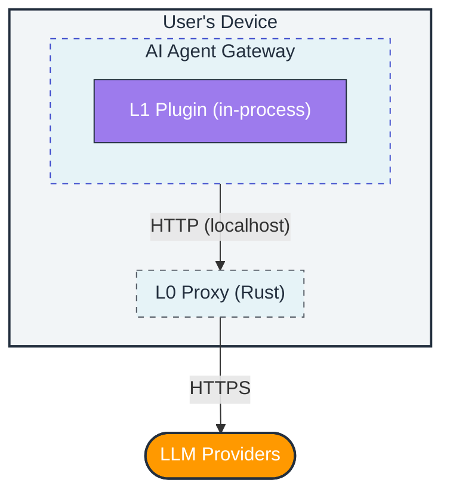
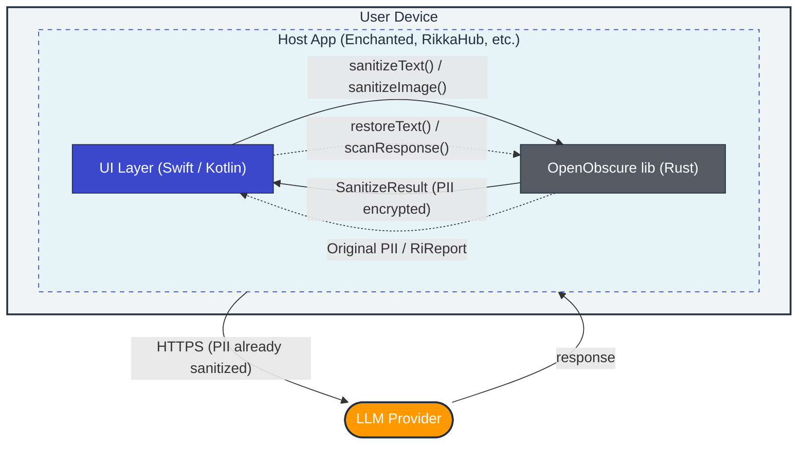
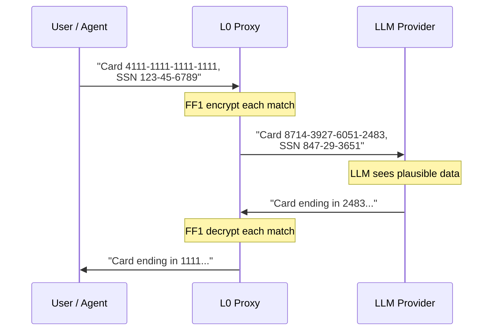
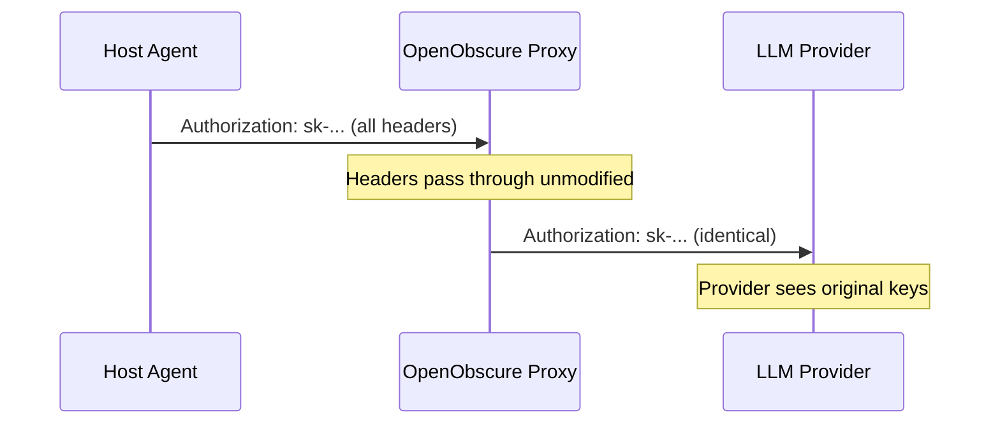
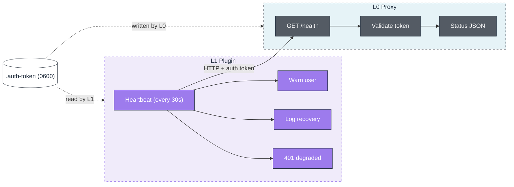
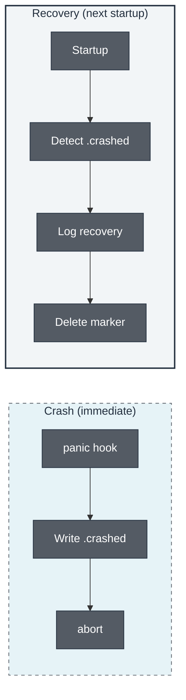
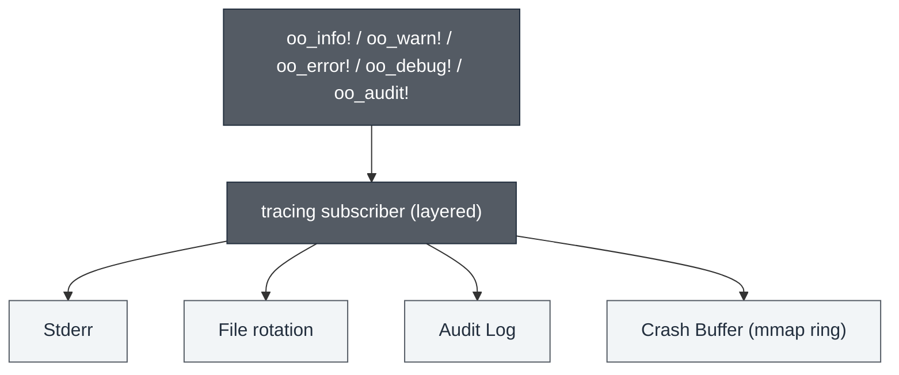
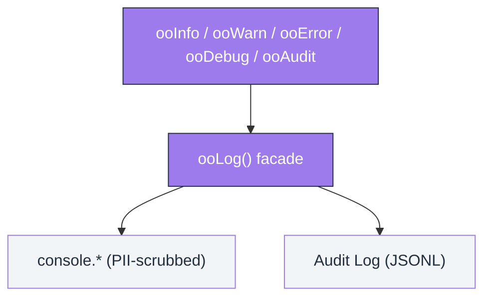
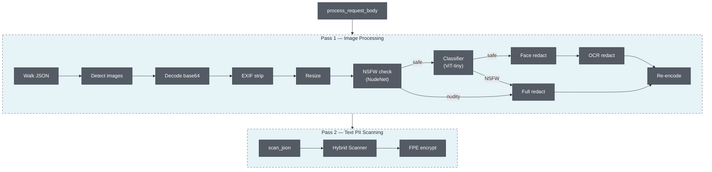
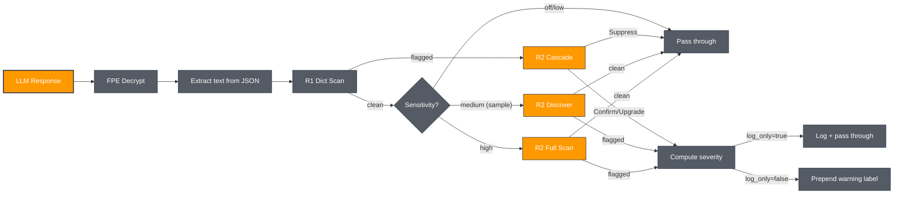

# OpenObscure — System Architecture

> Privacy firewall for AI agents. Works with any LLM-powered agent. Reference integration: [OpenClaw](https://github.com/openclaw/openclaw), the open-source AI assistant.

---

## What OpenObscure Does

Every message, tool result, and file a user shares with an AI agent gets sent to third-party LLM APIs in plaintext — credit cards, health discussions, API keys, children's information, photos. OpenObscure prevents this by intercepting data at multiple layers, encrypting or redacting PII before it leaves the device.

## Deployment Models

OpenObscure runs **entirely on the user's device** — no remote servers, no cloud components, no separate infrastructure. It supports two deployment models depending on where the AI agent runs.

### Gateway Model (Desktop / Server)

The full-featured deployment. OpenObscure runs as a **sidecar HTTP proxy** on the same host as the AI agent's Gateway. Both layers are active.



| Component | Process | How it runs |
|-----------|---------|-------------|
| **L0** (Rust proxy) | Standalone binary | Separate process, started as sidecar alongside the host agent. |
| **L1** (TS plugin) | In-process | Loaded into the host agent's runtime (e.g., OpenClaw's Node.js via plugin SDK) or used as a library. |

**Supported platforms:** macOS (Apple Silicon), Linux (x64 + ARM64), Windows (x64).

**Activation:**
1. **At install time** — The host agent's bundler includes OpenObscure and activates it during setup (if user opts in). OpenClaw supports this via its plugin SDK.
2. **Post-install** — User enables OpenObscure by configuring the host agent to route API traffic through `127.0.0.1:18790` instead of directly to LLM providers, and installs the L1 plugin into the agent's extensions directory (e.g., OpenClaw's `extensions/`)

When disabled, the host agent operates normally with direct LLM connections — OpenObscure adds zero overhead when not active.

### Embedded Model (Mobile / Library)

For mobile apps and custom integrations, OpenObscure compiles as a **native library** (`.a` for iOS, `.so` for Android) linked directly into the host application. No HTTP server, no sockets — just function calls via UniFFI-generated Swift/Kotlin bindings.



| Component | What | How it runs |
|-----------|------|-------------|
| **L0** (Rust library) | `OpenObscureMobile` API | Linked into host app binary. PII scan + FPE encrypt/decrypt + image pipeline + response integrity (cognitive firewall). FPE key provided by host app's native secure storage (iOS Keychain / Android Keystore). |

**Supported platforms:** iOS (aarch64 device + simulator), Android (arm64-v8a, armeabi-v7a, x86_64, x86).

**API surface:**

| Function | What it does |
|----------|-------------|
| `OpenObscureMobile::new(config, fpe_key)` | Initialize scanner + FPE engine with host-provided key |
| `sanitize_text(text)` | Scan for PII, encrypt with FPE, return sanitized text + mapping |
| `restore_text(text, mapping)` | Decrypt FPE values in response text using saved mapping |
| `sanitize_image(bytes)` | Face redact + OCR text redact + NSFW redact + EXIF strip (optional, adds ~20MB) |
| `sanitize_audio_transcript(text)` | Scan speech transcript for PII, return sanitized text + mapping |
| `check_audio_pii(text)` | Quick PII count in audio transcript (no encryption) |
| `scan_response(text)` | Scan LLM response for persuasion/manipulation (cognitive firewall, Full/Standard tier) |
| `stats()` | PII counts, scanner mode, image pipeline status, device tier |

**Third-party integration:** OpenObscure can be embedded into any iOS/macOS/Android chat app. Tested integrations include [Enchanted](https://github.com/AugustDev/enchanted) (iOS/macOS Ollama client) and [RikkaHub](https://github.com/rikkahub/rikkahub) (Android multi-provider LLM client). See [INTEGRATION_GUIDE.md](integration/INTEGRATION_GUIDE.md) for step-by-step instructions.

**Key differences from Gateway Model:**
- No HTTP server (axum/tokio not compiled in)
- FPE key passed from host app (no OS keychain access on mobile)
- Hardware auto-detection (`auto_detect: true` default) profiles device RAM and selects features automatically — phones with 8GB+ RAM get full NER + ensemble + image pipeline + cognitive firewall, matching gateway efficacy
- Image pipeline enabled automatically on capable devices (4GB+)
- Response integrity (cognitive firewall) available on Full/Standard tier — R1 dictionary always, R2 classifier if model provided

### Defense in Depth: Both Models Together

In the OpenClaw architecture, **both models can run simultaneously**. The mobile app sanitizes PII before it reaches the Gateway (Embedded Model), and the Gateway sanitizes again before forwarding to LLM providers (Gateway Model). Double protection for mobile-originated data:


### API Keys & External Connections

OpenObscure does **not** have its own LLM credentials and does **not** initiate its own API calls.

- **Gateway Model:** Passthrough-first — forwards the host agent's API keys unchanged.
- **Embedded Model:** No API calls at all — the library sanitizes text/images and returns results. The host app handles all networking.

The only network activity OpenObscure produces (Gateway Model only) is forwarding the host agent's existing LLM requests through the local proxy. No telemetry, no phone-home, no external dependencies at runtime.

## Two-Layer Defense-in-Depth


## Language Choices

| Layer | Language | Why |
|-------|----------|-----|
| **L0 Proxy** | Rust | Sits in the hot path of every LLM request — low latency and predictable memory are non-negotiable. Rust's ownership model enforces the 275MB RAM ceiling without GC pauses. ONNX model inference (face detection, OCR, NER) and audio keyword spotting require efficient memory management with multiple models loaded simultaneously. Cross-compiles to mobile targets (iOS/Android) via UniFFI-generated Swift/Kotlin bindings. |
| **L1 Plugin** | TypeScript | Runs in-process inside the host agent's runtime. OpenClaw (primary integration) is Node.js/TypeScript — same language means direct hook access (`tool_result_persist`, `before_tool_call`) with no FFI or IPC overhead. When `@openobscure/scanner-napi` is installed, auto-upgrades to the Rust HybridScanner for 15-type detection without requiring L0. Falls back to regex-only otherwise. |
| **L2 Storage** | Rust | Shares the L0 crate ecosystem. AES-256-GCM encryption and Argon2id KDF benefit from Rust's constant-time cryptography crates. |

**Design principle:** L0 is Rust because it's a performance-critical network proxy with ML models. L1 is TypeScript because it must speak the host agent's language. Each layer uses the right tool for its job — not a single language forced across both.

## Layer Details

### L0 — Rust PII Proxy (`openobscure-proxy/`)

The **hard enforcement** layer. Sits between the host agent and LLM providers as an HTTP reverse proxy. Every API request passes through it — there is no bypass path.

| Aspect | Detail |
|--------|--------|
| **What it does** | **Request path:** Scans JSON request bodies for PII via hybrid scanner (regex → keywords → NER/CRF) with ensemble confidence voting, encrypts matches with FF1 FPE. Processes base64-encoded images (face solid-fill redaction, OCR text solid-fill redaction, NSFW solid-fill redaction, EXIF strip). Handles nested/escaped JSON strings and respects markdown code fences. **Response path:** Decrypts FPE ciphertexts in responses (SSE streaming supported). Scans for persuasion/manipulation techniques (response integrity cognitive firewall) and optionally prepends warning labels (EU AI Act Article 5 compliance). |
| **What it catches** | Structured: credit cards (Luhn), SSNs (range-validated), phones, emails, API keys. Network/device: IPv4 (rejects loopback/broadcast), IPv6 (full + compressed), GPS coordinates (4+ decimal precision), MAC addresses (colon/dash/dot). Multilingual: national IDs (DNI, NIR, CPF, My Number, Citizen ID, RRN) with check-digit validation for 9 languages. Semantic: person names, addresses, orgs (NER/CRF). Health/child keyword dictionary (~700 terms, multilingual). Visual: nudity (NudeNet ONNX), faces in photos — solid-color fill redaction (SCRFD-2.5GF on Full/Standard, Ultra-Light RFB-320 on Lite), text in screenshots/images (PaddleOCR PP-OCRv4 ONNX). Audio: KWS keyword spotting via sherpa-onnx Zipformer (~5MB INT8) detects PII trigger phrases and strips matching audio blocks (`voice` feature). |
| **Auth model** | Passthrough-first — forwards the host agent's API keys unchanged |
| **Key management** | FPE master key: `OPENOBSCURE_MASTER_KEY` env var (64 hex chars) or OS keychain via `keyring`. Env var takes priority (headless/Docker/CI). |
| **Content-Type** | Only scans JSON bodies. Binary, text, multipart pass through unchanged |
| **Fail mode** | Configurable fail-open (default) or fail-closed. Vault unavailable always blocks (503) |
| **Logging** | Unified `oo_*!()` macro API, PII scrub layer, mmap crash buffer, file rotation, platform logging (OSLog/journald) |
| **Stack** | Rust, axum 0.8, hyper 1, tokio, fpe 0.6 (FF1), ort (ONNX Runtime), image 0.25, whatlang 0.16, keyring 3, clap 4 (CLI) |
| **CLI** | Subcommands: `serve` (default), `key-rotate`, `passthrough`, `service {install,start,stop,status,uninstall}` |
| **Resource** | Tier-dependent: ~12MB (Lite/regex-only), ~67MB (Standard/NER), ~224MB peak (Full/image processing); 2.7MB binary |
| **Tests** | 1,683 (745 lib + 938 bin) |
| **Deployment** | Gateway Model: standalone binary. Embedded Model: static/shared library with UniFFI bindings (Swift/Kotlin). |
| **Docs** | [openobscure-proxy/ARCHITECTURE.md](openobscure-proxy/ARCHITECTURE.md) |

### L1 — Gateway Plugin (`openobscure-plugin/`)

The **second line of defense**. Runs in-process with the host agent. Catches PII that enters through tool results (web scraping, file reads, API responses) — data that never passes through the HTTP proxy.

| Aspect | Detail |
|--------|--------|
| **What it does** | Hooks the host agent's tool result persistence (e.g., OpenClaw's `tool_result_persist`) to scan and redact PII in tool outputs. Three detection paths (auto-selected): **(1)** Native NAPI addon (`@openobscure/scanner-napi`) — 15-type Rust HybridScanner in-process, no L0 needed; **(2)** NER-enhanced via `POST /_openobscure/ner` — semantic NER + regex merge when L0 is healthy; **(3)** JS regex fallback — 5 structured types. Prepared `before_tool_call` handler activates when host agent supports it. Provides L0 heartbeat monitor with auth token validation and unified logging API (`ooInfo`/`ooWarn`/`ooAudit`). |
| **PII handling** | Native addon (15 types, in-process), NER-enhanced via L0 (when active), or regex-only (`[REDACTED]`) — always redaction, not FPE, since tool results are internal |
| **Heartbeat** | Pings L0 `/_openobscure/health` every 30s with `X-OpenObscure-Token` auth header. Warns user when L0 is down, logs recovery. |
| **Hook model** | Synchronous — must not return a Promise. OpenClaw-specific: OpenClaw silently skips async hooks. Prepared `before_tool_call` handler (hard enforcement) activates automatically when wired upstream. |
| **Logging** | Unified `ooInfo/ooWarn/ooError/ooDebug/ooAudit` API with PII scrubbing, JSON output |
| **Stack** | TypeScript 5.4, CommonJS |
| **Resource** | ~25MB RAM (within the host agent's process), ~3MB storage |
| **Tests** | 112 (22 suites: redactor, heartbeat, state-messages, oo-log, PII scrubbing, audit log, modules, NER-enhanced redaction, before-tool-call, cognitive dictionary, parity, tokenizer, category detection, overlap, offsets, multi-category, severity, warning label, edge cases, severity boundaries, label format, scanPersuasion) |
| **Docs** | [openobscure-plugin/ARCHITECTURE.md](openobscure-plugin/ARCHITECTURE.md) |

**Process watchdog** (install templates):
- macOS: launchd plist with `KeepAlive` + `ThrottleInterval`
- Linux: systemd unit with `Restart=on-failure` + `MemoryMax=275M`

## How FPE Works

Format-Preserving Encryption transforms plaintext into ciphertext of **identical format**. The LLM sees plausible-looking data instead of `[REDACTED]`, preserving conversational context.



| PII Type | Radix | Encrypted Part | Preserved |
|----------|-------|----------------|-----------|
| Credit Card | 10 | 15-16 digits | Dash positions |
| SSN | 10 | 9 digits | Dash positions |
| Phone | 10 | 10+ digits | `+`, parens, spaces, dashes |
| Email | 36 | Local part | `@` + domain |
| API Key | 62 | Post-prefix body | Known prefix (`sk-`, `AKIA`...) |
| IPv4 Address | 10 | Digit octets | Dot positions |
| IPv6 Address | 16 | Hex groups (lowercase) | Colon positions, `::` structure |
| GPS Coordinate | 10 | Lat+lon digits together | Signs, dots, comma, space |
| MAC Address | 16 | 12 hex chars (lowercase) | Colon/dash/dot positions |
| IBAN | 36 | BBAN (post-country digits+letters) | 2-letter country prefix |

**Algorithm:** FF1 per NIST SP 800-38G. FF3 is **WITHDRAWN** (SP 800-38G Rev 2, Feb 2025) — never used.

**Tweak strategy:** Per-record `request_uuid (16B) || SHA-256(json_path)[0..16]` — same PII value in different requests produces different ciphertexts, preventing frequency analysis.

## L0 vs L1 — Why Both?

| | L0 (Proxy) | L1 (Plugin) |
|---|------------|-------------|
| **Intercept point** | HTTP requests/responses to LLMs | Tool results within the host agent |
| **PII handling** | FPE encryption (reversible) | Redaction (destructive) |
| **Catches** | All LLM API traffic | Web scrapes, file reads, API outputs |
| **Bypass possible?** | No — all traffic must route through proxy | Only if the host agent skips the hook |
| **Runs in** | Standalone Rust binary | Host agent process (e.g., OpenClaw Node.js) |

Neither layer alone is sufficient:
- L0 can't see tool results (they're generated inside the host agent, never pass through HTTP)
- L1 can't intercept before LLM sees data (in OpenClaw, only `tool_result_persist` is wired, not `before_tool_call`)

## Data Flow

### Outbound (user → LLM)


### Inbound (LLM → user)


### Tool Results (agent tools → persistence)


**Important:** OpenObscure never reads local files itself. The agent's tools perform all file I/O and produce text results. OpenObscure only sees the resulting text *after* the agent has already read and extracted it. L1 operates on text strings from tool outputs, not on files directly.

## Authentication Model

**Passthrough-first** — OpenObscure is transparent to API authentication:



- All original request headers forwarded (except hop-by-hop per RFC 7230)
- FPE master key is separate — 32-byte AES-256 via `OPENOBSCURE_MASTER_KEY` env var (headless) or OS keychain (desktop), generated with `--init-key`

## Resource Budget

OpenObscure uses a **hardware capability detection system** to select features at startup. The `device_profile` module detects total RAM, available RAM, and CPU cores, classifies the device into a capability tier, and derives a feature budget.

### Capability Tiers

| Device RAM | Tier | Scanners | Image Pipeline | Model Idle Timeout |
|------------|------|----------|----------------|--------------------|
| 8GB+ | **Full** | NER + CRF + ensemble voting | Yes | 300s |
| 4–8GB | **Standard** | NER + CRF (no ensemble) | Yes | 120s |
| <4GB | **Lite** | NER + CRF (no ensemble) | Yes (shorter timeout) | 60s |

### Gateway Budgets (fixed per tier)

| Tier | Max RAM | NER | CRF | Ensemble | Image |
|------|---------|-----|-----|----------|-------|
| Full | 275MB | Yes | Yes | Yes | Yes |
| Standard | 200MB | Yes | Yes | No | Yes |
| Lite | 80MB | Yes | Yes | No | Yes |

### Embedded Budgets (proportional to device RAM)

Budget = 20% of total RAM, clamped to [12MB, 275MB]. Features enabled based on available budget within the tier:

| Device | Total RAM | Budget | Tier | NER | CRF | Ensemble | Image |
|--------|-----------|--------|------|-----|-----|----------|-------|
| iPhone 16 Pro | 12GB | 275MB (capped) | Full | Yes | Yes | Yes | Yes |
| iPhone 15 | 6GB | 275MB (capped) | Standard | Yes | Yes | No | Yes |
| Budget Android | 3GB | 275MB (capped) | Lite | Yes | Yes | No | Yes |
| Embedded IoT | 512MB | 102MB | Lite | Yes | Yes | No | Yes |

### Full Stack Component Breakdown

| Component | RAM | Resident? |
|-----------|-----|-----------|
| L0 + L1 + runtime | 115MB | Always |
| TinyBERT INT8 NER | 55MB | Always (when tier enables NER) |
| Health/child keyword dict | 2MB | Always |
| SCRFD-2.5GF (face detection, Full/Standard) | 15MB | On-demand |
| Ultra-Light RFB-320 (face detection, Lite) | 8MB | On-demand |
| BlazeFace (face detection, fallback) | 8MB | On-demand |
| PaddleOCR-Lite (OCR) | 35MB | On-demand |
| Image buffer | 48MB | On-demand |
| **Peak (Full tier)** | **224MB** | — |
| **Hard ceiling** | **275MB** | — |

Storage ceiling: **62MB** (including all models, ONNX Runtime, config).

Explicit `scanner_mode` config ("ner", "crf", "regex") overrides auto-detection.

## PII Coverage Roadmap

| Phase | Coverage | What's Added |
|-------|----------|--------------|
| **Phase 1** (complete) | **78%** | Regex + FPE for structured PII (CC, SSN, phone, email, API keys) |
| **Phase 2** (complete) | **91%** | Hybrid scanner (NER/CRF + keywords), health monitoring, nested JSON, code fences |
| **Phase 2.5** (complete) | **91%** | Unified logging, PII scrub layer, mmap crash buffer, file rotation |
| **Phase 3** (complete) | **95%** | Visual PII (face redaction, OCR text extraction, EXIF strip, screenshot detection, platform logging) |
| **Phase 5** (complete) | **97%** | SSE streaming, PII benchmark corpus (~400 samples, 100% recall), production benchmarks (criterion) |
| **Phase 6** (complete) | **97%** | Ensemble confidence voting (cluster-based overlap resolution + agreement bonus) |
| **Phase 7** (complete) | **97%** | Cross-platform support (Windows, Linux ARM64), mobile library API (iOS + Android via UniFFI), Embedded deployment model |
| **Post-Phase 7** (complete) | **98%** | Network/device identifier detection (IPv4, IPv6, GPS coordinates, MAC addresses) — closes PII-06 + PII-12 |
| **Phase 8** (complete) | **98%** | Production hardening — CI/CD matrix, mobile API gaps (breach detect, SIEM export, encrypted storage), governance feature flags |
| **Post-Phase 8** (complete) | **99%** | Tier-gated features — SCRFD-2.5GF face detection (Full/Standard), L1 NER via L0 endpoint, CoreML/NNAPI mobile EPs, PP-OCRv4 English OCR, 99.7% recall |
| **Phase 9** (complete) | **99%** | Runtime hardware capability detection — device profiler auto-selects features based on RAM; mobile devices with 8GB+ get full NER + ensemble parity with gateway |
| **Phase 10** (complete) | **99.5%** | Multilingual PII (9 languages, national ID validation), voice anonymization (KWS keyword spotting via sherpa-onnx Zipformer), mobile test apps (iOS + Android), UniFFI binding automation, TinyBERT fine-tuning dataset, OpenClaw `before_tool_call` preparation |
| **Phase R1** (complete) | **99.5%** | Response integrity cognitive firewall — persuasion/manipulation detection on LLM responses (7 categories, ~250 phrases), severity tiers (Notice/Warning/Caution), optional warning labels (EU AI Act Article 5), Anthropic + OpenAI format support |
| **Phase 11** (complete) | **99.5%** | SSE frame accumulation buffer (`SseAccumulator`), model pre-warming (`ReadinessState`), tier-aware body size limits, request/response FPE mapping module |
| **Phase 12** (complete) | **99.5%** | R2 cognitive firewall — TinyBERT FP32 multi-label classifier (4 EU AI Act Article 5 categories), R1→R2 cascade (Confirm/Suppress/Upgrade/Discover), first-window early exit, ONNX FP32 export (54.9 MB), macro P=80.9% R=74.5% F1=77.3% |
| **Phase 13** (partial) | **99.5%** | Embedded voice pipeline — platform speech APIs (iOS `SFSpeechRecognizer` + Android `SpeechRecognizer`), mobile audio transcript PII methods (`sanitizeAudioTranscript`/`checkAudioPii` via UniFFI), L1 cognitive firewall (JS persuasion dictionary, NAPI bridge), comprehensive testing (Tier 1-4 coverage) |
| **Phase 15** (complete) | **99.5%** | Ensemble NSFW classifier — ViT-tiny holistic model (Marqo/nsfw-image-detection-384) as Phase 0b fallback when NudeNet clean, multi-LLM response format detection (`response_format.rs`) |

## Project Layout

```
OpenObscure/
├── ARCHITECTURE.md              ← this file (system-level architecture)
├── integration/                 Embedding OpenObscure in third-party apps (guide, examples, templates)
├── session-notes/               Per-session implementation logs
├── .github/workflows/
│   ├── ci.yml                   CI: proxy-test matrix, cross-arm64, mobile-build, plugin, lint
│   └── release.yml              Release: binary matrix + iOS XCFramework + UniFFI bindings
├── build/
│   ├── download_models.sh       Download ONNX models for image + voice pipeline
│   ├── download_kws_models.sh   Download sherpa-onnx KWS models for voice pipeline
│   ├── build_napi.sh            Build NAPI native scanner addon for current platform
│   ├── build_ios.sh             Build iOS static library + XCFramework
│   ├── build_android.sh         Build Android shared library via cargo-ndk
│   ├── generate_bindings.sh     Generate UniFFI Swift/Kotlin bindings
│   └── check_openclaw_hooks.sh  Monitor OpenClaw for before_tool_call hook wiring
├── docs/examples/images/        Before/after visual PII examples
├── data/
│   └── pii_finetune_dataset.json  TinyBERT fine-tuning dataset (500-1000 labeled PII samples)
├── test/
│   ├── apps/
│   │   ├── ios/                 iOS test app (SwiftUI, 25 runner + 30 XCTest incl. audio transcript PII)
│   │   └── android/             Android test app (Compose, 36 instrumented incl. audio transcript PII + 8 UI)
│   ├── config/                  Test TOML configs (test_fpe.toml, etc.)
│   ├── data/
│   │   ├── input/               PII test corpus (45 files across 8 categories)
│   │   └── output/              Gateway/embedded JSON results
│   ├── scripts/                 Test runners, validators, echo server
│   │   └── mock/                Mock data generators (screenshots, mock models, datasets)
│   ├── expected_results.json    Threshold-based validation manifest (v2.0, ~85%)
│   ├── snapshot.json            Exact-count snapshot for --strict regression mode
│   ├── TESTING_GUIDE.md         Testing documentation
│   ├── GATEWAY_TEST.md          Gateway mode test walkthrough
│   └── EMBEDDED_TEST.md         Embedded mode test walkthrough
├── openobscure-proxy/             L0: Rust PII proxy (+ embedded mobile library)
│   ├── ARCHITECTURE.md          L0 architecture details
│   ├── LICENSE_AUDIT.md         Dependency license audit
│   ├── src/                     Rust source (50 modules incl. multilingual/, voice, detection)
│   ├── examples/                Demo binaries (demo_image_pipeline)
│   ├── models/                  ONNX models (git-ignored, download via script)
│   ├── config/openobscure.toml    Default configuration
│   └── install/                 Process watchdog templates (launchd, systemd)
├── openobscure-napi/               NAPI native scanner addon (Rust via napi-rs)
│   ├── ARCHITECTURE.md          NAPI architecture details
│   ├── src/lib.rs               OpenObscureScanner class (scanText, hasNer, scanPersuasion)
│   └── package.json             @openobscure/scanner-napi
├── review-notes/                Architecture review analysis & responses
├── openobscure-plugin/            L1: Gateway plugin
│   ├── ARCHITECTURE.md          L1 architecture details
│   ├── LICENSE_AUDIT.md         Dependency license audit
│   └── src/                     TypeScript source (redactor, heartbeat, oo-log, core, cognitive, before-tool-call)
└── project-plan/
    ├── MASTER_PLAN.md           Full design reference (single source of truth)
    ├── PHASE1_PLAN.md           Phase 1 plan (COMPLETE — 75 tests)
    ├── PHASE2_PLAN.md           Phase 2 plan (COMPLETE — 193 tests)
    ├── PHASE3_PLAN.md           Phase 3 plan (COMPLETE — 319 tests)
    ├── PHASE4_PLAN.md           Phase 4 plan (COMPLETE — 376 tests)
    ├── PHASE5_PLAN.md           Phase 5 plan (COMPLETE — 399 tests)
    ├── PHASE6_PLAN.md           Phase 6 plan (COMPLETE — 418 tests)
    ├── PHASE7_PLAN.md           Phase 7 plan (COMPLETE — 431 tests)
    ├── PHASE8_PLAN.md           Phase 8 plan (COMPLETE — 880 tests)
    ├── PHASE9_PLAN.md           Phase 9 plan (COMPLETE — 9A done, 9C dropped)
    ├── PHASE10_PLAN.md          Phase 10 plan (COMPLETE — 1,060 tests)
    ├── PHASE11_PLAN.md          Phase 11 plan (11A/B COMPLETE, 11C/D pending)
    ├── PHASE12_PLAN.md          Phase 12 plan (COMPLETE — 1,166 tests, R2 cognitive firewall)
    ├── FEATURE_PARITY.md        Feature comparison L0 vs L1
    ├── TESTING_STRATEGY.md      Testing strategy and launch readiness
    ├── COGNITIVE_FIREWALL.md    R1+R2 cognitive firewall design reference
    └── LOGGING_STRATEGY.md      Platform-specific logging strategy
```

## Key Design Decisions

| Decision | Rationale |
|----------|-----------|
| FF1 only, never FF3 | FF3 withdrawn by NIST (SP 800-38G Rev 2, Feb 2025) |
| Fail-open default | Proxy must never block AI functionality due to FPE edge cases |
| Vault unavailable → 503 | No privacy guarantees without FPE key — blocking is correct |
| Passthrough-first auth | No duplicate key management; OpenObscure is transparent to the host agent |
| Per-record FPE tweaks | Prevents frequency analysis across requests |
| L1 redacts, not encrypts | Tool results are internal — redaction is simpler and guarantees removal |
| Synchronous hooks only | OpenClaw-specific: OpenClaw silently skips async hook returns |
| INT8 quantization for NER | FP32 TinyBERT NER = ~200MB; INT8 = ~50MB — difference between fitting and OOM. R2 uses FP32 (see below) |
| FP32 for R2, not INT8 | INT8 dynamic quantization produced 7.45 max logit error — too much accuracy loss for multi-label classification. FP32 is accurate (0.000013 max diff) at 54.9 MB |
| R1→R2 cascade | R1 is <1ms (dictionary). R2 is ~30ms (ONNX). Cascade avoids R2 overhead on clean responses at low/medium sensitivity |
| Interior mutability for R2 (`Mutex<Option<RiModel>>`) | R2 ONNX session needs `&mut self`. Mutex allows `scan(&self)` on Arc-shared scanner across async request handlers |
| Solid-fill redaction (all regions) | Gaussian blur is partially reversible by AI deblurring models; solid color fill destroys original pixels completely, compresses better in base64, and clearly signals intentional redaction. Applied to faces, OCR text, and NSFW images. |
| On-demand model loading | Face + OCR models load/evict per image, saving ~43MB between images |
| Sequential model loading | Face model loaded/used/dropped before OCR model loaded — never both in RAM |
| Two-pass body processing | Images processed first (replaces base64 strings), then text PII (replaces substrings by offset) |
| EXIF strip via decode/encode | `image` crate loads pixels only, discarding all EXIF metadata — no explicit strip step |
| 960px image cap | A 12MP ARGB bitmap = 48MB; resizing before load prevents OOM |

## Host Agent Constraints (OpenClaw Reference)

Three critical OpenClaw-specific constraints that shaped OpenObscure's architecture. Other host agents may have different constraints:

1. **Only `tool_result_persist` is wired** — of OpenClaw's 14 defined hooks, only 3 have invocation sites. `before_tool_call`, `message_sending`, etc. are defined in TypeScript types but never called. This is why L0 (HTTP proxy) exists — it's the only way to intercept data *before* the LLM sees it.

2. **`tool_result_persist` is synchronous** — returning a Promise causes OpenClaw to silently skip the hook. All L1 processing must be synchronous.

3. **OpenClaw updates constantly** — 40+ security patches per release. OpenObscure modules touching internal APIs may break. Pin to known-good OpenClaw versions.

## Running

```bash
# Generate FPE key (first time only)
cd openobscure-proxy && cargo run -- --init-key

# Start proxy
cargo run -- -c config/openobscure.toml

# Run all tests
cd openobscure-proxy && cargo test
cd openobscure-plugin && npm test
```

## Health Monitoring & User Experience

OpenObscure must be **invisible when working, clear when not**. Users should never wonder whether their PII is protected.

### OpenObscure States (from the user's perspective)

| State | What the user sees | What happens |
|-------|-------------------|--------------|
| **Active** | Nothing — AI works normally | L0 encrypts PII, L1 redacts tool results. Silent protection. |
| **Degraded** | Warning: "OpenObscure proxy is not responding — PII protection is disabled" | L1 detects L0 is down. Agent requests fail (no bypass). User is informed. |
| **Disabled** | Startup message: "OpenObscure is not enabled. PII will be sent in plaintext." | Host agent configured for direct LLM connections. No protection. |
| **Crashed** | Same as Degraded — L1 warns, requests fail | L0 process died. Crash marker written for diagnostics. |
| **OOM** | Warning: "OpenObscure ran out of memory and stopped" + crash marker | L0 killed by OS. L1 detects, warns. Crash marker includes memory stats. |
| **Recovering** | "OpenObscure proxy recovered from a previous crash" | L0 restarts, finds crash marker, logs recovery, resumes. |

### Design Principle

**Warn, don't block.** When L0 is down, L1 should warn the user clearly — but not prevent the host agent from functioning. The user decides whether to continue without protection. L0 being down already blocks LLM requests (traffic is routed through the proxy), so L1's role is **explanation**, not enforcement.

### Health Monitoring Architecture



**Crash path:**



**Auth token handshake:** L0 generates a random 32-byte hex token on first startup, writes to `~/.openobscure/.auth-token` (file permissions 0600 on Unix). L1 reads this file and sends it as the `X-OpenObscure-Token` header with every health check. If the token is missing or wrong, L0 returns 401 Unauthorized. This prevents other localhost processes from querying or impersonating the health endpoint.

Token resolution (L0 startup): `OPENOBSCURE_AUTH_TOKEN` env var → `~/.openobscure/.auth-token` file → auto-generate and write.

| Component | What | Status |
|-----------|------|--------|
| `GET /_openobscure/health` endpoint | Returns status, version, uptime, PII stats, device tier, feature budget. Auth-gated via `X-OpenObscure-Token`. | Complete |
| L1 heartbeat monitor | Pings health endpoint every 30s with auth token, warns user on failure | Complete |
| L0/L1 auth token | Shared via file (`~/.openobscure/.auth-token`) or env var. Auto-generated on first run. | Complete |
| Panic hook + crash marker | Writes `~/.openobscure/.crashed` before abort | Complete |
| Graceful shutdown logging | "OpenObscure proxy shutting down" on SIGTERM/SIGINT | Complete |
| Process watchdog (launchd/systemd) | Auto-restart L0 on crash via `install/launchd/` and `install/systemd/` templates | Complete |

## Logging Architecture (Phase 2.5)

All logging across both L0 (Rust) and L1 (TypeScript) uses a **unified facade API** — no direct `tracing::*!()` or `console.*` calls outside the logging module. This guarantees every log line passes through PII scrubbing and audit routing.

### L0 Logging Stack



| Layer | Purpose | Config |
|-------|---------|--------|
| **Stderr** | Primary output, JSON or human-readable | `logging.json_output` |
| **PII scrub** | Regex-based scrub of SSN, CC, email, phone, API keys in log text | `logging.pii_scrub` (default: true) |
| **File rotation** | Daily rolling log files | `logging.file_path`, `max_file_size`, `max_files` |
| **Audit log** | Audit trail — only `oo_audit!` events routed to separate JSONL | `logging.audit_log_path` |
| **Crash buffer** | mmap ring buffer (default 2MB) — kernel flushes pages even on hard crash | `logging.crash_buffer`, `crash_buffer_size` |

**Module tagging:** Every log line includes a `module` field (PROXY, SCANNER, HYBRID, FPE, VAULT, HEALTH, CONFIG, NER, CRF, BODY, SERVER, MAPPING, DEVICE, VOICE, LANG, MULTILINGUAL, BREACH, NSFW, IMAGE, KEY_MANAGER) for structured filtering.

### L1 Logging Stack



Module constants: REDACTOR, HEARTBEAT, PLUGIN.

All string fields are run through `redactPii()` before output — defense-in-depth ensures no PII leaks through log messages even if developers forget to sanitize.

---

## Image Pipeline (Phase 3)

L0 detects base64-encoded images in JSON request bodies (both Anthropic and OpenAI formats) and processes them before text PII scanning. All redaction uses solid light-gray fill — face regions, OCR text regions, and NSFW images all have original pixel data completely destroyed and cannot be recovered by AI deblurring models. For before/after visual examples of the pipeline in action, see [README.md — Visual PII Protection](README.md#visual-pii-protection).



**Provider formats:**
- **Anthropic:** `{"type":"image","source":{"type":"base64","media_type":"image/png","data":"iVBOR..."}}`
- **OpenAI:** `{"type":"image_url","image_url":{"url":"data:image/png;base64,iVBOR..."}}`

**Key properties:**
- Images processed BEFORE text so byte offsets remain correct
- **Four-phase pipeline:** Phase 0 (NudeNet body-part detection) → Phase 0b (holistic ViT-tiny classifier, if Phase 0 clean) → Phase 1 (face detection via SCRFD or BlazeFace + solid-fill redaction) → Phase 2 (OCR text detection via PP-OCRv4 + solid-fill redaction)
- NSFW detection: if nudity found by NudeNet or classifier, solid-fill entire image and skip face/OCR phases
- Phase 0b: ViT-tiny classifier (Marqo/nsfw-image-detection-384) runs only when NudeNet + implied-topless heuristic produce no signal; threshold 0.75 to minimize false positives; fail-open on errors
- Face redaction: detected face regions are filled with light gray (rgb 200,200,200) — original pixel data is completely destroyed, not recoverable by AI deblurring. Elliptical fill inscribed in the bounding box with 15% padding. If face occupies >80% of image area, fill entire image.
- OCR text redaction: detected text regions are filled with solid color — same irreversible approach as face redaction.
- Sequential model loading: models loaded/used/dropped one at a time (never multiple in RAM)
- EXIF metadata stripped implicitly — `image` crate loads pixels only, discarding all metadata
- Fail-open: corrupt base64, unsupported format, or model failure → forward original image unchanged
- Screenshot detection (EXIF software tags, screen resolution, status bar uniformity) flags images; metadata wired into pipeline

**Models (on-demand, evicted after 300s idle):**

| Model | Size | RAM | Purpose |
|-------|------|-----|---------|
| NudeNet 320n | ~12MB | ~20MB | NSFW/nudity detection (YOLOv8n, 320x320 input, Phase 0) |
| Marqo ViT-tiny | ~21MB | ~20MB | Holistic NSFW classifier — Phase 0b fallback (384x384, Apache 2.0) |
| SCRFD-2.5GF | ~3MB | ~15MB | Face detection — Full/Standard tiers (640x640 input, multi-scale FPN) |
| Ultra-Light RFB-320 | ~1.2MB | ~8MB | Face detection — Lite tier default (320x240 input, with tiling heuristic) |
| BlazeFace short-range | ~408KB | ~8MB | Face detection — fallback (128x128 input, NMS) |
| PaddleOCR det | ~2.4MB | ~15MB | Text region detection |
| PaddleOCR rec (PP-OCRv4) | ~10MB | ~20MB | Character recognition (Tier 2 only, English) |

**Two OCR tiers:**
- **Tier 1 (default):** Detect text regions → solid-fill all. No recognition model needed.
- **Tier 2:** Detect → recognize → scan text for PII → selectively solid-fill PII regions only.

---

## Response Integrity — Cognitive Firewall (Phases R1 + R2)

OpenObscure protects the **outbound path** (user PII encrypted before reaching LLM providers) and the **inbound path** (LLM responses scanned for manipulation before reaching users).

**Why this matters:** Privacy tools typically stop at input sanitization — they protect what you send. But LLM providers control the response side: they can embed persuasion techniques (urgency, scarcity, false authority, fear appeals, commercial pressure) to influence user behavior. EU AI Act Article 5 prohibits such subliminal/manipulative techniques, but there is no enforcement mechanism at the user's endpoint. OpenObscure's cognitive firewall provides that enforcement — scanning every response before it reaches the user or agent.

**Two-tier cascade:** R1 (pattern-based dictionary, ~250 phrases across 7 Cialdini categories, <1ms) runs on every response. R2 (TinyBERT FP32 multi-label classifier, ~30ms, 4 EU AI Act Article 5 categories) runs conditionally based on sensitivity level and R1 results — confirming, suppressing, upgrading, or discovering manipulation that R1 alone cannot detect.

The response integrity scanner operates after FPE decryption. SSE responses are accumulated via `SseAccumulator` for cross-frame token reassembly before scanning.



**Detection categories** (mapped to Cialdini's persuasion principles):

| Category | Examples | Principle |
|----------|----------|-----------|
| Urgency | "act now", "limited time", "don't wait" | Scarcity of time |
| Scarcity | "only a few left", "exclusive offer", "selling fast" | Scarcity of supply |
| Social Proof | "everyone is", "most popular", "trusted by millions" | Consensus |
| Fear | "you could lose", "don't fall behind", "fomo" | Loss aversion |
| Authority | "experts agree", "studies show", "clinically proven" | Authority |
| Commercial | "best deal", "free trial", "buy now", "discount" | Commercial pressure |
| Flattery | "smart choice", "you deserve", "people like you" | Liking |

**Severity tiers:**

| Tier | Trigger | Label |
|------|---------|-------|
| Notice | 1 category, 1-2 matches | `--- OpenObscure NOTICE ---` |
| Warning | 2-3 categories or 3+ matches | `--- OpenObscure WARNING ---` |
| Caution | 4+ categories or commercial+fear/urgency combo | `--- OpenObscure CAUTION ---` |

**Configuration** (`[response_integrity]` section):

| Field | Default | Description |
|-------|---------|-------------|
| `enabled` | `true` | Enabled by default — set to `false` to disable entirely |
| `sensitivity` | `"low"` | `off`/`low` (R2 on R1-flagged only)/`medium` (R2 samples 10%)/`high` (R2 on all) |
| `log_only` | `true` | When true, flags are logged but responses pass through unchanged. When false, warning labels are prepended to response content |

**Key properties:**
- **Enabled by default, log-only at low sensitivity** — observe before acting, matches fail-open philosophy
- **Fail-open** — JSON parse errors or unrecognized response formats forward unchanged
- **Supports Anthropic and OpenAI response formats** — extracts text from `content[].text` or `choices[].message.content`
- **SSE streaming supported** — `SseAccumulator` buffers SSE frames for cross-frame token reassembly before R1+R2 scanning
- **~250 phrases** across 7 categories, HashSet O(1) lookup with 3→2→1 word scanning (longest match first)
- **R2 model optional** — when `ri_model_dir` is not set, degrades gracefully to R1-only

### R2 Semantic Classifier (Phase 12)

R2 is a TinyBERT FP32 ONNX multi-label classifier that detects manipulation techniques aligned to EU AI Act Article 5 prohibited categories. It runs conditionally after R1, adding semantic understanding that dictionary matching alone cannot provide.

**Model:** `huawei-noah/TinyBERT_General_4L_312D`, fine-tuned on 2,750 synthetic examples (1,924 train / 411 val / 415 test). Exported as ONNX FP32 (54.9 MB). INT8 quantization was evaluated but rejected due to excessive accuracy loss (7.45 max logit error).

**Article 5 categories:**

| Category | What it catches | Examples |
|----------|----------------|----------|
| `Art_5_1_a_Deceptive` | Deceptive/manipulative techniques | Urgency, scarcity, social proof, fear, authority, flattery, anchoring, confirmshaming |
| `Art_5_1_b_Age` | Age vulnerability exploitation | Child gamification, elderly confusion, oversimplified risk |
| `Art_5_1_b_SocioEcon` | Socioeconomic vulnerability exploitation | Debt pressure, health anxiety, unemployment exploitation, isolation |
| `Art_5_1_c_Social_Scoring` | Social scoring patterns | Trust score threats, behavioral compliance, access restriction |

**R2 Role (cascade behavior):**

| Role | Trigger | Behavior |
|------|---------|----------|
| **Confirm** | R1 flagged, R2 agrees | Severity stays or upgrades based on R2 category count |
| **Suppress** | R1 flagged, R2 sees benign | R1 false positive suppressed — no detection reported |
| **Upgrade** | R1 flagged, R2 finds more categories | Severity tier upgraded |
| **Discover** | R1 clean, R2 finds manipulation | New detection that R1 missed (paraphrased manipulation) |

**Sensitivity tiers (R2 activation):**

| Sensitivity | R1 Clean | R1 Flagged | Overhead |
|-------------|----------|------------|----------|
| `off` | Skip all | Skip all | 0ms |
| `low` | Skip R2 | R2 confirms | ~30ms on 1-5% |
| `medium` | R2 samples 10% | R2 confirms | ~30ms on ~11-15% |
| `high` | R2 full scan | R2 confirms | ~30ms on 100% |

**Performance (held-out test set, threshold=0.55):**

| Metric | Value |
|--------|-------|
| Macro precision | 80.9% |
| Macro recall | 74.5% |
| Macro F1 | 77.3% |
| Benign accuracy | 94.9% |
| Model size | 54.9 MB (FP32 ONNX) |
| Inference | ~30ms (first-window early exit on clean text) |

**Implementation:** R2 model is held behind `Mutex<Option<RiModel>>` inside `ResponseIntegrityScanner`, allowing `scan(&self)` on the `Arc`-shared scanner. First-window early exit: if max sigmoid score on the first 128 tokens is below `early_exit_threshold` (0.30), full-sequence inference is skipped.

**Configuration** (`[response_integrity]` section):

| Field | Default | Description |
|-------|---------|-------------|
| `ri_model_dir` | `None` | Path to R2 ONNX model directory. `None` = R2 disabled, R1-only |
| `ri_threshold` | `0.55` | Per-category sigmoid threshold for positive detection |
| `ri_early_exit_threshold` | `0.30` | Below this on first 128 tokens → skip full inference |
| `ri_idle_evict_secs` | `300` | Evict R2 model from memory after N seconds idle |
| `ri_sample_rate` | `0.10` | Fraction of R1-clean responses scanned by R2 at `medium` sensitivity |

---

## Threat Model

OpenObscure is designed for open-source distribution. Security follows **Kerckhoffs's principle** — the system is secure even when all source code, documentation, and algorithms are public. Security depends entirely on the secrecy of keys, never on code obscurity.

### What OpenObscure Protects Against

| Threat | Protection | Layer |
|--------|-----------|-------|
| PII leaking to LLM providers in API requests | FF1 FPE encryption of structured PII before request leaves device | L0 |
| Visual PII in images (faces, text, EXIF) | NSFW full-image solid fill, face solid-fill redaction (irreversible), OCR text solid-fill redaction, EXIF metadata stripping on base64 images | L0 |
| LLM responses containing persuasion/manipulation techniques | Response integrity scanner detects urgency, scarcity, fear, authority, flattery patterns and prepends warning labels (EU AI Act Article 5) | L0 |
| PII persisted in tool result transcripts | Regex redaction of PII in tool outputs before persistence | L1 |
| Frequency analysis of FPE ciphertexts | Per-record tweaks (UUID + JSON path hash) produce unique ciphertexts for identical inputs | L0 |
| API key exposure via proxy | Passthrough-first — keys are never stored or logged by OpenObscure | L0 |

### What OpenObscure Does NOT Protect Against

| Threat | Why | Mitigation |
|--------|-----|------------|
| **Compromised OS / root access** | Attacker with root can read process memory, dump OS keychain, intercept localhost traffic. No userspace software can defend against this. | OS-level security (disk encryption, patching, access controls) |
| **Semantic PII not covered by regex** (Phase 1) | Names, addresses, health conditions bypass regex. "Tell John about my diabetes" passes through unencrypted. | Phase 2 TinyBERT NER closes this gap (~91% coverage) |
| **PII in tool results sent to LLM** | L1 hooks `tool_result_persist` (after LLM sees data), not `before_tool_call`. Tool result PII reaches the LLM before L1 can redact it. | OpenClaw limitation — when `before_tool_call` is wired, L1 upgrades to pre-LLM enforcement |
| **Side-channel attacks on FPE** | Timing analysis of FF1 encrypt/decrypt could theoretically leak information. | AES-NI hardware acceleration provides constant-time operations on supported CPUs |
| **Model extraction from ONNX** (Phase 2+) | NER model weights are readable from the ONNX file. | Not a concern — the model detects PII patterns, it doesn't contain user data. Knowing the model helps craft evasion, but NER is supplementary to regex, not a sole defense |

### Secrets Inventory

All runtime secrets live in the **OS keychain** or (for headless environments) environment variables. Never in source code or config files:

| Secret | Format | Where | Generated |
|--------|--------|-------|-----------|
| FPE master key | 32 bytes (AES-256) | `OPENOBSCURE_MASTER_KEY` env var (64 hex chars) **or** OS keychain (`openobscure/fpe-key`). Env var takes priority. | `--init-key` with `OsRng` |
| L0/L1 auth token | 32 bytes (hex string) | `OPENOBSCURE_AUTH_TOKEN` env var **or** `~/.openobscure/.auth-token` file (0600). Auto-generated on first run. | `OsRng` at startup |

**Key compromise impact:**
- FPE key compromised → all FPE ciphertexts are decryptable (but attacker needs both the key AND the ciphertexts, which exist only in LLM provider logs)

### Open-Source Security Considerations

Publishing source code does **not** weaken OpenObscure's security posture:

1. **Algorithms are public standards** — FF1 (NIST SP 800-38G) is a published, peer-reviewed algorithm. Security never depended on algorithm secrecy.

2. **Regex patterns are standard** — Credit card (Luhn), SSN (range validation), phone, email, and API key patterns are well-known. An attacker doesn't need source code to guess them.

3. **NER models are not secrets** — The TinyBERT model detects PII patterns; it doesn't contain user data. An attacker could study the model to craft evasion inputs, but NER is layered on top of regex, not a sole defense.

4. **Community audit is a net positive** — Cryptographic implementations benefit from public scrutiny. Bugs found by the community are bugs that don't become exploits.

### Attack Surface Reduction

- **Localhost-only binding** — L0 proxy listens on `127.0.0.1:18790`, not `0.0.0.0`. Not network-accessible.
- **Health endpoint auth** — `/_openobscure/health` requires `X-OpenObscure-Token` header. Prevents other localhost processes from querying or impersonating L0.
- **No telemetry** — Zero outbound connections beyond forwarded LLM requests.
- **No default credentials** — FPE key must be explicitly generated. No fallback "demo mode" keys. Auth token auto-generated with secure random on first run.
- **Minimal dependencies** — Rust binary has no runtime dependency beyond libc.
- **Memory-safe language** — L0 is Rust (no buffer overflows, use-after-free, or memory corruption).

---

## FAQ

**Does OpenObscure read local files to scan for PII?**
No. OpenObscure never performs file I/O. The agent's tools (file_read, web_fetch, etc.) read files and produce text results. OpenObscure's L1 plugin only sees the resulting text after the agent has extracted it, via the tool result persistence hook.

**Does OpenObscure need its own API keys?**
No. By default, OpenObscure forwards the host agent's existing API keys unchanged (passthrough-first). It never provisions, generates, or requires separate LLM credentials.

**Does OpenObscure phone home or contact external servers?**
No. The only network traffic OpenObscure produces is forwarding the host agent's existing LLM API requests through the local proxy. No telemetry, no update checks, no external dependencies at runtime. Everything runs locally on the user's device.

**Is L0 (proxy) a separate server I need to host?**
No. L0 runs as a lightweight sidecar process on the same device as the host agent, listening on `127.0.0.1:18790` (localhost only). It's started alongside the agent — either automatically during installation or manually when the user enables OpenObscure. It's not exposed to the network.

**Does OpenObscure intercept data *before* the LLM sees it?**
L0 (proxy) does — it sits in the HTTP path and encrypts PII before the request reaches the LLM provider. L1 (plugin) hooks the agent's tool result persistence (e.g., OpenClaw's `tool_result_persist`), which fires *after* tool execution. L1 prevents PII from being persisted to transcripts, but cannot prevent it from being sent to the LLM via tool results.

**How much RAM does OpenObscure actually use?**
It depends on the device's capability tier. OpenObscure detects hardware at startup and selects features automatically. Lite tier (NER/CRF, no ensemble): ~12–80MB. Standard tier (NER + images): ~67–200MB. Full tier (NER + ensemble + images): up to 224MB peak. The 275MB ceiling is the hard limit. On mobile, the budget is 20% of device RAM (capped at 275MB), so a 12GB phone gets the same features as a desktop server.

**What happens if OpenObscure is disabled or crashes?**
If L0 is not running, the host agent can't reach LLM providers (traffic is configured to route through the proxy). If L1 crashes, the agent continues normally but tool results won't be redacted. If OpenObscure is fully disabled via configuration, the agent operates with direct LLM connections — zero overhead.

## Future Architecture Changes

Recently completed:
- **Ensemble NSFW classifier** — ViT-tiny (Marqo/nsfw-image-detection-384, 21MB FP32 ONNX) as Phase 0b fallback — catches semi-nude content NudeNet body-part detector misses, 0.75 threshold, fail-open, lazy-loaded with eviction — DONE (Phase 15)
- **Multi-LLM response format detection** — `response_format.rs` auto-detects 6 provider formats (Anthropic, OpenAI, Gemini, Cohere, Ollama, plaintext) for response integrity text extraction — DONE
- **ONNX Runtime mobile EPs** — CoreML (Apple) and NNAPI (Android) via `ort_ep.rs` — DONE
- **SCRFD multi-scale face detection** — SCRFD-2.5GF for Full/Standard tiers, Ultra-Light RFB-320 for Lite (BlazeFace fallback) — DONE
- **GLiNER NER evaluation** — DROPPED (82.78% recall, worse than TinyBERT 97%)
- **Multilingual PII detection** — `whatlang` language detection + per-language regex/keywords for 9 languages with national ID check-digit validation — DONE (Phase 10C)
- **Voice anonymization** — KWS keyword spotting via sherpa-onnx Zipformer (~5MB INT8), detects PII trigger phrases and strips matching audio blocks, `voice` feature flag — DONE (Phase 10D)
- **Mobile test apps** — iOS (SwiftUI, 25 runner + 30 XCTest incl. audio) and Android (Compose, 36 instrumented incl. audio + 8 UI) — DONE (Phase 10A + 13D)
- **`before_tool_call` preparation** — L1 plugin prepared handler that auto-activates when OpenClaw wires the hook — DONE (Phase 10F)
- **Response integrity cognitive firewall** — Persuasion/manipulation detection on LLM responses (7 categories, ~250 phrases, severity tiers, warning labels, EU AI Act Article 5) — DONE (Phase R1)
- **Embedded cognitive firewall** — JS persuasion dictionary (248 phrases, 7 Cialdini categories) + NAPI `scan_persuasion()` bridge in L1 plugin — mirrors Rust R1 logic exactly — DONE (Phase 13F)
- **Mobile voice platform APIs** — `sanitizeAudioTranscript`/`checkAudioPii` UniFFI methods + iOS `SFSpeechRecognizer` + Android `SpeechRecognizer` wrappers — DONE (Phase 13D)
- **UniFFI API surface CI assertion** — Binding drift check + function presence verification for 8 required APIs in both Swift and Kotlin bindings — DONE (Phase 14C)
- **Third-party app integration guide** — Step-by-step embedded integration for Enchanted (iOS/macOS Ollama client) and RikkaHub (Android multi-provider LLM client) with code examples for all intercept points — DONE (Phase 14)
- **SSE frame accumulation** — `SseAccumulator` cross-frame buffer for PII token and FPE ciphertext reassembly in streaming responses — DONE (Phase 11)
- **Model pre-warming** — `ReadinessState` enum (Cold/Warming/Ready) in health.rs, health returns 503 until warm — DONE (Phase 11)
- **Tier-aware body limits** — Per-tier body size limits (Lite 10MB, Standard 50MB, Full 100MB) with streaming early-reject — DONE (Phase 11)
- **Response integrity R2** — TinyBERT FP32 multi-label classifier for 4 EU AI Act Article 5 categories, R1→R2 cascade (Confirm/Suppress/Upgrade/Discover), first-window early exit, SSE streaming via SseAccumulator — DONE (Phase 12)

Planned (future):
- **Protection status header** — L0 injects `X-OpenObscure-Protection` response header (`pii=on; ri=on; image=on`) so L1 or any UI client can display a "Privacy Protection ON" indicator; header stripped before upstream forwarding
- **Real-time breach monitoring** — Rolling window anomaly detection in live proxy path (Phase 9D, deferred)
- **Streaming redaction** — Incremental redaction for large tool results (blocked by OpenClaw's synchronous hook API)
