# OpenObscure — System Architecture

> Privacy firewall for AI agents. Primary integration: [OpenClaw](https://github.com/openclaw/openclaw), the open-source AI assistant.
> Last updated: 2026-02-18 (Phase 7 — cross-platform support + mobile library, 431 tests)

---

## What OpenObscure Does

Every message, tool result, and file a user shares with an AI agent gets sent to third-party LLM APIs in plaintext — credit cards, health discussions, API keys, children's information, photos. OpenObscure prevents this by intercepting data at multiple layers, encrypting or redacting PII before it leaves the device.

## Deployment Models

OpenObscure runs **entirely on the user's device** — no remote servers, no cloud components, no separate infrastructure. It supports two deployment models depending on where the AI agent runs.

### Gateway Model (Desktop / Server)

The full-featured deployment. OpenObscure runs as a **sidecar HTTP proxy** on the same host as the AI agent's Gateway. All three layers are active.

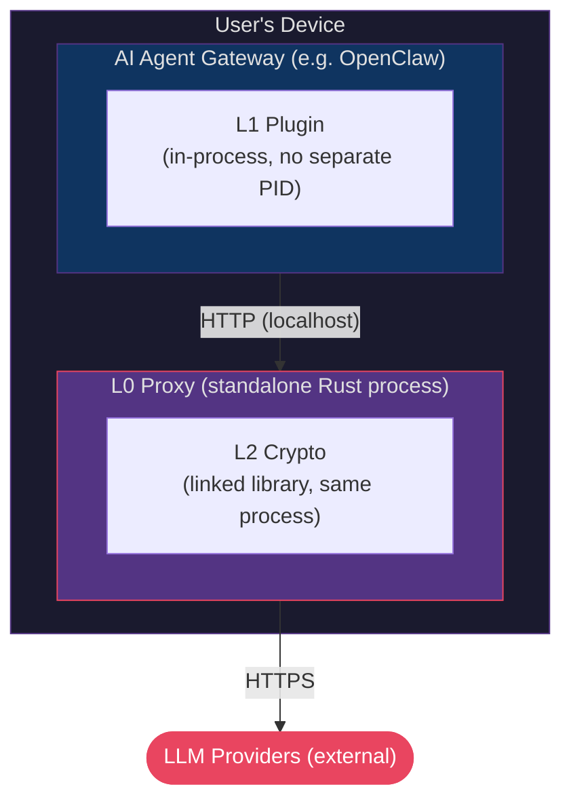

| Component | Process | How it runs |
|-----------|---------|-------------|
| **L0** (Rust proxy) | Standalone binary | Separate process, started as sidecar alongside the host agent. Includes compliance CLI subcommands (`openobscure compliance ...`). |
| **L1** (TS plugin) | In-process | Loaded into the host agent's runtime (e.g., OpenClaw's Node.js via plugin SDK) or used as a library. Includes `/privacy` commands. |
| **L2** (Rust crypto) | Library | Linked into L0's binary, not a separate process |

**Supported platforms:** macOS (Apple Silicon), Linux (x64 + ARM64), Windows (x64).

**Activation:**
1. **At install time** — The host agent's bundler includes OpenObscure and activates it during setup (if user opts in). OpenClaw supports this via its plugin SDK.
2. **Post-install** — User enables OpenObscure by configuring the host agent to route API traffic through `127.0.0.1:18790` instead of directly to LLM providers, and installs the L1 plugin into the agent's extensions directory (e.g., OpenClaw's `extensions/`)

When disabled, the host agent operates normally with direct LLM connections — OpenObscure adds zero overhead when not active.

### Embedded Model (Mobile / Library)

For mobile apps and custom integrations, OpenObscure compiles as a **native library** (`.a` for iOS, `.so` for Android) linked directly into the host application. No HTTP server, no sockets — just function calls via UniFFI-generated Swift/Kotlin bindings.

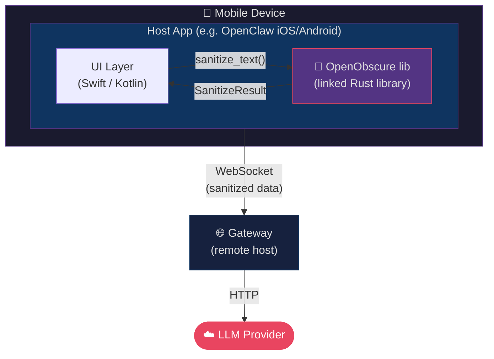

| Component | What | How it runs |
|-----------|------|-------------|
| **L0** (Rust library) | `OpenObscureMobile` API | Linked into host app binary. PII scan + FPE encrypt/decrypt + image pipeline. |
| **L1** (consent/governance) | Not available on mobile | Deferred to Phase 8 (Rust rewrite of TypeScript plugin). Gateway-side L1 still protects when data passes through. |
| **L2** (crypto) | Not applicable | FPE key provided by host app's native secure storage (iOS Keychain / Android Keystore). |

**Supported platforms:** iOS (aarch64 device + simulator), Android (arm64-v8a, armeabi-v7a, x86_64, x86).

**API surface:**

| Function | What it does |
|----------|-------------|
| `OpenObscureMobile::new(config, fpe_key)` | Initialize scanner + FPE engine with host-provided key |
| `sanitize_text(text)` | Scan for PII, encrypt with FPE, return sanitized text + mapping |
| `restore_text(text, mapping)` | Decrypt FPE values in response text using saved mapping |
| `sanitize_image(bytes)` | Face blur + OCR text blur + EXIF strip (optional, adds ~20MB) |
| `stats()` | PII counts, scanner mode, image pipeline status |

**Key differences from Gateway Model:**
- No HTTP server (axum/tokio not compiled in)
- FPE key passed from host app (no OS keychain access on mobile)
- CRF scanner used by default (NER requires ~55MB RAM, not recommended on mobile)
- L1 governance not available — rely on Gateway-side L1 when data passes through
- Image pipeline optional via feature flag (`mobile` = text only, `mobile` + `image-pipeline` = full)

### Defense in Depth: Both Models Together

In the OpenClaw architecture, **both models can run simultaneously**. The mobile app sanitizes PII before it reaches the Gateway (Embedded Model), and the Gateway sanitizes again before forwarding to LLM providers (Gateway Model). Double protection for mobile-originated data:


### API Keys & External Connections

OpenObscure does **not** have its own LLM credentials and does **not** initiate its own API calls.

- **Gateway Model:** Passthrough-first — forwards the host agent's API keys unchanged. The optional `override_auth` feature uses keys the user explicitly places in the OS keychain.
- **Embedded Model:** No API calls at all — the library sanitizes text/images and returns results. The host app handles all networking.

The only network activity OpenObscure produces (Gateway Model only) is forwarding the host agent's existing LLM requests through the local proxy. No telemetry, no phone-home, no external dependencies at runtime.

## Three-Layer Defense-in-Depth

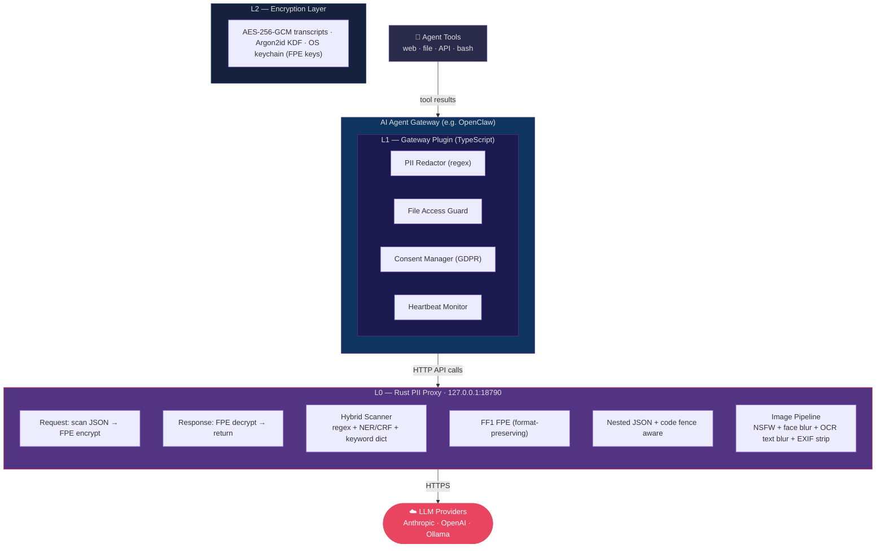

## Layer Details

### L0 — Rust PII Proxy (`openobscure-proxy/`)

The **hard enforcement** layer. Sits between the host agent and LLM providers as an HTTP reverse proxy. Every API request passes through it — there is no bypass path.

| Aspect | Detail |
|--------|--------|
| **What it does** | Scans JSON request bodies for PII via hybrid scanner (regex → keywords → NER/CRF) with ensemble confidence voting, encrypts matches with FF1 FPE (versioned keys with rotation support), decrypts ciphertexts in responses (SSE streaming supported). Processes base64-encoded images (face blur, OCR text blur, EXIF strip). Handles nested/escaped JSON strings and respects markdown code fences. Cross-border jurisdiction classification + policy enforcement. CLI compliance tooling (ROPA, DPIA, breach detection, SIEM export). |
| **What it catches** | Structured: credit cards (Luhn), SSNs (range-validated), phones, emails, API keys. Semantic: person names, addresses, orgs (NER/CRF). Health/child keyword dictionary (~700 terms). Visual: nudity (NudeNet ONNX), faces in photos (BlazeFace ONNX), text in screenshots/images (PaddleOCR ONNX). Cross-border: jurisdiction flags from phone country codes, email TLDs, SSN format. |
| **Auth model** | Passthrough-first — forwards the host agent's API keys unchanged. Optional `override_auth` per provider for vault-sourced keys |
| **Key management** | FPE master key: `OPENOBSCURE_MASTER_KEY` env var (64 hex chars) or OS keychain via `keyring`. Env var takes priority (headless/Docker/CI). Versioned keys (`fpe-master-key-v{N}`) with 30s dual-key overlap during rotation. CLI `key-rotate` for offline rotation. |
| **Content-Type** | Only scans JSON bodies. Binary, text, multipart pass through unchanged |
| **Fail mode** | Configurable fail-open (default) or fail-closed. Vault unavailable always blocks (503) |
| **Logging** | Unified `oo_*!()` macro API, PII scrub layer, mmap crash buffer, file rotation, GDPR audit log, platform logging (OSLog/journald) |
| **Stack** | Rust, axum 0.8, hyper 1, tokio, fpe 0.6 (FF1), ort (ONNX Runtime), image 0.25, keyring 3, clap 4 (CLI) |
| **Resource** | ~12MB RAM (regex-only), ~67MB with NER model loaded, ~224MB peak during image processing; 2.7MB binary |
| **Tests** | 319 (297 unit + 13 integration + 9 accuracy) |
| **Deployment** | Gateway Model: standalone binary. Embedded Model: static/shared library with UniFFI bindings (Swift/Kotlin). |
| **Docs** | [openobscure-proxy/ARCHITECTURE.md](openobscure-proxy/ARCHITECTURE.md) |

### L1 — Gateway Plugin (`openobscure-plugin/`)

The **second line of defense**. Runs in-process with the host agent. Catches PII that enters through tool results (web scraping, file reads, API responses) — data that never passes through the HTTP proxy.

| Aspect | Detail |
|--------|--------|
| **What it does** | Hooks the host agent's tool result persistence (e.g., OpenClaw's `tool_result_persist`) to scan and redact PII in tool outputs. Provides file access guard, GDPR consent manager (SQLite), L0 heartbeat monitor with auth token validation, memory governance (4-tier retention lifecycle), and unified logging API (`ooInfo`/`ooWarn`/`ooAudit`). |
| **PII handling** | Redaction (`[REDACTED]`), not FPE — tool results are internal, don't need format preservation |
| **File guard** | 15+ deny patterns (.env, SSH keys, AWS creds, databases, etc.) with configurable allow/deny |
| **Heartbeat** | Pings L0 `/_openobscure/health` every 30s with `X-OpenObscure-Token` auth header. Warns user when L0 is down, logs recovery. |
| **Hook model** | Synchronous — must not return a Promise. OpenClaw-specific: OpenClaw silently skips async hooks. |
| **Logging** | Unified `ooInfo/ooWarn/ooError/ooDebug/ooAudit` API with PII scrubbing, JSON output, GDPR audit log |
| **Stack** | TypeScript 5.4, CommonJS, better-sqlite3 (consent DB) |
| **Resource** | ~25MB RAM (within the host agent's process), ~3MB storage |
| **Tests** | 96 (9 redactor + 11 file-guard + 17 consent + 10 privacy-commands + 1 disclosure + 12 heartbeat + 2 state-messages + 17 oo-log + 17 memory-governance) |
| **Docs** | [openobscure-plugin/ARCHITECTURE.md](openobscure-plugin/ARCHITECTURE.md) |

### L2 — Encryption Layer (`openobscure-crypto/`)

**At-rest encryption** for session transcripts. Ensures conversation history is unreadable without the passphrase, even if storage is compromised.

| Aspect | Detail |
|--------|--------|
| **What it does** | Encrypts/decrypts session transcripts using AES-256-GCM with Argon2id-derived keys |
| **KDF** | Argon2id (19MB memory, 2 iterations, parallelism 1) — OWASP recommended |
| **Format** | Self-contained JSON files with embedded KDF params + base64 ciphertext |
| **API** | `EncryptedStore::write/read/list/delete` |
| **Stack** | Rust, aes-gcm 0.10, argon2 0.5, rand 0.8 |
| **Resource** | ~6MB RAM (19MB peak during KDF) |
| **Tests** | 16 |
| **Docs** | [openobscure-crypto/ARCHITECTURE.md](openobscure-crypto/ARCHITECTURE.md) |

### Compliance CLI (built into L0 + L1)

Compliance tooling runs on-demand within existing L0/L1 processes — no separate layer or web server.

**L0 CLI subcommands** (`openobscure compliance <subcommand>`):

| Subcommand | GDPR Article | Output |
|------------|-------------|--------|
| `summary` | Art. 5(2) | Aggregate stats from audit log |
| `ropa` | Art. 30 | Record of Processing Activities (Markdown/JSON) |
| `dpia` | Art. 35 | Data Protection Impact Assessment (Markdown/JSON) |
| `audit-log` | Art. 5(2) | Filtered audit log entries |
| `breach-check` | Art. 33 | Anomaly detection + breach notification draft |
| `export` | — | SIEM export (CEF/LEEF format) |

**L0 cross-border router** (in proxy request path):
- Jurisdiction classification from detected PII: phone country codes (~30 prefixes), email TLDs, SSN → US
- Policy engine: allow/warn/block based on `[cross_border]` config
- Block mode returns 403 Forbidden before request reaches upstream

**L0 breach detection** (batch mode via `breach-check`):
- Hourly bucketing of audit log entries
- Mean + stddev anomaly scoring, configurable sigma threshold (default 3.0)
- GDPR Art. 33 breach notification draft generator

**L1 memory governance** (`/privacy retention <subcommand>`):
- 4-tier retention lifecycle: hot (7d) → warm (30d) → cold (90d) → expired (delete)
- Periodic enforcement timer (1 hour default)
- `/privacy retention status|enforce|policy` commands

**Process watchdog** (install templates):
- macOS: launchd plist with `KeepAlive` + `ThrottleInterval`
- Linux: systemd unit with `Restart=on-failure` + `MemoryMax=275M`

## How FPE Works

Format-Preserving Encryption transforms plaintext into ciphertext of **identical format**. The LLM sees plausible-looking data instead of `[REDACTED]`, preserving conversational context.

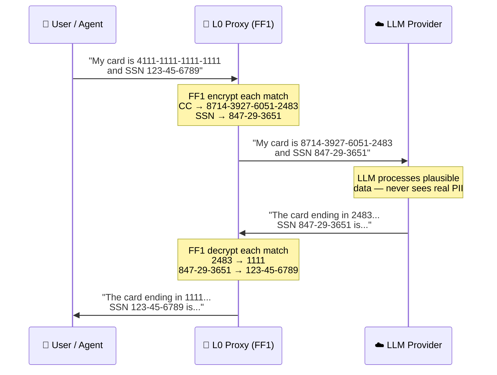

| PII Type | Radix | Encrypted Part | Preserved |
|----------|-------|----------------|-----------|
| Credit Card | 10 | 15-16 digits | Dash positions |
| SSN | 10 | 9 digits | Dash positions |
| Phone | 10 | 10+ digits | `+`, parens, spaces, dashes |
| Email | 36 | Local part | `@` + domain |
| API Key | 62 | Post-prefix body | Known prefix (`sk-`, `AKIA`...) |

**Algorithm:** FF1 per NIST SP 800-38G. FF3 is **WITHDRAWN** (SP 800-38G Rev 2, Feb 2025) — never used.

**Tweak strategy:** Per-record `request_uuid (16B) || SHA-256(json_path)[0..16]` — same PII value in different requests produces different ciphertexts, preventing frequency analysis.

## L0 vs L1 — Why Both?

| | L0 (Proxy) | L1 (Plugin) |
|---|------------|-------------|
| **Intercept point** | HTTP requests/responses to LLMs | Tool results within the host agent |
| **PII handling** | FPE encryption (reversible) | Redaction (destructive) |
| **Catches** | All LLM API traffic | Web scrapes, file reads, API outputs |
| **Bypass possible?** | No — all traffic must route through proxy | Only if the host agent skips the hook |
| **Runs in** | Standalone Rust binary | Host agent process (e.g., OpenClaw Node.js) |

Neither layer alone is sufficient:
- L0 can't see tool results (they're generated inside the host agent, never pass through HTTP)
- L1 can't intercept before LLM sees data (in OpenClaw, only `tool_result_persist` is wired, not `before_tool_call`)

## Data Flow

### Outbound (user → LLM)


### Inbound (LLM → user)

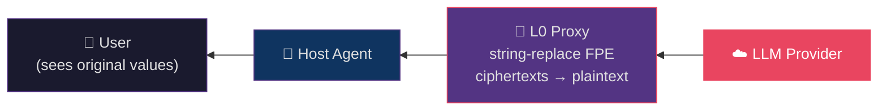

### Tool Results (agent tools → persistence)

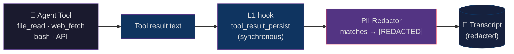

**Important:** OpenObscure never reads local files itself. The agent's tools perform all file I/O and produce text results. OpenObscure only sees the resulting text *after* the agent has already read and extracted it. L1 operates on text strings from tool outputs, not on files directly.

### File Access (agent → local files)

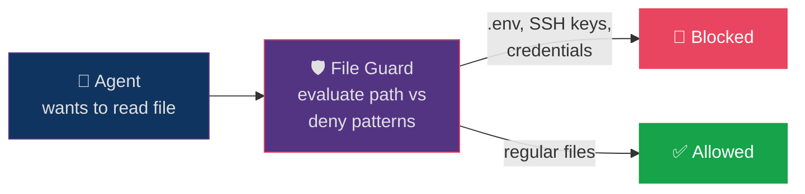

The File Access Guard is a **gate, not a parser** — it checks the file path before the agent reads the file, but the actual file I/O is always performed by the agent's tools.

## Authentication Model

**Passthrough-first** — OpenObscure is transparent to API authentication:

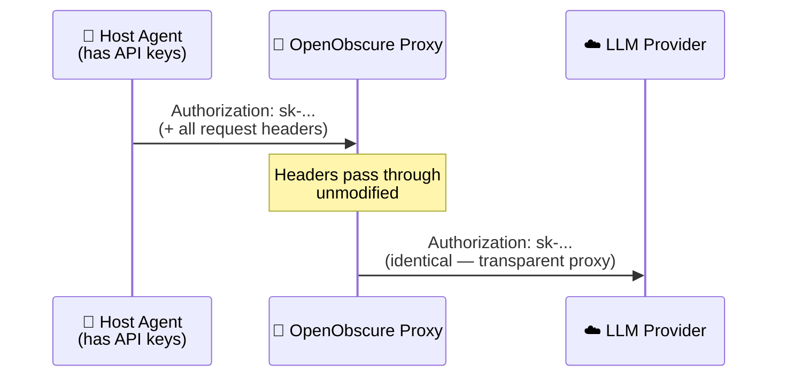

- All original request headers forwarded (except hop-by-hop per RFC 7230)
- Optional `override_auth = true` per provider injects keys from OS keychain
- FPE master key is separate — 32-byte AES-256 via `OPENOBSCURE_MASTER_KEY` env var (headless) or OS keychain (desktop), generated with `--init-key`

## Resource Budget

### Current (Phase 1 — text-only)

| Component | RAM | Storage |
|-----------|-----|---------|
| Rust PII Proxy (L0) | ~12MB | 2.7MB |
| Gateway Plugin (L1) | ~25MB | ~3MB |
| Encryption Layer (L2) | ~6MB | <1MB |
| Runtime overhead | ~15MB | — |
| **Total** | **~58MB** | **~7MB** |

### Target (Phase 4 — full stack)

| Component | RAM | Resident? |
|-----------|-----|-----------|
| L0 + L1 + L2 + runtime | 115MB | Always |
| TinyBERT INT8 NER | 55MB | Always |
| Health/child keyword dict | 2MB | Always |
| BlazeFace (face detection) | 8MB | On-demand |
| PaddleOCR-Lite (OCR) | 35MB | On-demand |
| Image buffer | 48MB | On-demand |
| **Peak** | **224MB** | — |
| **Hard ceiling** | **275MB** | — |

Storage ceiling: **62MB** (including all models, ONNX Runtime, config).

## PII Coverage Roadmap

| Phase | Coverage | What's Added |
|-------|----------|--------------|
| **Phase 1** (complete) | **78%** | Regex + FPE for structured PII (CC, SSN, phone, email, API keys) |
| **Phase 2** (complete) | **91%** | Hybrid scanner (NER/CRF + keywords), GDPR consent, health monitoring, nested JSON, code fences |
| **Phase 2.5** (complete) | **91%** | Unified logging, PII scrub layer, mmap crash buffer, GDPR audit log, file rotation |
| **Phase 3** (complete) | **95%** | Visual PII (face blur, OCR text extraction, EXIF strip, screenshot detection, platform logging) |
| **Phase 4** (complete) | **97%** | Cross-border routing, memory governance, breach detection, compliance CLI |
| **Phase 5** (complete) | **97%** | FPE key rotation, SSE streaming, PII benchmark corpus (~400 samples, 100% recall), production benchmarks (criterion) |
| **Phase 6** (complete) | **97%** | Ensemble confidence voting (cluster-based overlap resolution + agreement bonus), architecture cleanup (3-layer) |
| **Phase 7** (complete) | **97%** | Cross-platform support (Windows, Linux ARM64), mobile library API (iOS + Android via UniFFI), Embedded deployment model |

## Project Layout

```
OpenObscure/
├── ARCHITECTURE.md              ← this file (system-level architecture)
├── session-notes/               Per-session implementation logs
├── scripts/
│   ├── download_models.sh       Download ONNX models for image pipeline
│   ├── generate_screenshot.py   Generate synthetic PII screenshot for demos
│   ├── build_ios.sh             Build iOS static library + XCFramework
│   └── build_android.sh         Build Android shared library via cargo-ndk
├── docs/examples/images/        Before/after visual PII examples
├── openobscure-proxy/             L0: Rust PII proxy
│   ├── ARCHITECTURE.md          L0 architecture details
│   ├── LICENSE_AUDIT.md         Dependency license audit
│   ├── src/                     Rust source (32 modules + integration tests)
│   ├── examples/                Demo binaries (demo_image_pipeline)
│   ├── models/                  ONNX models (git-ignored, download via script)
│   ├── config/openobscure.toml    Default configuration
│   └── install/                 Process watchdog templates (launchd, systemd)
├── openobscure-crypto/            L2: Encryption layer
│   ├── ARCHITECTURE.md          L2 architecture details
│   ├── LICENSE_AUDIT.md         Dependency license audit
│   └── src/                     Rust source (KDF, cipher, store)
├── review-notes/                Architecture review analysis & responses
├── openobscure-plugin/            L1: Gateway plugin
│   ├── ARCHITECTURE.md          L1 architecture details
│   ├── LICENSE_AUDIT.md         Dependency license audit
│   └── src/                     TypeScript source (redactor, file-guard, consent, heartbeat, oo-log, memory-governance)
└── project-plan/
    ├── MASTER_PLAN.md           Full design reference (single source of truth)
    ├── PHASE1_PLAN.md           Phase 1 plan (COMPLETE — 75 tests)
    ├── PHASE2_PLAN.md           Phase 2 plan (COMPLETE — 193 tests)
    ├── PHASE3_PLAN.md           Phase 3 plan (COMPLETE — 319 tests)
    ├── PHASE4_PLAN.md           Phase 4 plan (COMPLETE — 376 tests)
    ├── PHASE5_PLAN.md           Phase 5 plan (COMPLETE — 399 tests)
    ├── PHASE6_PLAN.md           Phase 6 plan (COMPLETE — 418 tests)
    ├── PHASE7_PLAN.md           Phase 7 plan (COMPLETE — 431 tests)
    ├── PHASE8_PLAN.md           Phase 8 plan (future work)
    └── LOGGING_STRATEGY.md      Platform-specific logging strategy
```

## Key Design Decisions

| Decision | Rationale |
|----------|-----------|
| FF1 only, never FF3 | FF3 withdrawn by NIST (SP 800-38G Rev 2, Feb 2025) |
| Fail-open default | Proxy must never block AI functionality due to FPE edge cases |
| Vault unavailable → 503 | No privacy guarantees without FPE key — blocking is correct |
| Passthrough-first auth | No duplicate key management; OpenObscure is transparent to the host agent |
| Per-record FPE tweaks | Prevents frequency analysis across requests |
| L1 redacts, not encrypts | Tool results are internal — redaction is simpler and guarantees removal |
| Synchronous hooks only | OpenClaw-specific: OpenClaw silently skips async hook returns |
| INT8 quantization mandatory | FP32 TinyBERT = ~200MB; INT8 = ~50MB — difference between fitting and OOM |
| On-demand model loading | Face + OCR models load/evict per image, saving ~43MB between images |
| Sequential model loading | Face model loaded/used/dropped before OCR model loaded — never both in RAM |
| Two-pass body processing | Images processed first (replaces base64 strings), then text PII (replaces substrings by offset) |
| EXIF strip via decode/encode | `image` crate loads pixels only, discarding all EXIF metadata — no explicit strip step |
| 960px image cap | A 12MP ARGB bitmap = 48MB; resizing before load prevents OOM |

## Host Agent Constraints (OpenClaw Reference)

Three critical OpenClaw-specific constraints that shaped OpenObscure's architecture. Other host agents may have different constraints:

1. **Only `tool_result_persist` is wired** — of OpenClaw's 14 defined hooks, only 3 have invocation sites. `before_tool_call`, `message_sending`, etc. are defined in TypeScript types but never called. This is why L0 (HTTP proxy) exists — it's the only way to intercept data *before* the LLM sees it.

2. **`tool_result_persist` is synchronous** — returning a Promise causes OpenClaw to silently skip the hook. All L1 processing must be synchronous.

3. **OpenClaw updates constantly** — 40+ security patches per release. OpenObscure modules touching internal APIs may break. Pin to known-good OpenClaw versions.

## Running

```bash
# Generate FPE key (first time only)
cd openobscure-proxy && cargo run -- --init-key

# Start proxy
cargo run -- -c config/openobscure.toml

# Run all tests
cd openobscure-proxy && cargo test          # 319 tests
cd openobscure-crypto && cargo test         # 16 tests
cd openobscure-plugin && npm test           # 96 tests
```

## Health Monitoring & User Experience

OpenObscure must be **invisible when working, clear when not**. Users should never wonder whether their PII is protected.

### OpenObscure States (from the user's perspective)

| State | What the user sees | What happens |
|-------|-------------------|--------------|
| **Active** | Nothing — AI works normally | L0 encrypts PII, L1 redacts tool results. Silent protection. |
| **Degraded** | Warning: "OpenObscure proxy is not responding — PII protection is disabled" | L1 detects L0 is down. Agent requests fail (no bypass). User is informed. |
| **Disabled** | Startup message: "OpenObscure is not enabled. PII will be sent in plaintext." | Host agent configured for direct LLM connections. No protection. |
| **Crashed** | Same as Degraded — L1 warns, requests fail | L0 process died. Crash marker written for diagnostics. |
| **OOM** | Warning: "OpenObscure ran out of memory and stopped" + crash marker | L0 killed by OS. L1 detects, warns. Crash marker includes memory stats. |
| **Recovering** | "OpenObscure proxy recovered from a previous crash" | L0 restarts, finds crash marker, logs recovery, resumes. |

### Design Principle

**Warn, don't block.** When L0 is down, L1 should warn the user clearly — but not prevent the host agent from functioning. The user decides whether to continue without protection. L0 being down already blocks LLM requests (traffic is routed through the proxy), so L1's role is **explanation**, not enforcement.

### Health Monitoring Architecture

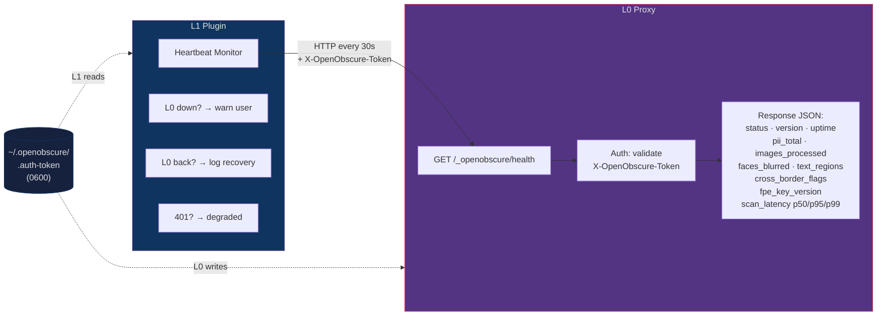

**Crash path:**

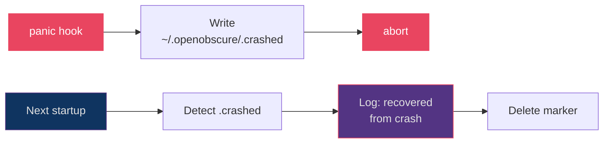

**Auth token handshake:** L0 generates a random 32-byte hex token on first startup, writes to `~/.openobscure/.auth-token` (file permissions 0600 on Unix). L1 reads this file and sends it as the `X-OpenObscure-Token` header with every health check. If the token is missing or wrong, L0 returns 401 Unauthorized. This prevents other localhost processes from querying or impersonating the health endpoint.

Token resolution (L0 startup): `OPENOBSCURE_AUTH_TOKEN` env var → `~/.openobscure/.auth-token` file → auto-generate and write.

| Component | What | Status |
|-----------|------|--------|
| `GET /_openobscure/health` endpoint | Returns status, version, uptime, PII stats. Auth-gated via `X-OpenObscure-Token`. | Complete |
| L1 heartbeat monitor | Pings health endpoint every 30s with auth token, warns user on failure | Complete |
| L0/L1 auth token | Shared via file (`~/.openobscure/.auth-token`) or env var. Auto-generated on first run. | Complete |
| Panic hook + crash marker | Writes `~/.openobscure/.crashed` before abort | Complete |
| Graceful shutdown logging | "OpenObscure proxy shutting down" on SIGTERM/SIGINT | Complete |
| Process watchdog (launchd/systemd) | Auto-restart L0 on crash via `install/launchd/` and `install/systemd/` templates | Complete |

## Logging Architecture (Phase 2.5)

All logging across both L0 (Rust) and L1 (TypeScript) uses a **unified facade API** — no direct `tracing::*!()` or `console.*` calls outside the logging module. This guarantees every log line passes through PII scrubbing and audit routing.

### L0 Logging Stack

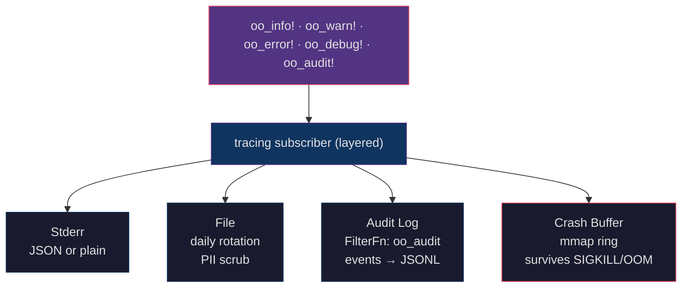

| Layer | Purpose | Config |
|-------|---------|--------|
| **Stderr** | Primary output, JSON or human-readable | `logging.json_output` |
| **PII scrub** | Regex-based scrub of SSN, CC, email, phone, API keys in log text | `logging.pii_scrub` (default: true) |
| **File rotation** | Daily rolling log files | `logging.file_path`, `max_file_size`, `max_files` |
| **Audit log** | GDPR audit trail — only `oo_audit!` events routed to separate JSONL | `logging.audit_log_path` |
| **Crash buffer** | mmap ring buffer (default 2MB) — kernel flushes pages even on hard crash | `logging.crash_buffer`, `crash_buffer_size` |

**Module tagging:** Every log line includes a `module` field (PROXY, SCANNER, HYBRID, FPE, VAULT, HEALTH, CONFIG, NER, CRF, BODY, SERVER, MAPPING) for structured filtering.

### L1 Logging Stack

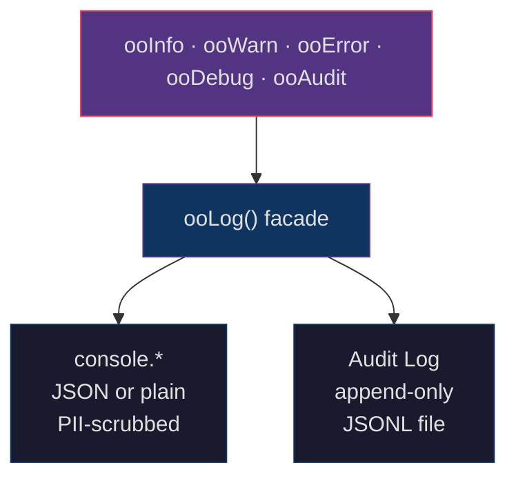

Module constants: REDACTOR, FILE_GUARD, CONSENT, PRIVACY, HEARTBEAT, PLUGIN, RETENTION.

All string fields are run through `redactPii()` before output — defense-in-depth ensures no PII leaks through log messages even if developers forget to sanitize.

---

## Image Pipeline (Phase 3)

L0 detects base64-encoded images in JSON request bodies (both Anthropic and OpenAI formats) and processes them before text PII scanning. For before/after visual examples of the pipeline in action, see [README.md — Visual PII Protection](README.md#visual-pii-protection).

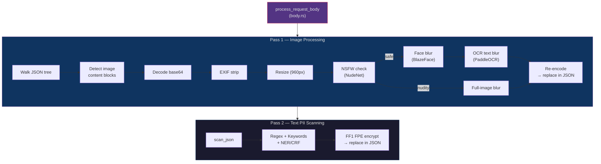

**Provider formats:**
- **Anthropic:** `{"type":"image","source":{"type":"base64","media_type":"image/png","data":"iVBOR..."}}`
- **OpenAI:** `{"type":"image_url","image_url":{"url":"data:image/png;base64,iVBOR..."}}`

**Key properties:**
- Images processed BEFORE text so byte offsets remain correct
- **Three-phase pipeline:** Phase 0 (NSFW check) → Phase 1 (face detection + blur) → Phase 2 (OCR text detection + blur)
- NSFW detection: if nudity found, blur entire image with heavy sigma=30 and skip face/OCR phases
- Face blur: if face occupies >80% of image area, blur entire image; otherwise selective blur with 15% padding
- Sequential model loading: models loaded/used/dropped one at a time (never multiple in RAM)
- EXIF metadata stripped implicitly — `image` crate loads pixels only, discarding all metadata
- Fail-open: corrupt base64, unsupported format, or model failure → forward original image unchanged
- Screenshot detection (EXIF software tags, screen resolution, status bar uniformity) flags images for aggressive text blur

**Models (on-demand, evicted after 300s idle):**

| Model | Size | RAM | Purpose |
|-------|------|-----|---------|
| NudeNet 320n | ~12MB | ~20MB | NSFW/nudity detection (YOLOv8n, 320x320 input) |
| BlazeFace short-range | ~408KB | ~8MB | Face detection (128x128 input, NMS) |
| PaddleOCR det | ~2.4MB | ~15MB | Text region detection |
| PaddleOCR rec | ~7.8MB | ~20MB | Character recognition (Tier 2 only) |

**Two OCR tiers:**
- **Tier 1 (default):** Detect text regions → blur all. No recognition model needed.
- **Tier 2:** Detect → recognize → scan text for PII → selectively blur PII regions only.

---

## Threat Model

OpenObscure is designed for open-source distribution. Security follows **Kerckhoffs's principle** — the system is secure even when all source code, documentation, and algorithms are public. Security depends entirely on the secrecy of keys, never on code obscurity.

### What OpenObscure Protects Against

| Threat | Protection | Layer |
|--------|-----------|-------|
| PII leaking to LLM providers in API requests | FF1 FPE encryption of structured PII before request leaves device | L0 |
| Visual PII in images (faces, text, EXIF) | NSFW full-image blur, face blur, OCR text blur, EXIF metadata stripping on base64 images | L0 |
| PII persisted in tool result transcripts | Regex redaction of PII in tool outputs before persistence | L1 |
| Agent reading sensitive local files (.env, SSH keys) | File path deny-list blocking before read | L1 |
| Transcript exposure from storage compromise | AES-256-GCM encryption at rest with Argon2id KDF | L2 |
| Frequency analysis of FPE ciphertexts | Per-record tweaks (UUID + JSON path hash) produce unique ciphertexts for identical inputs | L0 |
| API key exposure via proxy | Passthrough-first — keys are never stored or logged by OpenObscure (unless user opts into vault override) | L0 |

### What OpenObscure Does NOT Protect Against

| Threat | Why | Mitigation |
|--------|-----|------------|
| **Compromised OS / root access** | Attacker with root can read process memory, dump OS keychain, intercept localhost traffic. No userspace software can defend against this. | OS-level security (disk encryption, patching, access controls) |
| **Compromised OpenClaw process** | If OpenClaw's Node.js process is hijacked, the attacker can bypass L1 hooks, read API keys from memory, and send direct HTTP requests bypassing L0. | OpenClaw integrity (version pinning, dependency auditing) |
| **Semantic PII not covered by regex** (Phase 1) | Names, addresses, health conditions bypass regex. "Tell John about my diabetes" passes through unencrypted. | Phase 2 TinyBERT NER closes this gap (~91% coverage) |
| **PII in tool results sent to LLM** | L1 hooks `tool_result_persist` (after LLM sees data), not `before_tool_call`. Tool result PII reaches the LLM before L1 can redact it. | OpenClaw limitation — when `before_tool_call` is wired, L1 upgrades to pre-LLM enforcement |
| **Side-channel attacks on FPE** | Timing analysis of FF1 encrypt/decrypt could theoretically leak information. | AES-NI hardware acceleration provides constant-time operations on supported CPUs |
| **Model extraction from ONNX** (Phase 2+) | NER model weights are readable from the ONNX file. | Not a concern — the model detects PII patterns, it doesn't contain user data. Knowing the model helps craft evasion, but NER is supplementary to regex, not a sole defense |

### Secrets Inventory

All runtime secrets live in the **OS keychain** or (for headless environments) environment variables. Never in source code or config files:

| Secret | Format | Where | Generated |
|--------|--------|-------|-----------|
| FPE master key | 32 bytes (AES-256) | `OPENOBSCURE_MASTER_KEY` env var (64 hex chars) **or** OS keychain (`openobscure/fpe-key`). Env var takes priority. | `--init-key` with `OsRng` |
| L0/L1 auth token | 32 bytes (hex string) | `OPENOBSCURE_AUTH_TOKEN` env var **or** `~/.openobscure/.auth-token` file (0600). Auto-generated on first run. | `OsRng` at startup |
| Vault API keys (optional) | String | OS keychain (`openobscure/<provider>`) | User-provided |
| Transcript passphrase | User-provided string | Never stored — entered at runtime | User-chosen |

**Key compromise impact:**
- FPE key compromised → all FPE ciphertexts are decryptable (but attacker needs both the key AND the ciphertexts, which exist only in LLM provider logs)
- Transcript passphrase compromised → stored transcripts are decryptable (but attacker needs physical access to encrypted files on disk)
- Both require separate attacks — compromising one does not compromise the other

### Open-Source Security Considerations

Publishing source code does **not** weaken OpenObscure's security posture:

1. **Algorithms are public standards** — FF1 (NIST SP 800-38G), AES-256-GCM, Argon2id are all published, peer-reviewed algorithms. Security never depended on algorithm secrecy.

2. **Regex patterns are standard** — Credit card (Luhn), SSN (range validation), phone, email, and API key patterns are well-known. An attacker doesn't need source code to guess them.

3. **File deny list is defense-in-depth** — Even if an attacker knows which paths are blocked, the deny list supplements (not replaces) OS-level file permissions.

4. **NER models are not secrets** — The TinyBERT model detects PII patterns; it doesn't contain user data. An attacker could study the model to craft evasion inputs, but NER is layered on top of regex, not a sole defense.

5. **Community audit is a net positive** — Cryptographic implementations benefit from public scrutiny. Bugs found by the community are bugs that don't become exploits.

### Attack Surface Reduction

- **Localhost-only binding** — L0 proxy listens on `127.0.0.1:18790`, not `0.0.0.0`. Not network-accessible.
- **Health endpoint auth** — `/_openobscure/health` requires `X-OpenObscure-Token` header. Prevents other localhost processes from querying or impersonating L0.
- **No telemetry** — Zero outbound connections beyond forwarded LLM requests.
- **No default credentials** — FPE key must be explicitly generated. No fallback "demo mode" keys. Auth token auto-generated with secure random on first run.
- **No admin interface** — compliance CLI generates reports on-demand, no web server or persistent UI.
- **Minimal dependencies** — Rust binary has no runtime dependency beyond libc. Plugin uses better-sqlite3 for consent storage.
- **Memory-safe language** — L0 and L2 are Rust (no buffer overflows, use-after-free, or memory corruption).

---

## FAQ

**Does OpenObscure read local files to scan for PII?**
No. OpenObscure never performs file I/O. The agent's tools (file_read, web_fetch, etc.) read files and produce text results. OpenObscure's L1 plugin only sees the resulting text after the agent has extracted it, via the tool result persistence hook. The File Access Guard checks file *paths* before reads, but doesn't touch the files themselves.

**Does OpenObscure need its own API keys?**
No. By default, OpenObscure forwards the host agent's existing API keys unchanged (passthrough-first). It never provisions, generates, or requires separate LLM credentials. The optional `override_auth` feature allows users to place separate keys in the OS keychain for specific providers, but this is off by default and entirely user-controlled.

**Does OpenObscure phone home or contact external servers?**
No. The only network traffic OpenObscure produces is forwarding the host agent's existing LLM API requests through the local proxy. No telemetry, no update checks, no external dependencies at runtime. Everything runs locally on the user's device.

**Is L0 (proxy) a separate server I need to host?**
No. L0 runs as a lightweight sidecar process on the same device as the host agent, listening on `127.0.0.1:18790` (localhost only). It's started alongside the agent — either automatically during installation or manually when the user enables OpenObscure. It's not exposed to the network.

**Is L2 (crypto) a separate process?**
No. L2 is a Rust library linked into the L0 proxy binary. It runs in the same process as L0, not as a separate service. There's no IPC overhead.

**Does OpenObscure intercept data *before* the LLM sees it?**
L0 (proxy) does — it sits in the HTTP path and encrypts PII before the request reaches the LLM provider. L1 (plugin) does not — it hooks the agent's tool result persistence (e.g., OpenClaw's `tool_result_persist`), which fires *after* tool execution. L1 prevents PII from being persisted to transcripts, but cannot prevent it from being sent to the LLM via tool results. This is a host agent limitation — in OpenClaw, only 3 of 14 hooks are wired. When the host agent supports pre-execution hooks (e.g., OpenClaw's `before_tool_call`), L1 will upgrade to pre-LLM enforcement.

**How much RAM does OpenObscure actually use?**
It depends on which phase is deployed. Phase 1: ~58MB. Phase 2 (+NER): ~140MB. Phase 3 (+vision): ~224MB peak during image processing, ~140MB baseline. Phase 4 (+compliance CLI): same peak — CLI tools run on-demand and add negligible RAM. The 275MB ceiling is the hard limit for the full stack across all phases.

**What happens if OpenObscure is disabled or crashes?**
If L0 is not running, the host agent can't reach LLM providers (traffic is configured to route through the proxy). If L1 crashes, the agent continues normally but tool results won't be redacted. If OpenObscure is fully disabled via configuration, the agent operates with direct LLM connections — zero overhead.

## Future Architecture Changes

Planned (Phase 8):
- **L1 Rust rewrite** — port consent manager, file access guard, and memory governance from TypeScript to Rust so the Embedded Model gets full governance on mobile
- **CI/CD matrix** — GitHub Actions cross-platform build verification (macOS, Linux, Windows, iOS sim, Android NDK)
- **ONNX Runtime mobile** — pre-built ORT for iOS (CoreML EP) and Android (NNAPI EP), `.ort` format models
- **UniFFI binding generation** — automated Swift/Kotlin binding generation in CI
- **SCRFD upgrade** — SCRFD-2.5GF for multi-scale face detection on screenshots with mixed-size faces

Potential future enhancements (not scheduled):
- FastText language detection for multilingual PII
- GLiNER NER upgrade for 16GB+ devices
- Real-time breach monitoring (rolling window in proxy, vs current batch CLI)
- Voice anonymization (~200MB model, high-resource devices only)
