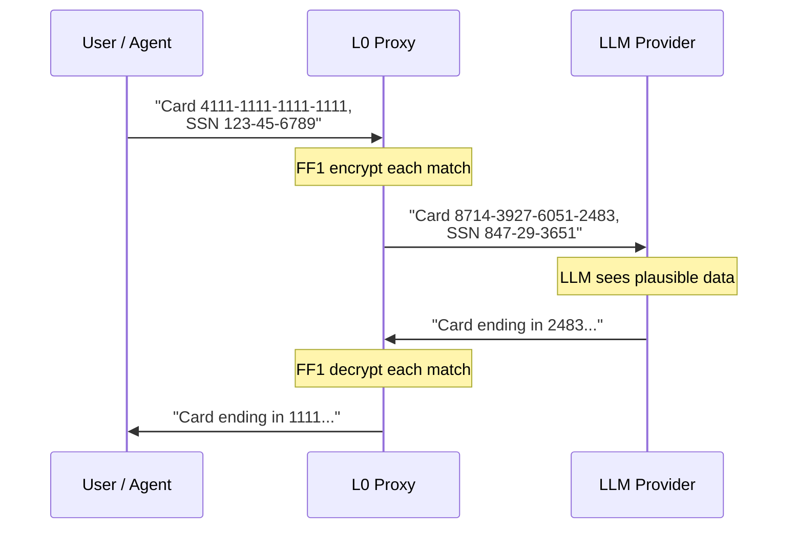
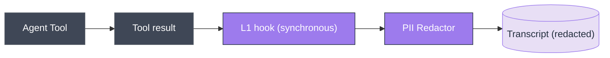
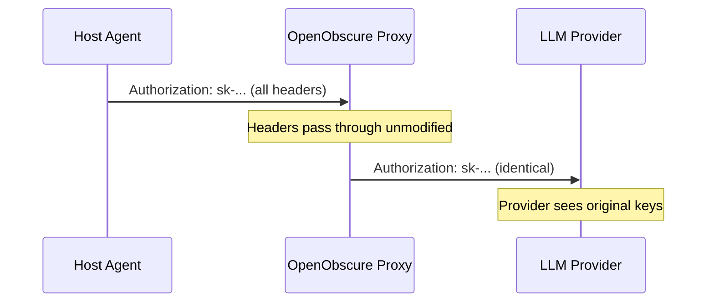

# OpenObscure — System Architecture

> Privacy firewall for AI agents. Works with any LLM-powered agent. Reference integration: [OpenClaw](https://github.com/openclaw/openclaw), the open-source AI assistant.

---

## What OpenObscure Does

Every message, tool result, and file a user shares with an AI agent gets sent to third-party LLM APIs in plaintext — credit cards, health discussions, API keys, children's information, photos. OpenObscure prevents this by intercepting data at multiple layers, encrypting or redacting PII before it leaves the device.

## Deployment Models

OpenObscure runs **entirely on the user's device** — no remote servers, no cloud components, no separate infrastructure. It supports two deployment models depending on where the AI agent runs.

### Gateway Model (Desktop / Server)

The full-featured deployment. OpenObscure runs as a **sidecar HTTP proxy** on the same host as the AI agent's Gateway. Both layers are active.


| Component | Process | How it runs |
|-----------|---------|-------------|
| **L0** (Rust proxy) | Standalone binary | Separate process, started as sidecar alongside the host agent. |
| **L1** (TS plugin) | In-process | Loaded into the host agent's runtime (e.g., OpenClaw's Node.js via plugin SDK) or used as a library. |

**Supported platforms:** macOS (Apple Silicon), Linux (x64 + ARM64), Windows (x64).

**Activation:**
1. **At install time** — The host agent's bundler includes OpenObscure and activates it during setup (if user opts in). OpenClaw supports this via its plugin SDK.
2. **Post-install** — User enables OpenObscure by configuring the host agent to route API traffic through `127.0.0.1:18790` instead of directly to LLM providers, and installs the L1 plugin into the agent's extensions directory (e.g., OpenClaw's `extensions/`)

When disabled, the host agent operates normally with direct LLM connections — OpenObscure adds zero overhead when not active.

### Embedded Model (Mobile / Library)

For mobile apps and custom integrations, OpenObscure compiles as a **native library** (`.a` for iOS, `.so` for Android) linked directly into the host application. No HTTP server, no sockets — just function calls via UniFFI-generated Swift/Kotlin bindings.


| Component | What | How it runs |
|-----------|------|-------------|
| **L0** (Rust library) | `OpenObscureMobile` API | Linked into host app binary. PII scan + FPE encrypt/decrypt + image pipeline + response integrity (cognitive firewall). FPE key provided by host app's native secure storage (iOS Keychain / Android Keystore). |

**Supported platforms:** iOS (aarch64 device + simulator), Android (arm64-v8a, armeabi-v7a, x86_64, x86).

**API surface:**

| Function | What it does |
|----------|-------------|
| `OpenObscureMobile::new(config, fpe_key)` | Initialize scanner + FPE engine with host-provided key |
| `sanitize_text(text)` | Scan for PII, encrypt with FPE, return sanitized text + mapping |
| `restore_text(text, mapping)` | Decrypt FPE values in response text using saved mapping |
| `sanitize_image(bytes)` | Face redact + OCR text redact + NSFW redact + EXIF strip (optional, adds ~20MB) |
| `sanitize_audio_transcript(text)` | Scan speech transcript for PII, return sanitized text + mapping |
| `check_audio_pii(text)` | Quick PII count in audio transcript (no encryption) |
| `scan_response(text)` | Scan LLM response for persuasion/manipulation (cognitive firewall, Full/Standard tier) |
| `rotate_key(new_key)` | Rotate FPE key with 30-second overlap window for in-flight mappings |
| `stats()` | PII counts, scanner mode, image pipeline status, device tier |

**Third-party integration:** OpenObscure can be embedded into any iOS/macOS/Android chat app. Tested integrations include [Enchanted](https://github.com/AugustDev/enchanted) (iOS/macOS Ollama client) and [RikkaHub](https://github.com/rikkahub/rikkahub) (Android multi-provider LLM client). See [INTEGRATION_GUIDE.md](integration/INTEGRATION_GUIDE.md) for step-by-step instructions.

**Key differences from Gateway Model:**
- No HTTP server (axum/tokio not compiled in)
- FPE key passed from host app (no OS keychain access on mobile)
- Hardware auto-detection (`auto_detect: true` default) profiles device RAM and selects features automatically — phones with 8GB+ RAM get full NER + ensemble + image pipeline + cognitive firewall, matching gateway efficacy
- `models_base_dir` config field simplifies model path setup — point to a single directory and individual `*_model_dir` fields are auto-resolved from standard subdirectories (`ner/`, `ner_lite/`, `crf/`, `scrfd/`, `blazeface/`, `ocr/`, `nsfw/`, `nsfw_classifier/`, `ri/`)
- Image pipeline and cognitive firewall default to enabled (`image_enabled: true`, `ri_enabled: true`); device budget gates actual activation — without model files on disk these are no-ops
- Response integrity (cognitive firewall) available on Full/Standard tier — R1 dictionary always, R2 classifier if model provided; R2 Discover role suppressed (matches gateway behavior)
- All features tier-gated via `FeatureBudget` — `gazetteer_enabled`, `keywords_enabled`, `ner_pool_size` all budget-gated (not just config defaults)
- FPE key rotation with 30-second overlap window via `rotate_key()` — matches gateway `KeyManager` semantics
- Per-match FPE tweaks (byte offset) prevent frequency analysis within a single request
- Name gazetteer enabled by default (embedded name lists, no model files needed)
- Screenshot detection via EXIF + resolution heuristics when `screen_guard` budget flag is enabled
- OCR Tier 2 uses full HybridScanner (NER + regex + keywords) for text in images

### Defense in Depth: Both Models Together

In the OpenClaw architecture, **both models can run simultaneously**. The mobile app sanitizes PII before it reaches the Gateway (Embedded Model), and the Gateway sanitizes again before forwarding to LLM providers (Gateway Model). Double protection for mobile-originated data:


### API Keys & External Connections

OpenObscure does **not** have its own LLM credentials and does **not** initiate its own API calls.

- **Gateway Model:** Passthrough-first — forwards the host agent's API keys unchanged.
- **Embedded Model:** No API calls at all — the library sanitizes text/images and returns results. The host app handles all networking.

The only network activity OpenObscure produces (Gateway Model only) is forwarding the host agent's existing LLM requests through the local proxy. No telemetry, no phone-home, no external dependencies at runtime.

## Two-Layer Defense-in-Depth


## Language Choices

| Layer | Language | Why |
|-------|----------|-----|
| **L0 Proxy** | Rust | Sits in the hot path of every LLM request — low latency and predictable memory are non-negotiable. Rust's ownership model enforces the 275MB RAM ceiling without GC pauses. ONNX model inference (face detection, OCR, NER) and audio keyword spotting require efficient memory management with multiple models loaded simultaneously. Cross-compiles to mobile targets (iOS/Android) via UniFFI-generated Swift/Kotlin bindings. |
| **L1 Plugin** | TypeScript | Runs in-process inside the host agent's runtime. OpenClaw (primary integration) is Node.js/TypeScript — same language means direct hook access (`tool_result_persist`, `before_tool_call`) with no FFI or IPC overhead. When `@openobscure/scanner-napi` is installed, auto-upgrades to the Rust HybridScanner for 15-type detection without requiring L0. Falls back to regex-only otherwise. |
| **L2 Storage** | Rust | Shares the L0 crate ecosystem. AES-256-GCM encryption and Argon2id KDF benefit from Rust's constant-time cryptography crates. |

**Design principle:** L0 is Rust because it's a performance-critical network proxy with ML models. L1 is TypeScript because it must speak the host agent's language. Each layer uses the right tool for its job — not a single language forced across both.

## Layer Details

### L0 — Rust PII Proxy (`openobscure-proxy/`)

The **hard enforcement** layer. Sits between the host agent and LLM providers as an HTTP reverse proxy. Every API request passes through it — there is no bypass path.

| Aspect | Detail |
|--------|--------|
| **What it does** | **Request path:** Scans JSON request bodies for PII via hybrid scanner (regex → keywords → NER/CRF) with ensemble confidence voting, encrypts matches with FF1 FPE. Processes base64-encoded images (face solid-fill redaction, OCR text solid-fill redaction, NSFW solid-fill redaction, EXIF strip). Handles nested/escaped JSON strings and respects markdown code fences. **Response path:** Decrypts FPE ciphertexts in responses (SSE streaming supported). Scans for persuasion/manipulation techniques (response integrity cognitive firewall) and optionally prepends warning labels (EU AI Act Article 5 compliance). |
| **What it catches** | Structured: credit cards (Luhn), SSNs (range-validated), phones, emails, API keys. Network/device: IPv4 (rejects loopback/broadcast), IPv6 (full + compressed), GPS coordinates (4+ decimal precision), MAC addresses (colon/dash/dot). Multilingual: national IDs (DNI, NIR, CPF, My Number, Citizen ID, RRN) with check-digit validation for 9 languages. Semantic: person names, addresses, orgs (NER/CRF). Health/child keyword dictionary (~700 terms, multilingual). Visual: nudity (NudeNet ONNX), faces in photos — solid-color fill redaction (SCRFD-2.5GF on Full/Standard, Ultra-Light RFB-320 on Lite), text in screenshots/images (PaddleOCR PP-OCRv4 ONNX). Audio: KWS keyword spotting via sherpa-onnx Zipformer (~5MB INT8) detects PII trigger phrases and strips matching audio blocks (`voice` feature). |
| **Auth model** | Passthrough-first — forwards the host agent's API keys unchanged |
| **Key management** | FPE master key: `OPENOBSCURE_MASTER_KEY` env var (64 hex chars) or OS keychain via `keyring`. Env var takes priority (headless/Docker/CI). |
| **Content-Type** | Only scans JSON bodies. Binary, text, multipart pass through unchanged |
| **Fail mode** | Configurable fail-open (default) or fail-closed. Vault unavailable always blocks (503) |
| **Logging** | Unified `oo_*!()` macro API, PII scrub layer, mmap crash buffer, file rotation, platform logging (OSLog/journald) |
| **Stack** | Rust, axum 0.8, hyper 1, tokio, fpe 0.6 (FF1), ort (ONNX Runtime), image 0.25, whatlang 0.16, keyring 3, clap 4 (CLI) |
| **CLI** | Subcommands: `serve` (default), `key-rotate`, `passthrough`, `service {install,start,stop,status,uninstall}` |
| **Resource** | Tier-dependent: ~12MB (Lite/regex-only), ~67MB (Standard/NER), ~224MB peak (Full/image processing); 2.7MB binary |
| **Tests** | 1,723 (765 lib + 958 bin) |
| **Deployment** | Gateway Model: standalone binary. Embedded Model: static/shared library with UniFFI bindings (Swift/Kotlin). |
| **Docs** | [openobscure-proxy/ARCHITECTURE.md](openobscure-proxy/ARCHITECTURE.md) |

### L1 — Gateway Plugin (`openobscure-plugin/`)

The **second line of defense**. Runs in-process with the host agent. Catches PII that enters through tool results (web scraping, file reads, API responses) — data that never passes through the HTTP proxy.

| Aspect | Detail |
|--------|--------|
| **What it does** | Hooks the host agent's tool result persistence (e.g., OpenClaw's `tool_result_persist`) to scan and redact PII in tool outputs. Three detection paths (auto-selected): **(1)** Native NAPI addon (`@openobscure/scanner-napi`) — 15-type Rust HybridScanner in-process, no L0 needed; **(2)** NER-enhanced via `POST /_openobscure/ner` — semantic NER + regex merge when L0 is healthy; **(3)** JS regex fallback — 5 structured types. Prepared `before_tool_call` handler activates when host agent supports it. Provides L0 heartbeat monitor with auth token validation and unified logging API (`ooInfo`/`ooWarn`/`ooAudit`). |
| **PII handling** | Native addon (15 types, in-process), NER-enhanced via L0 (when active), or regex-only (`[REDACTED]`) — always redaction, not FPE, since tool results are internal |
| **Heartbeat** | Pings L0 `/_openobscure/health` every 30s with `X-OpenObscure-Token` auth header. Warns user when L0 is down, logs recovery. |
| **Hook model** | Synchronous — must not return a Promise. OpenClaw-specific: OpenClaw silently skips async hooks. Prepared `before_tool_call` handler (hard enforcement) activates automatically when wired upstream. |
| **Logging** | Unified `ooInfo/ooWarn/ooError/ooDebug/ooAudit` API with PII scrubbing, JSON output |
| **Stack** | TypeScript 5.4, CommonJS |
| **Resource** | ~25MB RAM (within the host agent's process), ~3MB storage |
| **Tests** | 112 (22 suites: redactor, heartbeat, state-messages, oo-log, PII scrubbing, audit log, modules, NER-enhanced redaction, before-tool-call, cognitive dictionary, parity, tokenizer, category detection, overlap, offsets, multi-category, severity, warning label, edge cases, severity boundaries, label format, scanPersuasion) |
| **Docs** | [openobscure-plugin/ARCHITECTURE.md](openobscure-plugin/ARCHITECTURE.md) |

**Process watchdog** (install templates):
- macOS: launchd plist with `KeepAlive` + `ThrottleInterval`
- Linux: systemd unit with `Restart=on-failure` + `MemoryMax=275M`

## How FPE Works

Format-Preserving Encryption transforms plaintext into ciphertext of **identical format**. The LLM sees plausible-looking data instead of `[REDACTED]`, preserving conversational context.



| PII Type | Radix | Encrypted Part | Preserved |
|----------|-------|----------------|-----------|
| Credit Card | 10 | 15-16 digits | Dash positions |
| SSN | 10 | 9 digits | Dash positions |
| Phone | 10 | 10+ digits | `+`, parens, spaces, dashes |
| Email | 36 | Local part | `@` + domain |
| API Key | 62 | Post-prefix body | Known prefix (`sk-`, `AKIA`...) |
| IPv4 Address | 10 | Digit octets | Dot positions |
| IPv6 Address | 16 | Hex groups (lowercase) | Colon positions, `::` structure |
| GPS Coordinate | 10 | Lat+lon digits together | Signs, dots, comma, space |
| MAC Address | 16 | 12 hex chars (lowercase) | Colon/dash/dot positions |
| IBAN | 36 | BBAN (post-country digits+letters) | 2-letter country prefix |

**Algorithm:** FF1 per NIST SP 800-38G. FF3 is **WITHDRAWN** (SP 800-38G Rev 2, Feb 2025) — never used.

**Tweak strategy:** Per-record `request_uuid (16B) || SHA-256(path)[0..16]` — same PII value in different requests produces different ciphertexts, preventing frequency analysis. Gateway uses JSON path (e.g., `$.messages[0].content`); embedded uses match byte offset (e.g., `m:42`).

## L0 vs L1 — Why Both?

| | L0 (Proxy) | L1 (Plugin) |
|---|------------|-------------|
| **Intercept point** | HTTP requests/responses to LLMs | Tool results within the host agent |
| **PII handling** | FPE encryption (reversible) | Redaction (destructive) |
| **Catches** | All LLM API traffic | Web scrapes, file reads, API outputs |
| **Bypass possible?** | No — all traffic must route through proxy | Only if the host agent skips the hook |
| **Runs in** | Standalone Rust binary | Host agent process (e.g., OpenClaw Node.js) |

Neither layer alone is sufficient:
- L0 can't see tool results (they're generated inside the host agent, never pass through HTTP)
- L1 can't intercept before LLM sees data (in OpenClaw, only `tool_result_persist` is wired, not `before_tool_call`)

## Data Flow

### Outbound (user → LLM)


### Inbound (LLM → user)


### Tool Results (agent tools → persistence)



**Important:** OpenObscure never reads local files itself. The agent's tools perform all file I/O and produce text results. OpenObscure only sees the resulting text *after* the agent has already read and extracted it. L1 operates on text strings from tool outputs, not on files directly.

## Authentication Model

**Passthrough-first** — OpenObscure is transparent to API authentication:



- All original request headers forwarded (except hop-by-hop per RFC 7230)
- FPE master key is separate — 32-byte AES-256 via `OPENOBSCURE_MASTER_KEY` env var (headless) or OS keychain (desktop), generated with `--init-key`

## Resource Budget

OpenObscure uses **hardware capability detection** (`device_profile` module) to select features at startup. It detects RAM, classifies a tier, and derives a feature budget.

| Device RAM | Tier | Key Features | Max RAM |
|------------|------|-------------|---------|
| 8GB+ | **Full** | NER + CRF + ensemble + image + cognitive firewall | 275MB |
| 4–8GB | **Standard** | NER + CRF + image + cognitive firewall (R1 only) | 200MB |
| <4GB | **Lite** | NER + CRF + image (shorter timeouts) | 80MB |

Embedded budgets scale proportionally (20% of device RAM, clamped to [12MB, 275MB]). See `openobscure-proxy/src/device_profile.rs` for full tier logic and per-component breakdown.

## PII Coverage Roadmap

| Phase | Coverage | What's Added |
|-------|----------|--------------|
| **Phase 1** (complete) | **78%** | Regex + FPE for structured PII (CC, SSN, phone, email, API keys) |
| **Phase 2** (complete) | **91%** | Hybrid scanner (NER/CRF + keywords), health monitoring, nested JSON, code fences |
| **Phase 2.5** (complete) | **91%** | Unified logging, PII scrub layer, mmap crash buffer, file rotation |
| **Phase 3** (complete) | **95%** | Visual PII (face redaction, OCR text extraction, EXIF strip, screenshot detection, platform logging) |
| **Phase 5** (complete) | **97%** | SSE streaming, PII benchmark corpus (~400 samples, 100% recall), production benchmarks (criterion) |
| **Phase 6** (complete) | **97%** | Ensemble confidence voting (cluster-based overlap resolution + agreement bonus) |
| **Phase 7** (complete) | **97%** | Cross-platform support (Windows, Linux ARM64), mobile library API (iOS + Android via UniFFI), Embedded deployment model |
| **Post-Phase 7** (complete) | **98%** | Network/device identifier detection (IPv4, IPv6, GPS coordinates, MAC addresses) — closes PII-06 + PII-12 |
| **Phase 8** (complete) | **98%** | Production hardening — CI/CD matrix, mobile API gaps (breach detect, SIEM export, encrypted storage), governance feature flags |
| **Post-Phase 8** (complete) | **99%** | Tier-gated features — SCRFD-2.5GF face detection (Full/Standard), L1 NER via L0 endpoint, CoreML/NNAPI mobile EPs, PP-OCRv4 English OCR, 99.7% recall |
| **Phase 9** (complete) | **99%** | Runtime hardware capability detection — device profiler auto-selects features based on RAM; mobile devices with 8GB+ get full NER + ensemble parity with gateway |
| **Phase 10** (complete) | **99.5%** | Multilingual PII (9 languages, national ID validation), voice anonymization (KWS keyword spotting via sherpa-onnx Zipformer), mobile test apps (iOS + Android), UniFFI binding automation, TinyBERT fine-tuning dataset, OpenClaw `before_tool_call` preparation |
| **Phase R1** (complete) | **99.5%** | Response integrity cognitive firewall — persuasion/manipulation detection on LLM responses (7 categories, ~250 phrases), severity tiers (Notice/Warning/Caution), optional warning labels (EU AI Act Article 5), Anthropic + OpenAI format support |
| **Phase 11** (complete) | **99.5%** | SSE frame accumulation buffer (`SseAccumulator`), model pre-warming (`ReadinessState`), tier-aware body size limits, request/response FPE mapping module |
| **Phase 12** (complete) | **99.5%** | R2 cognitive firewall — TinyBERT FP32 multi-label classifier (4 EU AI Act Article 5 categories), R1→R2 cascade (Confirm/Suppress/Upgrade/Discover), first-window early exit, ONNX FP32 export (54.9 MB), macro P=80.9% R=74.5% F1=77.3% |
| **Phase 13** (partial) | **99.5%** | Embedded voice pipeline — platform speech APIs (iOS `SFSpeechRecognizer` + Android `SpeechRecognizer`), mobile audio transcript PII methods (`sanitizeAudioTranscript`/`checkAudioPii` via UniFFI), L1 cognitive firewall (JS persuasion dictionary, NAPI bridge), comprehensive testing (Tier 1-4 coverage) |
| **Phase 15** (complete) | **99.5%** | Ensemble NSFW classifier — ViT-tiny holistic model (Marqo/nsfw-image-detection-384) as Phase 0b fallback when NudeNet clean, multi-LLM response format detection (`response_format.rs`) |
| **Phase 19** (complete) | **99.5%** | Mobile parity — name gazetteer, per-match FPE tweaks, key rotation (30s overlap), OCR full scanner, screenshot detection, NER pool config, R2 Discover suppression, all features tier-gated via FeatureBudget |

## Project Layout

```
OpenObscure/
├── ARCHITECTURE.md              ← this file (system-level architecture)
├── setup/                       Setup guides (gateway proxy, embedded library, example config)
├── integration/                 Embedding in third-party apps (guide, diffs, templates)
├── build/                       Build scripts (iOS, Android, NAPI, model downloads, bindings)
├── test/                        Test apps (iOS/Android), PII corpus, test runners
├── openobscure-proxy/           L0: Rust PII proxy + embedded mobile library (see ARCHITECTURE.md inside)
├── openobscure-plugin/          L1: Gateway plugin (TypeScript, see ARCHITECTURE.md inside)
├── openobscure-crypto/          L2: Encrypted storage (AES-256-GCM + Argon2id)
├── openobscure-napi/            NAPI native scanner addon (Rust via napi-rs)
├── .github/workflows/           CI + release workflows
└── docs/examples/images/        Before/after visual PII examples
```

Each component folder contains its own `ARCHITECTURE.md` with module-level details.

## Key Design Decisions

| Decision | Rationale |
|----------|-----------|
| FF1 only, never FF3 | FF3 withdrawn by NIST (SP 800-38G Rev 2, Feb 2025) |
| Fail-open default | Proxy must never block AI functionality due to FPE edge cases |
| Vault unavailable → 503 | No privacy guarantees without FPE key — blocking is correct |
| Passthrough-first auth | No duplicate key management; OpenObscure is transparent to the host agent |
| Per-record FPE tweaks | Prevents frequency analysis across requests |
| L1 redacts, not encrypts | Tool results are internal — redaction is simpler and guarantees removal |
| Synchronous hooks only | OpenClaw-specific: OpenClaw silently skips async hook returns |
| INT8 quantization for NER | FP32 TinyBERT NER = ~200MB; INT8 = ~50MB — difference between fitting and OOM. R2 uses FP32 (see below) |
| FP32 for R2, not INT8 | INT8 dynamic quantization produced 7.45 max logit error — too much accuracy loss for multi-label classification. FP32 is accurate (0.000013 max diff) at 54.9 MB |
| R1→R2 cascade | R1 is <1ms (dictionary). R2 is ~30ms (ONNX). Cascade avoids R2 overhead on clean responses at low/medium sensitivity |
| Interior mutability for R2 (`Mutex<Option<RiModel>>`) | R2 ONNX session needs `&mut self`. Mutex allows `scan(&self)` on Arc-shared scanner across async request handlers |
| Solid-fill redaction (all regions) | Gaussian blur is partially reversible by AI deblurring models; solid color fill destroys original pixels completely, compresses better in base64, and clearly signals intentional redaction. Applied to faces, OCR text, and NSFW images. |
| On-demand model loading | Face + OCR models load/evict per image, saving ~43MB between images |
| Sequential model loading | Face model loaded/used/dropped before OCR model loaded — never both in RAM |
| Two-pass body processing | Images processed first (replaces base64 strings), then text PII (replaces substrings by offset) |
| EXIF strip via decode/encode | `image` crate loads pixels only, discarding all EXIF metadata — no explicit strip step |
| 960px image cap | A 12MP ARGB bitmap = 48MB; resizing before load prevents OOM |

## Host Agent Constraints (OpenClaw Reference)

Three critical OpenClaw-specific constraints that shaped OpenObscure's architecture. Other host agents may have different constraints:

1. **Only `tool_result_persist` is wired** — of OpenClaw's 14 defined hooks, only 3 have invocation sites. `before_tool_call`, `message_sending`, etc. are defined in TypeScript types but never called. This is why L0 (HTTP proxy) exists — it's the only way to intercept data *before* the LLM sees it.

2. **`tool_result_persist` is synchronous** — returning a Promise causes OpenClaw to silently skip the hook. All L1 processing must be synchronous.

3. **OpenClaw updates constantly** — 40+ security patches per release. OpenObscure modules touching internal APIs may break. Pin to known-good OpenClaw versions.

## Running

```bash
# Generate FPE key (first time only)
cd openobscure-proxy && cargo run -- --init-key

# Start proxy
cargo run -- -c config/openobscure.toml

# Run all tests
cd openobscure-proxy && cargo test
cd openobscure-plugin && npm test
```

## Health Monitoring & User Experience

OpenObscure must be **invisible when working, clear when not**.

| State | What the user sees | What happens |
|-------|-------------------|--------------|
| **Active** | Nothing — AI works normally | L0 encrypts PII, L1 redacts tool results. Silent protection. |
| **Degraded** | Warning: "proxy is not responding — PII protection is disabled" | L1 detects L0 is down via heartbeat. |
| **Crashed** | Same as Degraded | L0 writes crash marker (`~/.openobscure/.crashed`) for diagnostics. |
| **Recovering** | "proxy recovered from a previous crash" | L0 restarts, detects crash marker, logs recovery. |

**Design principle:** Warn, don't block. L1's role is explanation, not enforcement — L0 being down already blocks LLM requests since traffic routes through the proxy.

**Auth:** L0 generates a 32-byte hex token at `~/.openobscure/.auth-token` (0600). L1 sends it via `X-OpenObscure-Token` header on every heartbeat. See `openobscure-proxy/ARCHITECTURE.md` for monitoring architecture details.

## Logging

Both L0 and L1 use unified facade APIs (`oo_info!`/`oo_warn!` in Rust, `ooInfo`/`ooWarn` in TypeScript). All log output is PII-scrubbed by default — no direct `tracing::*!()` or `console.*` calls outside the logging module. Supports stderr, file rotation, JSONL audit trail, and crash buffer (mmap ring). See component-level ARCHITECTURE.md files for details.

---

## Image Pipeline

L0 detects base64-encoded images in JSON request bodies (Anthropic and OpenAI formats) and processes them **before** text PII scanning. All redaction uses solid fill — original pixel data is destroyed and cannot be recovered by AI deblurring.

**Pipeline phases:** NSFW detection (NudeNet + ViT-tiny classifier) → face solid-fill (SCRFD or BlazeFace) → OCR text solid-fill (PaddleOCR) → EXIF strip → re-encode. If NSFW detected, entire image is solid-filled and face/OCR phases are skipped. Models load on-demand and evict after 300s idle.

For visual before/after examples, see [README.md — Visual PII Protection](README.md#visual-pii-protection). For model details, pipeline architecture, and provider format handling, see `openobscure-proxy/ARCHITECTURE.md`.

---

## Response Integrity — Cognitive Firewall

OpenObscure scans LLM **responses** for manipulation techniques before they reach users. EU AI Act Article 5 prohibits subliminal/manipulative techniques, but there is no enforcement mechanism at the user's endpoint. The cognitive firewall provides that enforcement.

**Two-tier cascade:**
- **R1** — Pattern-based dictionary (~250 phrases across 7 Cialdini categories: urgency, scarcity, social proof, fear, authority, commercial, flattery). Runs on every response, <1ms.
- **R2** — TinyBERT ONNX multi-label classifier (4 EU AI Act Article 5 categories). Runs conditionally based on sensitivity level and R1 results (~30ms when triggered).

R2 can **confirm**, **suppress** (R1 false positive, single-category only), **upgrade** (add categories), or **discover** (catch paraphrased manipulation R1 missed) R1's findings. Multi-category R1 hits (2+ categories) are strong enough to stand on their own — R2 disagreement is treated as Confirm rather than Suppress.

**Severity tiers:** Notice (1 category) → Warning (2-3 categories) → Caution (4+ categories). Enabled by default at `low` sensitivity in log-only mode. Fail-open on errors.

For cascade flow diagrams, R2 model details, performance metrics, and configuration reference, see `openobscure-proxy/ARCHITECTURE.md`.

---

## Threat Model

Security follows **Kerckhoffs's principle** — the system is secure even when all source code and algorithms are public. Security depends entirely on the secrecy of keys.

**Protects against:** PII leaking to LLM providers (FF1 FPE), visual PII in images (face/OCR/NSFW solid fill, EXIF strip), manipulative LLM responses (cognitive firewall), PII in tool transcripts (L1 redaction), frequency analysis (per-record tweaks), API key exposure (passthrough-first).

**Does NOT protect against:** compromised OS/root access, side-channel attacks on FPE (mitigated by AES-NI).

**Secrets:** FPE master key (32 bytes, OS keychain or `OPENOBSCURE_MASTER_KEY` env var) and L0/L1 auth token (32 bytes, `~/.openobscure/.auth-token` or `OPENOBSCURE_AUTH_TOKEN` env var). Both generated with `OsRng`.

**Attack surface reduction:** Localhost-only binding, auth-gated health endpoint, no telemetry, no default credentials, memory-safe language (Rust), minimal dependencies.

---

## FAQ

**Does OpenObscure read local files to scan for PII?**
No. OpenObscure never performs file I/O. The agent's tools (file_read, web_fetch, etc.) read files and produce text results. OpenObscure's L1 plugin only sees the resulting text after the agent has extracted it, via the tool result persistence hook.

**Does OpenObscure need its own API keys?**
No. By default, OpenObscure forwards the host agent's existing API keys unchanged (passthrough-first). It never provisions, generates, or requires separate LLM credentials.

**Does OpenObscure phone home or contact external servers?**
No. The only network traffic OpenObscure produces is forwarding the host agent's existing LLM API requests through the local proxy. No telemetry, no update checks, no external dependencies at runtime. Everything runs locally on the user's device.

**Is L0 (proxy) a separate server I need to host?**
No. L0 runs as a lightweight sidecar process on the same device as the host agent, listening on `127.0.0.1:18790` (localhost only). It's started alongside the agent — either automatically during installation or manually when the user enables OpenObscure. It's not exposed to the network.

**Does OpenObscure intercept data *before* the LLM sees it?**
L0 (proxy) does — it sits in the HTTP path and encrypts PII before the request reaches the LLM provider. L1 (plugin) hooks the agent's tool result persistence (e.g., OpenClaw's `tool_result_persist`), which fires *after* tool execution. L1 prevents PII from being persisted to transcripts, but cannot prevent it from being sent to the LLM via tool results.

**How much RAM does OpenObscure actually use?**
It depends on the device's capability tier. OpenObscure detects hardware at startup and selects features automatically. Lite tier (NER/CRF, no ensemble): ~12–80MB. Standard tier (NER + images): ~67–200MB. Full tier (NER + ensemble + images): up to 224MB peak. The 275MB ceiling is the hard limit. On mobile, the budget is 20% of device RAM (capped at 275MB), so a 12GB phone gets the same features as a desktop server.

**What happens if OpenObscure is disabled or crashes?**
If L0 is not running, the host agent can't reach LLM providers (traffic is configured to route through the proxy). If L1 crashes, the agent continues normally but tool results won't be redacted. If OpenObscure is fully disabled via configuration, the agent operates with direct LLM connections — zero overhead.

## Future Architecture Changes

Recently completed:
- **Ensemble NSFW classifier** — ViT-tiny (Marqo/nsfw-image-detection-384, 21MB FP32 ONNX) as Phase 0b fallback — catches semi-nude content NudeNet body-part detector misses, 0.75 threshold, fail-open, lazy-loaded with eviction — DONE (Phase 15)
- **Multi-LLM response format detection** — `response_format.rs` auto-detects 6 provider formats (Anthropic, OpenAI, Gemini, Cohere, Ollama, plaintext) for response integrity text extraction — DONE
- **ONNX Runtime mobile EPs** — CoreML (Apple) and NNAPI (Android) via `ort_ep.rs` — DONE
- **SCRFD multi-scale face detection** — SCRFD-2.5GF for Full/Standard tiers, Ultra-Light RFB-320 for Lite (BlazeFace fallback) — DONE
- **GLiNER NER evaluation** — DROPPED (82.78% recall, worse than TinyBERT 97%)
- **Multilingual PII detection** — `whatlang` language detection + per-language regex/keywords for 9 languages with national ID check-digit validation — DONE (Phase 10C)
- **Voice anonymization** — KWS keyword spotting via sherpa-onnx Zipformer (~5MB INT8), detects PII trigger phrases and strips matching audio blocks, `voice` feature flag — DONE (Phase 10D)
- **Mobile test apps** — iOS (SwiftUI, 25 runner + 30 XCTest incl. audio) and Android (Compose, 36 instrumented incl. audio + 8 UI) — DONE (Phase 10A + 13D)
- **`before_tool_call` preparation** — L1 plugin prepared handler that auto-activates when OpenClaw wires the hook — DONE (Phase 10F)
- **Response integrity cognitive firewall** — Persuasion/manipulation detection on LLM responses (7 categories, ~250 phrases, severity tiers, warning labels, EU AI Act Article 5) — DONE (Phase R1)
- **Embedded cognitive firewall** — JS persuasion dictionary (248 phrases, 7 Cialdini categories) + NAPI `scan_persuasion()` bridge in L1 plugin — mirrors Rust R1 logic exactly — DONE (Phase 13F)
- **Mobile voice platform APIs** — `sanitizeAudioTranscript`/`checkAudioPii` UniFFI methods + iOS `SFSpeechRecognizer` + Android `SpeechRecognizer` wrappers — DONE (Phase 13D)
- **UniFFI API surface CI assertion** — Binding drift check + function presence verification for 8 required APIs in both Swift and Kotlin bindings — DONE (Phase 14C)
- **Third-party app integration guide** — Step-by-step embedded integration for Enchanted (iOS/macOS Ollama client) and RikkaHub (Android multi-provider LLM client) with code examples for all intercept points — DONE (Phase 14)
- **SSE frame accumulation** — `SseAccumulator` cross-frame buffer for PII token and FPE ciphertext reassembly in streaming responses — DONE (Phase 11)
- **Model pre-warming** — `ReadinessState` enum (Cold/Warming/Ready) in health.rs, health returns 503 until warm — DONE (Phase 11)
- **Tier-aware body limits** — Per-tier body size limits (Lite 10MB, Standard 50MB, Full 100MB) with streaming early-reject — DONE (Phase 11)
- **Response integrity R2** — TinyBERT FP32 multi-label classifier for 4 EU AI Act Article 5 categories, R1→R2 cascade (Confirm/Suppress/Upgrade/Discover), first-window early exit, SSE streaming via SseAccumulator — DONE (Phase 12)

Planned (future):
- **Protection status header** — L0 injects `X-OpenObscure-Protection` response header (`pii=on; ri=on; image=on`) so L1 or any UI client can display a "Privacy Protection ON" indicator; header stripped before upstream forwarding
- **Real-time breach monitoring** — Rolling window anomaly detection in live proxy path (Phase 9D, deferred)
- **Streaming redaction** — Incremental redaction for large tool results (blocked by OpenClaw's synchronous hook API)
