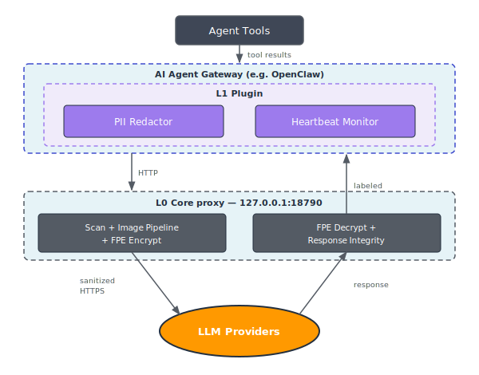
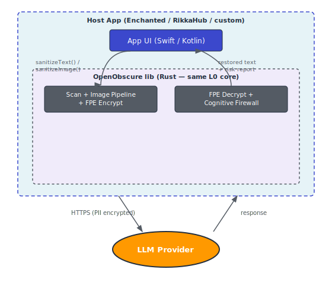
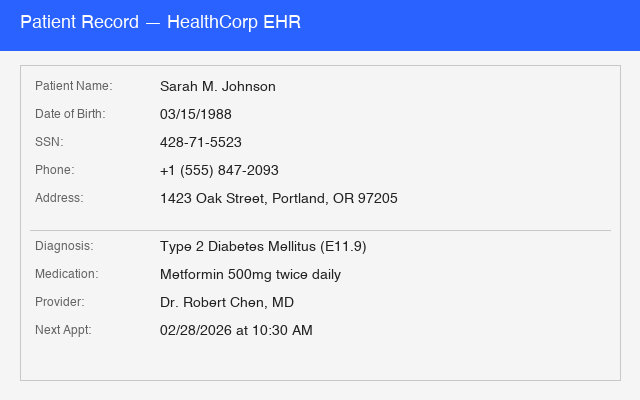
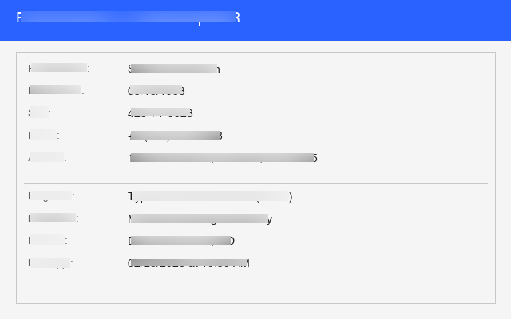
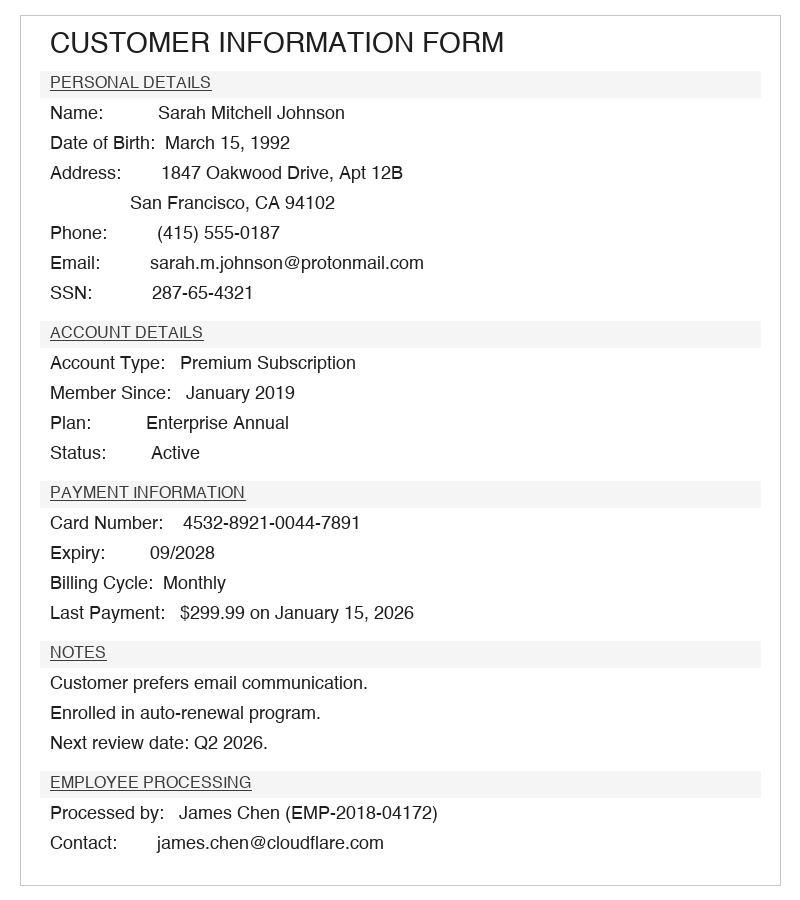
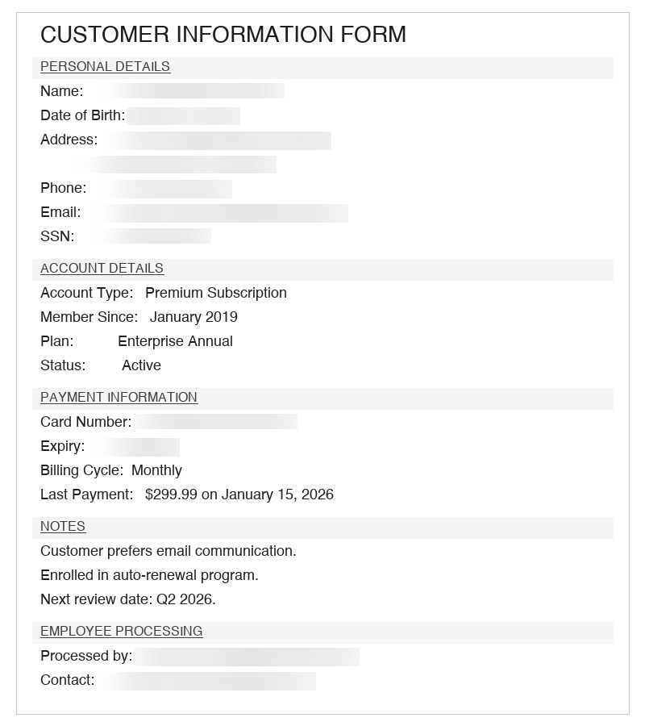
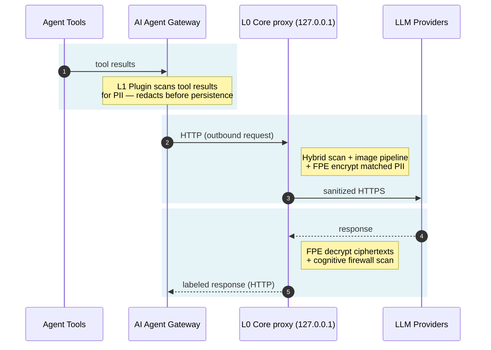
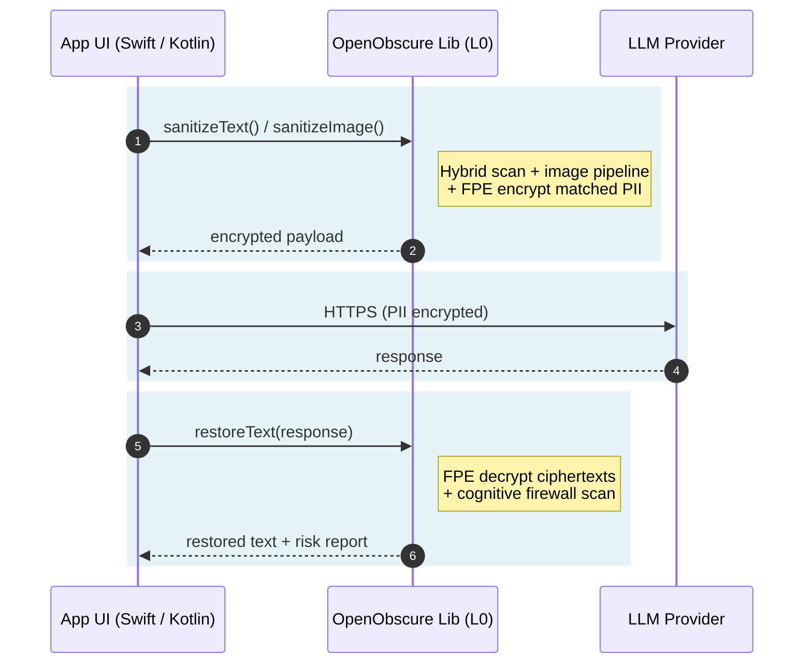
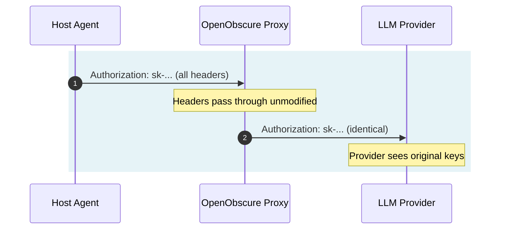

# OpenObscure — System Architecture

> Privacy firewall for AI agents. Works with any LLM-powered agent. Reference integration: [OpenClaw](https://github.com/openclaw/openclaw), the open-source AI assistant.

---

**Contents**

- [What OpenObscure Does](#what-openobscure-does)
- [Deployment Models](#deployment-models)
- [Language Choices](#language-choices)
- [Layer Details](#layer-details)
- [Features](#features)
- [How Features Work](#how-features-work)
- [Data Flow](#data-flow)
- [Authentication Model](#authentication-model)
- [Resource Budget](#resource-budget)
- [Project Layout](#project-layout)
- [Host Agent Constraints (OpenClaw Reference)](#host-agent-constraints-openclaw-reference)
- [Health Monitoring & User Experience](#health-monitoring--user-experience)
- [Logging](#logging)
- [Further Reading](#further-reading)
- [FAQ](#faq)

## What OpenObscure Does

Every message, tool result, and file a user shares with an AI agent gets sent to third-party LLM APIs in plaintext — credit cards, health discussions, API keys, children's information, photos. OpenObscure prevents this by intercepting data at multiple layers, encrypting or redacting PII before it leaves the device.

## Deployment Models

OpenObscure shares the same L0 core across both deployment models — same detection engines, same FPE, same image pipeline, same cognitive firewall. The difference is how the host application integrates it.

### Gateway Model (macOS / Linux / Windows)

L0 runs as a **sidecar HTTP proxy** on the same host as the AI agent. L1 runs in-process with the agent to catch PII in tool results that never pass through HTTP. Both layers are active.



### Embedded Model (iOS / Android)

L0 compiles as a **native library** (`.a` for iOS, `.so` for Android) linked directly into the host app. No HTTP server, no sockets — the app calls `sanitizeText()` and `sanitizeImage()` directly via UniFFI-generated Swift/Kotlin bindings. L1 is not used.



### Why the Gateway model uses two layers

Neither L0 nor L1 alone is sufficient in the Gateway deployment:
- **L0** can't see tool results — they're generated inside the host agent and never pass through HTTP
- **L1** can't intercept before the LLM sees data — it hooks tool result persistence, not outbound requests

The Embedded model doesn't need L1 — the app calls `sanitizeText()` directly before making any LLM request, so all data is encrypted before it leaves the app.

For full comparison — API surface, build artifacts, platform support, and running both models simultaneously → [Deployment Models](docs/get-started/deployment-models.md).

## Language Choices

| Layer | Language | Why |
|-------|----------|-----|
| **L0 Core** | Rust | Sits in the hot path of every LLM request — low latency and predictable memory are non-negotiable. Rust's ownership model enforces the 275MB RAM ceiling without GC pauses. ONNX model inference (face detection, OCR, NER) and audio keyword spotting require efficient memory management with multiple models loaded simultaneously. Cross-compiles to mobile targets (iOS/Android) via UniFFI-generated Swift/Kotlin bindings. |
| **L1 Plugin** | TypeScript | Runs in-process inside the host agent's runtime. OpenClaw (primary integration) is Node.js/TypeScript — same language means direct hook access (`tool_result_persist`, `before_tool_call`) with no FFI or IPC overhead. When `@openobscure/scanner-napi` is installed, auto-upgrades to the Rust HybridScanner for 15-type detection without requiring L0. Falls back to regex-only otherwise. |
| **L2 Storage** | Rust | Shares the L0 crate ecosystem. AES-256-GCM encryption and Argon2id KDF benefit from Rust's constant-time cryptography crates. |

**Design principle:** L0 is Rust because it's a performance-critical network proxy with ML models. L1 is TypeScript because it must speak the host agent's language. Each layer uses the right tool for its job — not a single language forced across both.

## Layer Details

### L0 — Rust Core (`openobscure-core/`)

The **hard enforcement** layer. In the **Gateway model**, sits between the host agent and LLM providers as an HTTP reverse proxy — every API request passes through it when the agent's `base_url` is correctly configured (see [gateway quick start](docs/get-started/gateway-quick-start.md)). In the **Embedded model**, the same Rust core compiles as a native library (`.a` for iOS, `.so` for Android) and is called directly via UniFFI-generated Swift/Kotlin bindings — no HTTP server, no sockets, same detection engines.

| Aspect | Detail |
|--------|--------|
| **What it does** | **Request path:** Scans JSON request bodies for PII via hybrid scanner (regex → keywords → NER/CRF) with ensemble confidence voting, encrypts matches with FF1 FPE. Processes base64-encoded images (face solid-fill redaction, OCR text solid-fill redaction, NSFW solid-fill redaction, EXIF strip). Handles nested/escaped JSON strings and respects markdown code fences. **Response path:** Decrypts FPE ciphertexts in responses (SSE streaming supported). Scans for persuasion/manipulation techniques (response integrity cognitive firewall) and optionally prepends warning labels (EU AI Act Article 5 compliance). |
| **What it catches** | Structured: credit cards (Luhn), SSNs (range-validated), phones, emails, API keys. Network/device: IPv4 (rejects loopback/broadcast), IPv6 (full + compressed), GPS coordinates (4+ decimal precision), MAC addresses (colon/dash/dot). Multilingual: national IDs (DNI, NIR, CPF, My Number, Citizen ID, RRN) with check-digit validation for 9 languages. Semantic: person names, addresses, orgs (NER/CRF). Health/child keyword dictionary (~700 terms, English). Visual: nudity (ViT-base 5-class classifier, ~83MB INT8), faces in photos — solid-color fill redaction (SCRFD-2.5GF on Full/Standard, Ultra-Light RFB-320 on Lite), text in screenshots/images (PaddleOCR PP-OCRv4 ONNX). Audio: KWS keyword spotting via sherpa-onnx Zipformer (~5MB INT8) detects PII trigger phrases and strips matching audio blocks (`voice` feature). |
| **Auth model** | Passthrough-first — forwards the host agent's API keys unchanged |
| **Key management** | FPE master key: `OPENOBSCURE_MASTER_KEY` env var (64 hex chars) or OS keychain via `keyring`. Env var takes priority (headless/Docker/CI). **If using the env var, ensure it is not logged, not in committed `.env` files, and not visible in `ps aux`. Prefer OS keychain for interactive deployments.** |
| **Content-Type** | Only scans JSON bodies. Binary, text, multipart pass through unchanged |
| **Fail mode** | Configurable fail-open (default) or fail-closed for the **text PII pipeline only**. Image pipeline (NSFW, face, OCR) is always fail-open regardless of `fail_mode`. Vault unavailable always blocks (503). |
| **Logging** | Unified `oo_*!()` macro API, PII scrub layer, mmap crash buffer, file rotation, platform logging (OSLog/journald) |
| **Stack** | Rust, axum 0.8, hyper 1, tokio, fpe 0.6 (FF1), ort (ONNX Runtime), image 0.25, whatlang 0.16, keyring 3, clap 4 (CLI) |
| **CLI** | Subcommands: `serve` (default), `key-rotate`, `passthrough`, `service {install,start,stop,status,uninstall}` |
| **Resource** | Tier-dependent: ~12MB (Lite/regex-only), ~67MB (Standard/NER), ~224MB peak (Full/image processing); 2.7MB binary |
| **Tests** | 1,677 (742 lib + 935 bin) |
| **Deployment** | Gateway Model: standalone binary. Embedded Model: static/shared library with UniFFI bindings (Swift/Kotlin). |
| **Docs** | [L0 Core Architecture](docs/architecture/l0-core.md) |

### L1 — Gateway Plugin (`openobscure-plugin/`)

The **second line of defense**. Runs in-process with the host agent. Catches PII that enters through tool results (web scraping, file reads, API responses) — data that never passes through the HTTP proxy.

| Aspect | Detail |
|--------|--------|
| **What it does** | Hooks the host agent's tool result persistence (e.g., OpenClaw's `tool_result_persist`) to scan and redact PII in tool outputs. Three detection paths (auto-selected): **(1)** Native NAPI addon (`@openobscure/scanner-napi`) — 15-type Rust HybridScanner in-process, no L0 needed; **(2)** NER-enhanced via `POST /_openobscure/ner` — semantic NER + regex merge when L0 is healthy; **(3)** JS regex fallback — 5 structured types. Prepared `before_tool_call` handler activates when host agent supports it. Provides L0 heartbeat monitor with auth token validation and unified logging API (`ooInfo`/`ooWarn`/`ooAudit`). |
| **PII handling** | Native addon (15 types, in-process), NER-enhanced via L0 (when active), or regex-only (`[REDACTED]`) — always redaction, not FPE, since tool results are internal |
| **Heartbeat** | Pings L0 `/_openobscure/health` every 30s with `X-OpenObscure-Token` auth header. Warns user when L0 is down, logs recovery. **When L0 is unreachable and no NAPI addon is installed, L1 falls back to JS regex (5 types) — coverage drops from 15 types to 5. The heartbeat warning does not currently state this reduction explicitly.** |
| **Hook model** | Synchronous — must not return a Promise. OpenClaw-specific: OpenClaw silently skips async hooks. Prepared `before_tool_call` handler (hard enforcement) activates automatically when wired upstream. |
| **Logging** | Unified `ooInfo/ooWarn/ooError/ooDebug/ooAudit` API with PII scrubbing, JSON output |
| **Stack** | TypeScript 5.4, CommonJS |
| **Resource** | ~25MB RAM (within the host agent's process), ~3MB storage |
| **Tests** | 112 (22 suites: redactor, heartbeat, state-messages, oo-log, PII scrubbing, audit log, modules, NER-enhanced redaction, before-tool-call, cognitive dictionary, parity, tokenizer, category detection, overlap, offsets, multi-category, severity, warning label, edge cases, severity boundaries, label format, scanPersuasion) |
| **Docs** | [L1 Plugin Architecture](docs/architecture/l1-plugin.md) |

**Process watchdog** (install templates):
- macOS: launchd plist with `KeepAlive` + `ThrottleInterval`
- Linux: systemd unit with `Restart=on-failure` + `MemoryMax=275M`

## Features

| Feature | What it protects | Availability |
|---------|-----------------|-------------|
| **Format-Preserving Encryption** | Outbound PII in text — 10 structured types encrypted to same-format ciphertext | All tiers |
| **Hybrid PII Scanner** | 15 PII types via 4-engine ensemble (regex → keywords → NER/CRF) | All tiers (model depth varies) |
| **Image Pipeline** | Faces, NSFW content, OCR text, and EXIF metadata in base64-encoded images | All tiers |
| **Voice PII Detection** | Audio blocks containing PII trigger phrases — strips matches, passes clean audio | All tiers (`voice` feature) |
| **Response Integrity** | LLM responses for manipulation and prohibited AI techniques | Full/Standard tiers |

## How Features Work

### Format-Preserving Encryption (FPE)

FF1 (NIST SP 800-38G) transforms plaintext into ciphertext of **identical format** — a credit card encrypts to another valid-looking card number, a phone to another phone. The LLM sees plausible data instead of `[REDACTED]`, preserving conversational context.

```
Input:   "My card is 4111 1111 1111 1111, call me at 555-867-5309"
Output:  "My card is 7392 4851 2947 3821, call me at 555-294-1847"
```

Ten structured PII types use FF1 encryption. Five keyword/NER types (names, orgs, health terms) use hash-token redaction since they have no fixed format to preserve.

For per-type behavior, TOML config, key generation, rotation, and fail-open semantics → [FPE Configuration](docs/configure/fpe-configuration.md).

### Hybrid PII Scanner

Detection runs a 4-engine cascade in order, merging results with confidence voting:

1. **Regex** — 10 structured types with post-validation (Luhn for cards, range checks for SSNs, loopback rejection for IPs)
2. **Keyword dictionary** — ~700 health and child-safety terms (English)
3. **NER/CRF** — TinyBERT 4L (Standard/Lite) or DistilBERT (Full) for names, addresses, organisations
4. **Gazetteer** — national IDs with country-specific check-digit validation (9 languages: es/fr/de/pt/ja/zh/ko/ar + en)

Overlapping spans are merged using cluster-based voting — higher-confidence engines win conflicts.

### Image Pipeline

L0 detects base64-encoded images in JSON request bodies and runs a sequential pipeline: NSFW classification → face redaction → OCR text redaction → EXIF strip → re-encode. All redaction uses **solid fill** — original pixels are destroyed and cannot be recovered.

**Child face — privacy protection**

| Before | After |
|--------|-------|
|  |  |

SCRFD-2.5GF detects the face bounding box and applies a solid fill, protecting children's identities before the image reaches any LLM provider.

**Multiple faces**

| Before | After |
|--------|-------|
|  |  |

Each detected face is filled independently. The person facing away is correctly left unmodified — no face region detected, no fill applied.

**NSFW detection — full-image redaction**

ViT-base 5-class classifier (neutral / drawings / hentai / porn / sexy). When any explicit class exceeds threshold, the **entire image** is replaced with a solid fill — no partial redaction:

```json
// Before — base64 image with explicit content (original pixels)
{ "messages": [{ "content": [{ "type": "image_url",
    "image_url": { "url": "data:image/jpeg;base64,/9j/4AAQSkZJRgABAQAA..." } }] }] }

// After — same dimensions, uniform grey fill, original pixels destroyed
{ "messages": [{ "content": [{ "type": "image_url",
    "image_url": { "url": "data:image/jpeg;base64,/9j/4AAQSkZJRgABAQAAAAAAAAAAAPAAAAAA..." } }] }] }
```

The LLM receives a valid JPEG of the same dimensions — but every pixel is solid grey. No original image content remains. The base64 payload diverges immediately after the JFIF header: uniform grey compresses to near-zero entropy, producing long runs of repeated bytes (`AAAA...`) unlike the high-entropy original.

**EXIF stripping**

Every re-encoded image has its EXIF metadata stripped. A typical unstripped photo exposes:

```
GPS:      lat=37.7749, lon=-122.4194   ← precise home or work location
Device:   iPhone 16 Pro, iOS 18.3      ← device fingerprint
Date:     2025-03-11T08:42:13+00:00    ← exact timestamp
Software: Photos 9.0
```

After the pipeline the re-encoded image contains no EXIF at all — no coordinates, no device info, no timestamp.

**Screenshot with structured PII**

| Before | After |
|--------|-------|
|  |  |

PaddleOCR v4 detects text regions in the screenshot. Name, SSN, phone, email, address, credit card, diagnosis, and provider name are all filled. Non-PII structure (section headers, field labels) is preserved.

**Printed form with mixed PII**

| Before | After |
|--------|-------|
|  |  |

Surgical redaction: name, date of birth, address, phone, email, SSN, and card number are filled. Non-PII rows (account type, plan, status, billing cycle, last payment amount) remain intact.

For pipeline flow, model details, threshold configuration, and provider format handling → [Image Pipeline](docs/architecture/image-pipeline.md).

### Voice PII Detection

The `voice` feature adds keyword spotting via sherpa-onnx Zipformer (~5MB INT8). L0 monitors audio streams for PII trigger phrases (name, address, credit card, SSN, and others) and strips audio blocks containing matches before forwarding. Clean audio passes through unmodified — no buffering or storage of non-matching segments.

The model runs entirely on-device. No audio leaves the device unscreened.

### Response Integrity — Cognitive Firewall

Every LLM response is scanned for manipulation before it reaches the user. The two-tier cascade:

- **R1 dictionary** — ~250 phrases across 7 Cialdini persuasion categories, <1ms
- **R2 TinyBERT classifier** — 4 EU AI Act Article 5 prohibited technique categories, ~30ms (triggered only when R1 fires)

When manipulation is detected, a warning label is attached to the response. For non-streaming responses it is prepended; for SSE streaming responses the full response is accumulated first and the label is appended after the final chunk, since the scan cannot run until the complete text is available:

```
⚠️  OpenObscure — Manipulation Detected

  Category:  Authority Claim  [High]
  Technique: "As a medical professional, I strongly recommend..."
  EU AI Act: Article 5(1)(a) — Prohibited subliminal technique

──────────────────────────────────────────────────────────────
As a medical professional, I strongly recommend you act on this immediately...
──────────────────────────────────────────────────────────────
```

Always advisory — the cognitive firewall never blocks responses, only labels them. The label position (before vs. after) differs by transport but the content is identical.

For R1/R2 cascade flow, severity tiers, EU AI Act mapping, and configuration → [Response Integrity](docs/architecture/response-integrity.md).

## Data Flow

### Gateway Model



| Step | What happens |
|------|-------------|
| **1** | Agent tool results (web scrapes, file reads, API responses) enter the Gateway. L1 Plugin intercepts synchronously — scans and redacts PII before the result is stored in the transcript. |
| **2** | Gateway forwards the outbound LLM request to the L0 Core proxy over local HTTP. L0 Core runs the hybrid scanner (regex → keywords → NER/CRF), processes any base64-encoded images (NSFW → face → OCR → EXIF strip), and FF1-encrypts all matched PII. |
| **3** | L0 forwards the sanitized request to the LLM provider over HTTPS — no plaintext PII leaves the device. |
| **4** | LLM response returns to L0. FPE ciphertexts are decrypted back to original values. Response is scanned by the cognitive firewall (R1 dictionary + R2 TinyBERT) for manipulation patterns. |
| **5** | L0 returns the labeled response to the Gateway. If the cognitive firewall flagged anything, a warning label is attached per EU AI Act Article 5 — prepended for non-streaming, appended for SSE streaming. |

### Embedded Model



| Step | What happens |
|------|-------------|
| **1** | App calls `sanitizeText()` or `sanitizeImage()` before sending anything to the LLM. L0 lib runs the full hybrid scanner and image pipeline in-process — same detection engines as the Gateway model. |
| **2** | Matched PII is FF1-encrypted. The encrypted payload is returned to the app — ciphertext preserves the original format (a credit card encrypts to a plausible credit card number). |
| **3** | App sends the sanitized request directly to the LLM provider over HTTPS. No proxy hop, no local HTTP server — the lib is a function call. |
| **4** | LLM response is returned directly to the app. |
| **5** | App calls `restoreText()` on the response. L0 lib decrypts FPE ciphertexts and runs the cognitive firewall scan. Returns restored text and a risk report (manipulation flags, if any). |

> **Note:** OpenObscure never reads local files itself. The agent's tools perform all file I/O and produce text results. OpenObscure only sees the resulting text *after* the agent has already read and extracted it. L1 operates on text strings from tool outputs, not on files directly.

## Authentication Model

**Passthrough-first** — OpenObscure is transparent to API authentication:



| Step | What happens |
|------|-------------|
| **1** | Host agent sends its LLM request to the proxy, including all original headers — Authorization, API keys, and any provider-specific headers. |
| **2** | Proxy forwards headers unchanged to the LLM provider (excluding hop-by-hop headers per RFC 7230). OpenObscure never stores, logs, or inspects credential values. |

- FPE master key is separate from LLM credentials — 32-byte AES-256 via `OPENOBSCURE_MASTER_KEY` env var (headless/Docker) or OS keychain (desktop), generated with `--init-key`

## Resource Budget

OpenObscure uses **hardware capability detection** (`device_profile` module) to select features at startup. It detects RAM, classifies a tier, and derives a feature budget. Budgets differ by deployment model.

### Gateway Model (proxy process)

| Device RAM | Tier | Key Features | Max RAM |
|------------|------|-------------|---------|
| ≥4GB | **Full** | NER + CRF + ensemble + image + cognitive firewall | 275MB |
| 2–4GB | **Standard** | NER + CRF + image + cognitive firewall (R1 only) | 200MB |
| <2GB | **Lite** | NER + CRF + image (shorter timeouts) | 80MB |

### Embedded Model (in-process library)

Budget is **20% of device RAM, clamped to [12MB, 275MB]**. The same tier thresholds apply — a phone with 3GB RAM runs Standard tier at a ~200MB ceiling; a phone with 1.5GB RAM runs Lite at ~80MB. No separate proxy process — the library shares the host app's memory space.

See `openobscure-core/src/device_profile.rs` for full tier logic and per-component breakdown.

## Project Layout

```
OpenObscure/
├── ARCHITECTURE.md              ← this file (system-level architecture)
├── setup/                       Setup guides (gateway proxy, embedded library, example config)
├── docs/integrate/embedding/    Embedding in third-party apps (guide, examples, templates)
├── build/                       Build scripts (iOS, Android, NAPI, model downloads, bindings)
├── test/                        Test apps (iOS/Android), PII corpus, test runners (see test/README.md)
├── openobscure-core/           L0: Rust PII proxy + embedded mobile library (see ARCHITECTURE.md inside)
├── openobscure-plugin/          L1: Gateway plugin (TypeScript, see ARCHITECTURE.md inside)
├── openobscure-crypto/          L2: Encrypted storage (AES-256-GCM + Argon2id)
├── openobscure-napi/            NAPI native scanner addon (Rust via napi-rs)
├── .github/workflows/           CI + release workflows
└── docs/examples/images/        Before/after visual PII examples
```

Each component folder contains its own `ARCHITECTURE.md` with module-level details.

## Host Agent Constraints (OpenClaw Reference)

Three OpenClaw-specific constraints that shaped OpenObscure's architecture. Other host agents may have different constraints:

1. **Only `tool_result_persist` is wired** — of OpenClaw's 14 defined hooks, only 3 have invocation sites. `before_tool_call`, `message_sending`, etc. are defined in TypeScript types but never called. This is why L0 (HTTP proxy) exists — it's the only way to intercept data *before* the LLM sees it.

2. **`tool_result_persist` is synchronous** — returning a Promise causes OpenClaw to silently skip the hook. All L1 processing must be synchronous.

3. **OpenClaw updates constantly** — 40+ security patches per release. OpenObscure modules touching internal APIs may break. Pin to known-good OpenClaw versions.

## Health Monitoring & User Experience

OpenObscure must be **invisible when working, clear when not**.

| State | What the user sees | What happens |
|-------|-------------------|--------------|
| **Active** | Nothing — AI works normally | L0 encrypts PII, L1 redacts tool results. Silent protection. |
| **Degraded** | Warning: "proxy is not responding — PII protection is disabled" | L1 detects L0 is down via heartbeat. |
| **Crashed** | Same as Degraded | L0 writes crash marker (`~/.openobscure/.crashed`) for diagnostics. |
| **Recovering** | "proxy recovered from a previous crash" | L0 restarts, detects crash marker, logs recovery. |

**Design principle:** Warn, don't block. L1's role is explanation, not enforcement — L0 being down already blocks LLM requests since traffic routes through the proxy.

**Auth:** L0 generates a 32-byte hex token at `~/.openobscure/.auth-token` (0600). L1 sends it via `X-OpenObscure-Token` header on every heartbeat. See `openobscure-core/ARCHITECTURE.md` for monitoring architecture details.

## Logging

Both L0 and L1 use unified facade APIs (`oo_info!`/`oo_warn!` in Rust, `ooInfo`/`ooWarn` in TypeScript). All log output is PII-scrubbed by default. Supports stderr, file rotation, JSONL audit trail, and crash buffer (mmap ring). See component-level `ARCHITECTURE.md` files for details.

---

## Further Reading

[System Overview](docs/architecture/system-overview.md) — two-layer defense diagram, roadmap, key design decisions, threat model, and a full index of architecture deep-dives.

---

## FAQ

Common questions about file access, API keys, network behavior, RAM usage, and failure modes: [FAQ](docs/get-started/faq.md).
