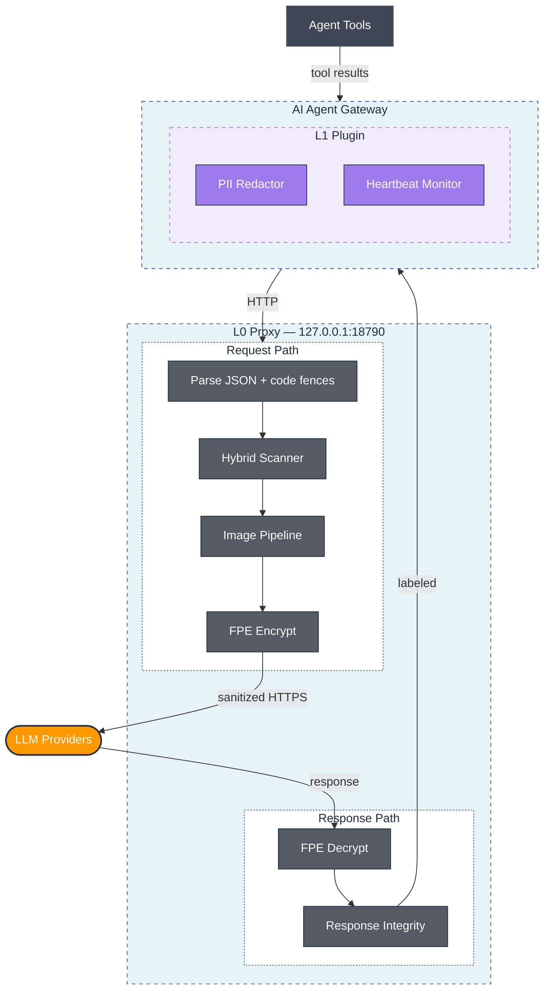
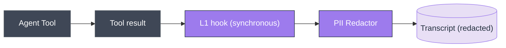
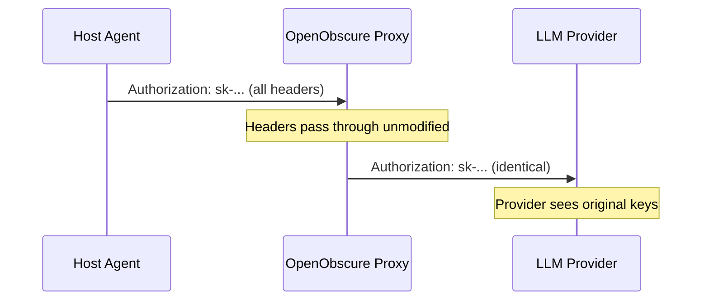

# OpenObscure — System Architecture

> Privacy firewall for AI agents. Works with any LLM-powered agent. Reference integration: [OpenClaw](https://github.com/openclaw/openclaw), the open-source AI assistant.

---

## What OpenObscure Does

Every message, tool result, and file a user shares with an AI agent gets sent to third-party LLM APIs in plaintext — credit cards, health discussions, API keys, children's information, photos. OpenObscure prevents this by intercepting data at multiple layers, encrypting or redacting PII before it leaves the device.

## Deployment Models

OpenObscure supports two deployment models: **Gateway** (sidecar HTTP proxy for desktop/server) and **Embedded** (native library for mobile/custom apps). Both run entirely on-device with no cloud components.

For full details — diagrams, API surface, platform support, comparison table, and defense-in-depth — see [Deployment Models](docs/get-started/deployment-models.md).

## Two-Layer Defense-in-Depth



## Language Choices

| Layer | Language | Why |
|-------|----------|-----|
| **L0 Proxy** | Rust | Sits in the hot path of every LLM request — low latency and predictable memory are non-negotiable. Rust's ownership model enforces the 275MB RAM ceiling without GC pauses. ONNX model inference (face detection, OCR, NER) and audio keyword spotting require efficient memory management with multiple models loaded simultaneously. Cross-compiles to mobile targets (iOS/Android) via UniFFI-generated Swift/Kotlin bindings. |
| **L1 Plugin** | TypeScript | Runs in-process inside the host agent's runtime. OpenClaw (primary integration) is Node.js/TypeScript — same language means direct hook access (`tool_result_persist`, `before_tool_call`) with no FFI or IPC overhead. When `@openobscure/scanner-napi` is installed, auto-upgrades to the Rust HybridScanner for 15-type detection without requiring L0. Falls back to regex-only otherwise. |
| **L2 Storage** | Rust | Shares the L0 crate ecosystem. AES-256-GCM encryption and Argon2id KDF benefit from Rust's constant-time cryptography crates. |

**Design principle:** L0 is Rust because it's a performance-critical network proxy with ML models. L1 is TypeScript because it must speak the host agent's language. Each layer uses the right tool for its job — not a single language forced across both.

## Layer Details

### L0 — Rust PII Proxy (`openobscure-proxy/`)

The **hard enforcement** layer. Sits between the host agent and LLM providers as an HTTP reverse proxy. Every API request passes through it when the agent's `base_url` is correctly configured — see [gateway quick start](docs/get-started/gateway-quick-start.md) for verification.

| Aspect | Detail |
|--------|--------|
| **What it does** | **Request path:** Scans JSON request bodies for PII via hybrid scanner (regex → keywords → NER/CRF) with ensemble confidence voting, encrypts matches with FF1 FPE. Processes base64-encoded images (face solid-fill redaction, OCR text solid-fill redaction, NSFW solid-fill redaction, EXIF strip). Handles nested/escaped JSON strings and respects markdown code fences. **Response path:** Decrypts FPE ciphertexts in responses (SSE streaming supported). Scans for persuasion/manipulation techniques (response integrity cognitive firewall) and optionally prepends warning labels (EU AI Act Article 5 compliance). |
| **What it catches** | Structured: credit cards (Luhn), SSNs (range-validated), phones, emails, API keys. Network/device: IPv4 (rejects loopback/broadcast), IPv6 (full + compressed), GPS coordinates (4+ decimal precision), MAC addresses (colon/dash/dot). Multilingual: national IDs (DNI, NIR, CPF, My Number, Citizen ID, RRN) with check-digit validation for 9 languages. Semantic: person names, addresses, orgs (NER/CRF). Health/child keyword dictionary (~700 terms, multilingual). Visual: nudity (ViT-base 5-class classifier, ~83MB INT8), faces in photos — solid-color fill redaction (SCRFD-2.5GF on Full/Standard, Ultra-Light RFB-320 on Lite), text in screenshots/images (PaddleOCR PP-OCRv4 ONNX). Audio: KWS keyword spotting via sherpa-onnx Zipformer (~5MB INT8) detects PII trigger phrases and strips matching audio blocks (`voice` feature). |
| **Auth model** | Passthrough-first — forwards the host agent's API keys unchanged |
| **Key management** | FPE master key: `OPENOBSCURE_MASTER_KEY` env var (64 hex chars) or OS keychain via `keyring`. Env var takes priority (headless/Docker/CI). **If using the env var, ensure it is not logged, not in committed `.env` files, and not visible in `ps aux`. Prefer OS keychain for interactive deployments.** |
| **Content-Type** | Only scans JSON bodies. Binary, text, multipart pass through unchanged |
| **Fail mode** | Configurable fail-open (default) or fail-closed for the **text PII pipeline only**. Image pipeline (NSFW, face, OCR) is always fail-open regardless of `fail_mode`. Vault unavailable always blocks (503). |
| **Logging** | Unified `oo_*!()` macro API, PII scrub layer, mmap crash buffer, file rotation, platform logging (OSLog/journald) |
| **Stack** | Rust, axum 0.8, hyper 1, tokio, fpe 0.6 (FF1), ort (ONNX Runtime), image 0.25, whatlang 0.16, keyring 3, clap 4 (CLI) |
| **CLI** | Subcommands: `serve` (default), `key-rotate`, `passthrough`, `service {install,start,stop,status,uninstall}` |
| **Resource** | Tier-dependent: ~12MB (Lite/regex-only), ~67MB (Standard/NER), ~224MB peak (Full/image processing); 2.7MB binary |
| **Tests** | 1,677 (742 lib + 935 bin) |
| **Deployment** | Gateway Model: standalone binary. Embedded Model: static/shared library with UniFFI bindings (Swift/Kotlin). |
| **Docs** | [L0 Proxy Architecture](docs/architecture/l0-proxy.md) |

### L1 — Gateway Plugin (`openobscure-plugin/`)

The **second line of defense**. Runs in-process with the host agent. Catches PII that enters through tool results (web scraping, file reads, API responses) — data that never passes through the HTTP proxy.

| Aspect | Detail |
|--------|--------|
| **What it does** | Hooks the host agent's tool result persistence (e.g., OpenClaw's `tool_result_persist`) to scan and redact PII in tool outputs. Three detection paths (auto-selected): **(1)** Native NAPI addon (`@openobscure/scanner-napi`) — 15-type Rust HybridScanner in-process, no L0 needed; **(2)** NER-enhanced via `POST /_openobscure/ner` — semantic NER + regex merge when L0 is healthy; **(3)** JS regex fallback — 5 structured types. Prepared `before_tool_call` handler activates when host agent supports it. Provides L0 heartbeat monitor with auth token validation and unified logging API (`ooInfo`/`ooWarn`/`ooAudit`). |
| **PII handling** | Native addon (15 types, in-process), NER-enhanced via L0 (when active), or regex-only (`[REDACTED]`) — always redaction, not FPE, since tool results are internal |
| **Heartbeat** | Pings L0 `/_openobscure/health` every 30s with `X-OpenObscure-Token` auth header. Warns user when L0 is down, logs recovery. **When L0 is unreachable and no NAPI addon is installed, L1 falls back to JS regex (5 types) — coverage drops from 15 types to 5. The heartbeat warning does not currently state this reduction explicitly.** |
| **Hook model** | Synchronous — must not return a Promise. OpenClaw-specific: OpenClaw silently skips async hooks. Prepared `before_tool_call` handler (hard enforcement) activates automatically when wired upstream. |
| **Logging** | Unified `ooInfo/ooWarn/ooError/ooDebug/ooAudit` API with PII scrubbing, JSON output |
| **Stack** | TypeScript 5.4, CommonJS |
| **Resource** | ~25MB RAM (within the host agent's process), ~3MB storage |
| **Tests** | 112 (22 suites: redactor, heartbeat, state-messages, oo-log, PII scrubbing, audit log, modules, NER-enhanced redaction, before-tool-call, cognitive dictionary, parity, tokenizer, category detection, overlap, offsets, multi-category, severity, warning label, edge cases, severity boundaries, label format, scanPersuasion) |
| **Docs** | [L1 Plugin Architecture](docs/architecture/l1-plugin.md) |

**Process watchdog** (install templates):
- macOS: launchd plist with `KeepAlive` + `ThrottleInterval`
- Linux: systemd unit with `Restart=on-failure` + `MemoryMax=275M`

## How FPE Works

Format-Preserving Encryption (FF1, NIST SP 800-38G) transforms plaintext into ciphertext of **identical format**. A credit card encrypts to another credit card, a phone number to another phone number — the LLM sees plausible data instead of `[REDACTED]`, preserving conversational context. Ten structured PII types use FF1 encryption; five keyword/NER types use hash-token redaction.

For the full FPE reference — per-type behavior table, TOML config options, key generation, key rotation, and fail-open/fail-closed semantics — see [FPE Configuration](docs/configure/fpe-configuration.md).

## L0 vs L1 — Why Both?

> **Comparison table:** See [L0 vs L1 — When to Use Which](docs/architecture/system-overview.md#two-layer-defense-in-depth) in the
> System Overview.

Neither layer alone is sufficient:
- L0 can't see tool results (they're generated inside the host agent, never pass through HTTP)
- L1 can't intercept before LLM sees data (in OpenClaw, only `tool_result_persist` is wired, not `before_tool_call`)

## Data Flow

### Outbound (user → LLM)


### Inbound (LLM → user)


### Tool Results (agent tools → persistence)



**Important:** OpenObscure never reads local files itself. The agent's tools perform all file I/O and produce text results. OpenObscure only sees the resulting text *after* the agent has already read and extracted it. L1 operates on text strings from tool outputs, not on files directly.

## Authentication Model

**Passthrough-first** — OpenObscure is transparent to API authentication:



- All original request headers forwarded (except hop-by-hop per RFC 7230)
- FPE master key is separate — 32-byte AES-256 via `OPENOBSCURE_MASTER_KEY` env var (headless) or OS keychain (desktop), generated with `--init-key`

## Resource Budget

OpenObscure uses **hardware capability detection** (`device_profile` module) to select features at startup. It detects RAM, classifies a tier, and derives a feature budget.

| Device RAM | Tier | Key Features | Max RAM |
|------------|------|-------------|---------|
| 8GB+ | **Full** | NER + CRF + ensemble + image + cognitive firewall | 275MB |
| 4–8GB | **Standard** | NER + CRF + image + cognitive firewall (R1 only) | 200MB |
| <4GB | **Lite** | NER + CRF + image (shorter timeouts) | 80MB |

Embedded budgets scale proportionally (20% of device RAM, clamped to [12MB, 275MB]). See `openobscure-proxy/src/device_profile.rs` for full tier logic and per-component breakdown.

## Roadmap

See [docs/reference/roadmap.md](docs/reference/roadmap.md) — current capability matrix (all 15 PII types, all platforms, all tiers) and planned features.

## Project Layout

```
OpenObscure/
├── ARCHITECTURE.md              ← this file (system-level architecture)
├── setup/                       Setup guides (gateway proxy, embedded library, example config)
├── docs/integrate/embedding/    Embedding in third-party apps (guide, examples, templates)
├── build/                       Build scripts (iOS, Android, NAPI, model downloads, bindings)
├── test/                        Test apps (iOS/Android), PII corpus, test runners
├── openobscure-proxy/           L0: Rust PII proxy + embedded mobile library (see ARCHITECTURE.md inside)
├── openobscure-plugin/          L1: Gateway plugin (TypeScript, see ARCHITECTURE.md inside)
├── openobscure-crypto/          L2: Encrypted storage (AES-256-GCM + Argon2id)
├── openobscure-napi/            NAPI native scanner addon (Rust via napi-rs)
├── .github/workflows/           CI + release workflows
└── docs/examples/images/        Before/after visual PII examples
```

Each component folder contains its own `ARCHITECTURE.md` with module-level details.

## Key Design Decisions

See [docs/architecture/design-decisions.md](docs/architecture/design-decisions.md) — rationale for FF1-only, fail-open, per-record tweaks, solid-fill redaction, sequential model loading, and all other core choices.

## Host Agent Constraints (OpenClaw Reference)

See [docs/architecture/system-overview.md — Host Agent Constraints](docs/architecture/system-overview.md#host-agent-constraints) — the three OpenClaw-specific constraints that shaped L0/L1 architecture.

## Health Monitoring & User Experience

OpenObscure must be **invisible when working, clear when not**.

| State | What the user sees | What happens |
|-------|-------------------|--------------|
| **Active** | Nothing — AI works normally | L0 encrypts PII, L1 redacts tool results. Silent protection. |
| **Degraded** | Warning: "proxy is not responding — PII protection is disabled" | L1 detects L0 is down via heartbeat. |
| **Crashed** | Same as Degraded | L0 writes crash marker (`~/.openobscure/.crashed`) for diagnostics. |
| **Recovering** | "proxy recovered from a previous crash" | L0 restarts, detects crash marker, logs recovery. |

**Design principle:** Warn, don't block. L1's role is explanation, not enforcement — L0 being down already blocks LLM requests since traffic routes through the proxy.

**Auth:** L0 generates a 32-byte hex token at `~/.openobscure/.auth-token` (0600). L1 sends it via `X-OpenObscure-Token` header on every heartbeat. See `openobscure-proxy/ARCHITECTURE.md` for monitoring architecture details.

## Logging

Both L0 and L1 use unified facade APIs (`oo_info!`/`oo_warn!` in Rust, `ooInfo`/`ooWarn` in TypeScript). All log output is PII-scrubbed by default — no direct `tracing::*!()` or `console.*` calls outside the logging module. Supports stderr, file rotation, JSONL audit trail, and crash buffer (mmap ring). See component-level ARCHITECTURE.md files for details.

---

## Image Pipeline

L0 detects base64-encoded images in JSON request bodies (Anthropic and OpenAI formats) and processes them **before** text PII scanning. All redaction uses solid fill — original pixel data is destroyed and cannot be recovered by AI deblurring.

**Pipeline phases:** NSFW detection (ViT-base 5-class classifier) → face solid-fill (SCRFD or BlazeFace) → OCR text solid-fill (PaddleOCR) → EXIF strip → re-encode. If NSFW detected (P(hentai) + P(porn) + P(sexy) ≥ 0.50), entire image is solid-filled and face/OCR phases are skipped. Models load on-demand and evict after 300s idle.

For model details, pipeline architecture, and provider format handling, see `openobscure-proxy/ARCHITECTURE.md`.

---

## Response Integrity — Cognitive Firewall

OpenObscure scans LLM **responses** for manipulation techniques before they reach users. EU AI Act Article 5 prohibits subliminal/manipulative techniques, but there is no enforcement mechanism at the user's endpoint. The cognitive firewall provides detection-layer defense.

**Two-tier cascade:**
- **R1** — Pattern-based dictionary (~250 phrases across 7 Cialdini categories: urgency, scarcity, social proof, fear, authority, commercial, flattery). Runs on every response, <1ms.
- **R2** — TinyBERT ONNX multi-label classifier (4 EU AI Act Article 5 categories). Runs conditionally based on sensitivity level and R1 results (~30ms when triggered).

R2 can **confirm**, **suppress** (R1 false positive, single-category only), **upgrade** (add categories), or **discover** (catch paraphrased manipulation R1 missed) R1's findings. Multi-category R1 hits (2+ categories) are strong enough to stand on their own — R2 disagreement is treated as Confirm rather than Suppress.

**Severity tiers:** Notice (1 category) → Warning (2-3 categories) → Caution (4+ categories). Enabled by default at `low` sensitivity in log-only mode.

**Fail-open conditions:** The cognitive firewall is always advisory — it never blocks responses. It passes through without flagging when: R2 ONNX session fails to initialize or produces an inference error; the response is below the minimum length for R1 scanning; `ri_enabled = false`; or sensitivity is set below the R2 trigger threshold. These conditions are logged at WARN or INFO but do not affect response delivery.

For cascade flow diagrams, R2 model details, performance metrics, and configuration reference, see `openobscure-proxy/ARCHITECTURE.md`.

---

## FAQ

**Does OpenObscure read local files to scan for PII?**
No. OpenObscure never performs file I/O. The agent's tools (file_read, web_fetch, etc.) read files and produce text results. OpenObscure's L1 plugin only sees the resulting text after the agent has extracted it, via the tool result persistence hook.

**Does OpenObscure need its own API keys?**
No. By default, OpenObscure forwards the host agent's existing API keys unchanged (passthrough-first). It never provisions, generates, or requires separate LLM credentials.

**Does OpenObscure phone home or contact external servers?**
No. The only network traffic OpenObscure produces is forwarding the host agent's existing LLM API requests through the local proxy. No telemetry, no update checks, no external dependencies at runtime. Everything runs locally on the user's device.

**Is L0 (proxy) a separate server I need to host?**
No. L0 runs as a lightweight sidecar process on the same device as the host agent, listening on `127.0.0.1:18790` (localhost only). It's started alongside the agent — either automatically during installation or manually when the user enables OpenObscure. It's not exposed to the network.

**Does OpenObscure intercept data *before* the LLM sees it?**
L0 (proxy) does — it sits in the HTTP path and encrypts PII before the request reaches the LLM provider. L1 (plugin) hooks the agent's tool result persistence (e.g., OpenClaw's `tool_result_persist`), which fires *after* tool execution. L1 prevents PII from being persisted to transcripts, but cannot prevent it from being sent to the LLM via tool results.

**How much RAM does OpenObscure actually use?**
It depends on the device's capability tier. OpenObscure detects hardware at startup and selects features automatically. Lite tier (NER/CRF, no ensemble): ~12–80MB. Standard tier (NER + images): ~67–200MB. Full tier (NER + ensemble + images): up to 224MB peak. The 275MB ceiling is the hard limit. On mobile, the budget is 20% of device RAM (capped at 275MB), so a 12GB phone gets the same features as a desktop server.

**What happens if OpenObscure is disabled or crashes?**
If L0 is not running, the host agent can't reach LLM providers (traffic is configured to route through the proxy). If L1 crashes, the agent continues normally but tool results won't be redacted. If OpenObscure is fully disabled via configuration, the agent operates with direct LLM connections — zero overhead.

