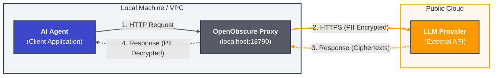
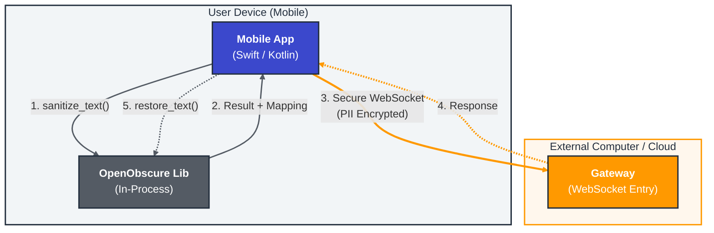
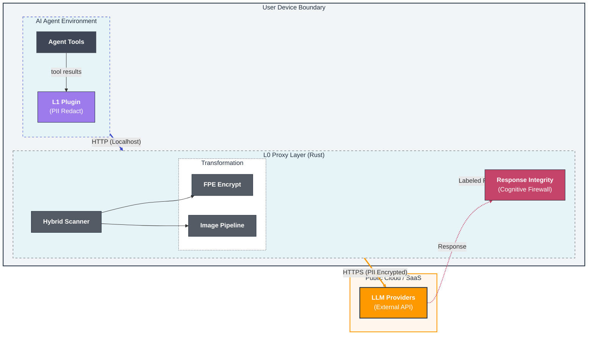
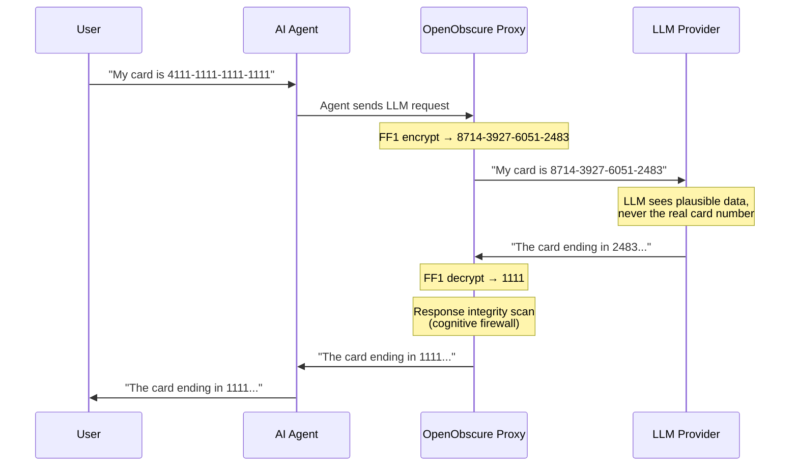
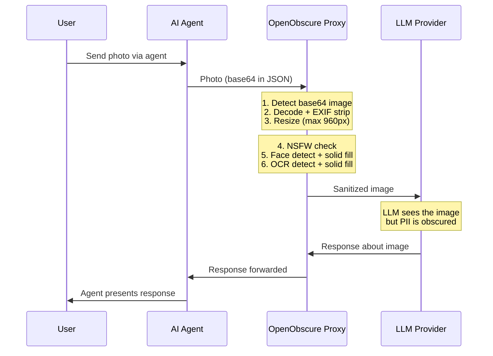
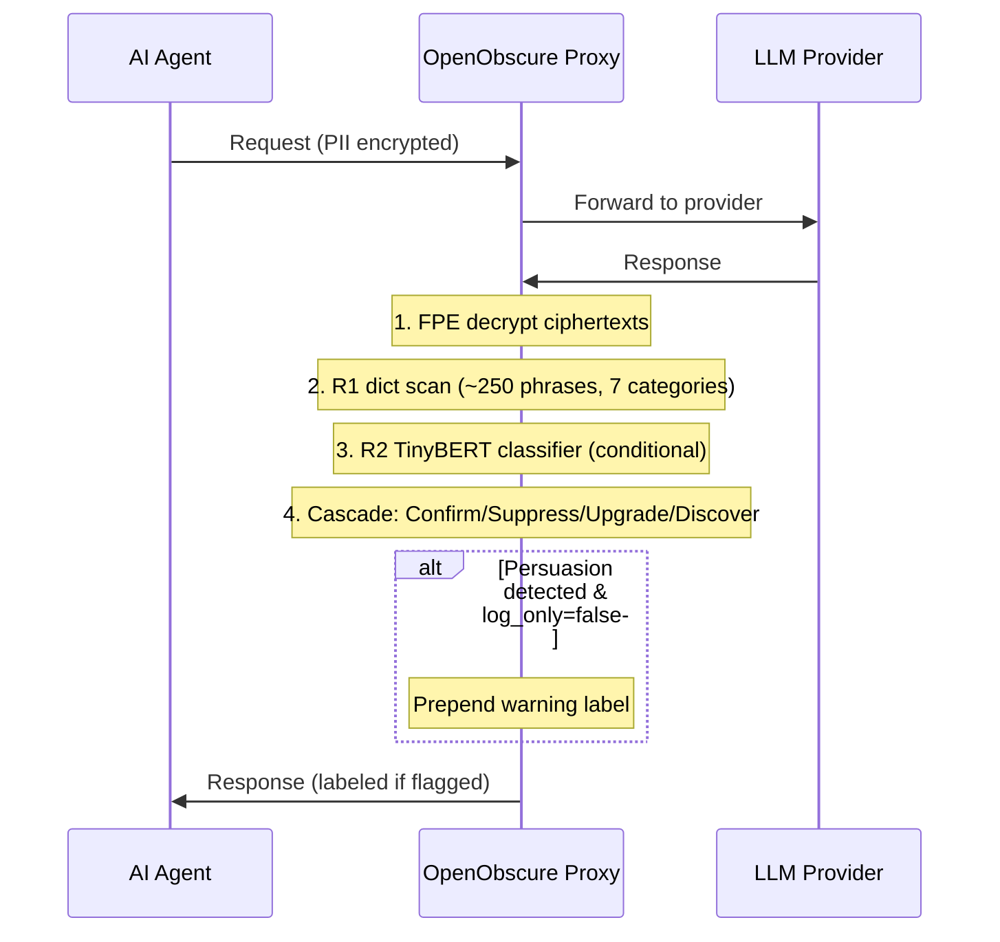

# OpenObscure

[](LICENSE)
[](SECURITY.md)

**The Endpoint Privacy Firewall for AI Agents.**

OpenObscure is an open-source privacy firewall that intercepts, sanitizes, and encrypts PII (Personally Identifiable Information) *before* it leaves your device — and scans LLM responses for persuasion and manipulation techniques *before* they reach you. It works with any AI agent, on any platform. Includes first-class [OpenClaw](https://github.com/openclaw/openclaw) integration.

> **Verify, Don't Trust.** OpenObscure runs entirely on your device. No remote servers, no telemetry, no cloud dependencies.

---

## Two Deployment Models

OpenObscure can protect AI agents in two ways, depending on where the agent runs:

### Gateway Model (Desktop / Server)

The proxy runs as a **sidecar process** on the same host as the AI agent. All LLM API traffic routes through it. This is the full-featured deployment with both layers active.



- **Platforms:** macOS, Linux (x64 + ARM64), Windows
- **Layers:** L0 (Rust proxy) + L1 (TypeScript plugin)
- **Features:** Full PII scanning (regex + NER/CRF + keywords + network/device identifiers), FPE encryption, image pipeline (face/OCR/NSFW solid-fill redaction, EXIF strip), voice PII detection (KWS keyword spotting), response integrity (R1 dictionary + R2 TinyBERT classifier — cognitive firewall), SSE streaming
- **Use case:** Desktop apps, servers, VPS, Raspberry Pi — anywhere the agent's Gateway runs

### Embedded Model (Mobile / Library)

OpenObscure is compiled as a **native library** and linked directly into the host application. Called via UniFFI-generated Swift/Kotlin bindings. No HTTP server, no sockets — just function calls.



- **Platforms:** iOS (aarch64), Android (arm64-v8a, armeabi-v7a, x86_64)
- **Layers:** L0 (PII scan + FPE)
- **Features:** Text PII scanning (regex + keywords + NER/CRF on capable devices), FPE encryption, image pipeline, voice PII detection, restore/decrypt for responses
- **Use case:** Mobile companion apps that sanitize PII on-device *before* data reaches the Gateway over WebSocket — defense in depth

### When to Use Which

| Scenario | Model | Why |
|----------|-------|-----|
| Desktop AI agent (e.g. OpenClaw Gateway) | Gateway | Full feature set, both layers |
| Server / VPS deployment | Gateway | Same binary, headless key management |
| iOS / Android companion app | Embedded | On-device PII protection, native bindings |
| Custom Rust application | Embedded | Link as a library crate, call directly |
| Edge device (Raspberry Pi) | Gateway | Full features, runs on ARM Linux |

---

## Hardware Capability Detection

OpenObscure detects device hardware at startup and automatically selects features based on what the device can support. A phone with 12GB RAM gets the same PII detection efficacy as a desktop server.

### Capability Tiers

| Device RAM | Tier | Scanners | Image Pipeline | Model Idle Timeout |
|------------|------|----------|----------------|--------------------|
| 8GB+ | **Full** | NER + CRF + ensemble voting | Yes | 300s |
| 4–8GB | **Standard** | NER + CRF (no ensemble) | Yes | 120s |
| <4GB | **Lite** | CRF + regex only | Yes (shorter timeout) | 60s |

Tier classification uses **total physical RAM** — a stable device indicator that doesn't fluctuate with app usage.

### Gateway vs Embedded Budgets

- **Gateway** (desktop/server): Fixed RAM budget per tier (Full=275MB, Standard=200MB, Lite=80MB)
- **Embedded** (mobile): 20% of total device RAM, capped at 275MB. A 12GB phone gets a 275MB budget (Full tier). A 6GB phone gets 275MB capped from 1228MB (Standard). A 3GB phone gets ~614MB budget (Lite)

### Explicit Override

Hardware auto-detection is the default when `scanner_mode = "auto"`. You can bypass it with an explicit mode:

```toml
# config/openobscure.toml
[scanner]
scanner_mode = "ner"    # Force NER regardless of device tier
# scanner_mode = "crf"  # Force CRF
# scanner_mode = "regex" # Force regex-only
```

On mobile, set `auto_detect: false` in `MobileConfig` to disable hardware profiling.

### Health Endpoint

The health endpoint reports the detected tier and active feature budget:

```bash
curl -s http://127.0.0.1:18790/_openobscure/health | jq '.device_tier, .feature_budget'
```

```json
"full"
{
  "tier": "full",
  "max_ram_mb": 275,
  "ner_enabled": true,
  "crf_enabled": true,
  "ensemble_enabled": true,
  "image_pipeline_enabled": true
}
```

### Supported Platforms

Hardware detection is implemented for all supported platforms:

| Platform | Total RAM | Available RAM |
|----------|-----------|---------------|
| macOS / iOS | `sysctl hw.memsize` | `vm_stat` (macOS) |
| Linux / Android | `/proc/meminfo MemTotal` | `/proc/meminfo MemAvailable` |
| Windows | `GlobalMemoryStatusEx` | `GlobalMemoryStatusEx` |

---

## Architecture

OpenObscure uses a **Sidecar + Plugin** hybrid architecture (Gateway Model) to provide Defense-in-Depth:



| Layer | Language | What it does |
|-------|----------|-------------|
| **L0** — PII Proxy | Rust | **Request path:** scans JSON for PII (structured, network/device, semantic, keywords), encrypts with FF1 FPE or redacts. Processes images (face/OCR/NSFW solid-fill redaction, EXIF strip). **Response path:** decrypts FPE ciphertexts, scans for persuasion/manipulation techniques (cognitive firewall). |
| **L1** — Gateway Plugin | TypeScript | Hooks tool results, redacts PII. Heartbeat monitor for L0 health. |

For the full architecture, see [ARCHITECTURE.md](ARCHITECTURE.md).

---

## Quick Start

### Prerequisites

- **Rust** 1.75+ (for L0 proxy)
- **Node.js** 20+ (for L1 plugin)
- An AI agent that makes HTTP calls to an LLM provider (OpenClaw, custom agents, etc.)

### 1. Build the proxy

```bash
cd openobscure-proxy
cargo build --release
```

### 2. Generate an FPE key (first time only)

```bash
cargo run --release -- --init-key
```

This stores a 256-bit AES key in your OS keychain. For headless/Docker environments, set `OPENOBSCURE_MASTER_KEY` (64 hex chars) instead.

### 3. Start the proxy

```bash
cargo run --release -- -c config/openobscure.toml
```

The proxy listens on `127.0.0.1:18790` by default.

### 4. Verify

```bash
curl -H "X-OpenObscure-Token: $(cat ~/.openobscure/.auth-token)" \
     http://127.0.0.1:18790/_openobscure/health
```

You should see a JSON response with `"status": "ok"`.

### OpenClaw Integration

Point OpenClaw's LLM traffic through the proxy:

```
LLM_API_BASE=http://127.0.0.1:18790
```

Optionally, copy `openobscure-plugin/` into OpenClaw's `extensions/` directory and enable it in OpenClaw's plugin config for L1 in-process redaction.

### Generic Integration (Any AI Agent)

Any AI agent that sends HTTP requests to an LLM provider can route traffic through the L0 proxy. Set your agent's LLM base URL to the proxy address:

```
http://127.0.0.1:18790
```

The proxy transparently intercepts JSON payloads, scans for PII, applies FF1 Format-Preserving Encryption, and forwards the sanitized request to the upstream LLM provider. Responses are decrypted before being returned to your agent.

For programmatic access to the L1 redaction from TypeScript/JavaScript, import directly from the plugin core:

```typescript
import { redactPii } from "openobscure-plugin/core";

// Scan text for PII
const result = redactPii(toolOutput);
if (result.count > 0) toolOutput = result.text;
```

This allows any agent — not just OpenClaw — to leverage OpenObscure's PII redaction as a library.

---

## Configuration

OpenObscure is configured via `config/openobscure.toml`. Key sections:

```toml
[proxy]
listen_addr = "127.0.0.1:18790"
fail_mode = "open"          # "open" or "closed"

[scanner]
respect_code_fences = true  # Skip PII inside markdown code blocks
nested_json_depth = 2       # Scan PII inside escaped JSON strings

[image]
enabled = true
face_detection = true
ocr_enabled = true
ocr_tier = "detect_and_fill"  # "detect_and_fill" or "full_recognition"
max_dimension = 960

[response_integrity]
enabled = false               # Opt-in cognitive firewall
sensitivity = "medium"        # off, low, medium, high
log_only = true               # true = log only; false = prepend warning labels

[logging]
json_output = false
pii_scrub = true
```

See `config/openobscure.toml` for all available options.

---

## Running Tests

**~1,254 tests** across all components (1,188 Rust proxy + 50 TypeScript plugin + 16 crypto).

```bash
# L0 Proxy (1,188 tests: 500 lib + 666 bin + 14 accuracy + 8 pipeline)
cd openobscure-proxy && cargo test

# L1 Plugin (50 tests)
cd openobscure-plugin && npm test

# L2 Crypto (16 tests)
cd openobscure-crypto && cargo test
```

---

## How It Works

OpenObscure uses **Format-Preserving Encryption (FF1)** to replace PII with realistic-looking ciphertext. The LLM sees plausible data, preserving conversational context, while the real values never leave your device.



PII detection uses a hybrid approach:
- **Regex** with post-validation (Luhn for credit cards, range checks for SSNs, IPv4 validation)
- **Network/device identifiers** — IPv4, IPv6, GPS coordinates, MAC addresses (redacted to `[IPv4]`, `[IPv6]`, `[GPS]`, `[MAC]`)
- **NER/CRF** (TinyBERT INT8) for semantic detection (names, addresses, orgs)
- **Keyword dictionary** (~700 terms) for health and child-related terms
- **Image pipeline** (SCRFD/BlazeFace + PaddleOCR ONNX) for visual PII in photos — faces redacted with solid fill (irreversible)
- **Voice PII detection** — KWS keyword spotting via sherpa-onnx Zipformer (~5MB INT8) detects PII trigger phrases and strips matching audio blocks
- **Response integrity** (cognitive firewall) — R1 dictionary scan (~250 phrases, 7 categories) plus R2 TinyBERT multi-label classifier (4 EU AI Act Article 5 categories) with cascade logic (Confirm/Suppress/Upgrade/Discover). Optionally prepends warning labels

---

## Visual PII Protection

OpenObscure doesn't just protect text — it also processes **images** for visual PII before they reach the LLM. The image pipeline runs entirely on-device using lightweight ONNX models.

### How Image Processing Works



### Before / After Examples

These examples were generated by running real images through the OpenObscure image pipeline using the `demo_image_pipeline` example binary:

```bash
# Download ONNX models (one-time)
./build/download_models.sh

# Process an image
cargo run --example demo_image_pipeline -- \
  --input photo.jpg --output photo-redacted.jpg
```

| Scenario | Before | After |
|----------|--------|-------|
| **Screenshot PII Redaction** — Full patient record with names, SSNs, credit cards, phone numbers, emails, addresses, and medical history. PaddleOCR detects all text regions and solid-fills them. |  |  |
| **Face Detection + Solid Fill** — SCRFD-2.5GF (Full/Standard) or BlazeFace (Lite) detects faces and fills with solid light gray. Original pixels are destroyed — not recoverable by AI deblurring. |  |  |
| **Multi-Face Detection** — Detects and redacts multiple faces independently in group photos. Each face gets its own elliptical solid-fill region. |  |  |
| **Child Face Privacy** — Automatically detects and redacts children's faces with solid fill to protect minors' privacy. |  |  |
| **OCR PII Redaction** — PaddleOCR detects text regions, then PII scanner filters and solid-fills only sensitive values (names, SSNs, emails, phones, card numbers) while leaving non-PII text readable. |  |  |

### Pipeline Details

The image pipeline processes images in three phases:

1. **NSFW detection** (Phase 0): NudeNet 320n ONNX (~12MB) checks for nudity. If detected, the entire image is solid-filled and subsequent phases are skipped.
2. **Face detection + redaction** (Phase 1): SCRFD-2.5GF (~3MB, 640x640 input) on Full/Standard tiers for multi-scale detection; BlazeFace (~408KB, 128x128 input) on Lite tier. Detected faces are filled with solid light gray (rgb 200,200,200) — original pixels are completely destroyed, not recoverable by AI deblurring models. Faces occupying >80% of the image trigger full-image fill; otherwise, elliptical solid fill is applied to the face bounding box with 15% padding.
3. **Text detection** (Phase 2): PaddleOCR v3 ONNX (~2.4MB), detects text regions, applies solid-color fill with vertical padding for complete coverage.

Additional features:
- **EXIF stripping**: Automatically removes GPS coordinates, camera model, timestamps from photos
- **Fail-open**: If a model fails to load, the pipeline skips that step and forwards the image as-is
- **Lazy loading**: Models are loaded on first use and evicted after idle timeout (default: 5 minutes)
- **Memory ceiling**: Models are loaded sequentially (never all in RAM) to stay within the device's feature budget (up to 275MB)

---

## Response Integrity Protection (Cognitive Firewall)

Most privacy tools focus on what you *send*. OpenObscure also protects what you *receive*.

LLM providers can embed persuasion techniques in responses — urgency ("act now!"), false authority ("experts agree"), fear appeals ("you could lose everything"), commercial pressure ("limited-time offer") — to influence user behavior. [EU AI Act Article 5](https://eur-lex.europa.eu/eli/reg/2024/1689/oj) explicitly prohibits subliminal and manipulative AI techniques, but no enforcement mechanism exists at the endpoint. OpenObscure's cognitive firewall fills that gap: it scans every LLM response for persuasion patterns across 7 categories (~250 phrases) and flags or labels responses before they reach the user.

Detection uses a two-tier cascade: R1 (pattern-based dictionary, <1ms) runs on every response, and R2 (TinyBERT FP32 multi-label classifier, ~30ms) runs conditionally based on sensitivity level to confirm, suppress, or upgrade R1 detections — or discover manipulation that R1 alone cannot detect.

### How It Works



### Detection Categories

| Category | Examples | What it catches |
|----------|----------|-----------------|
| **Urgency** | "act now", "limited time", "don't delay" | Artificial time pressure |
| **Scarcity** | "only a few left", "selling fast", "almost gone" | False supply constraints |
| **Social Proof** | "everyone is buying", "most popular", "trending" | Manufactured consensus |
| **Fear** | "risk losing", "dangerous to ignore", "before it's too late" | Fear-based manipulation |
| **Authority** | "experts agree", "studies show", "scientifically proven" | False authority claims |
| **Commercial** | "best deal", "save money", "free trial" | Hidden commercial intent |
| **Flattery** | "smart choice", "you deserve", "exclusive for you" | Ego-based manipulation |

### Severity Tiers

| Tier | Criteria | Action |
|------|----------|--------|
| **NOTICE** | 1 category, 1-2 matches | Log only (low confidence) |
| **WARNING** | 2-3 categories or 3+ matches | Log + optional label |
| **CAUTION** | 4+ categories or commercial+fear/urgency combo | Log + optional label |

### R2 Semantic Classifier (Phase 12)

R2 adds semantic model-based analysis to detect manipulation that dictionary matching alone cannot catch — paraphrased techniques, context-dependent vulnerability exploitation, and social scoring patterns.

**EU AI Act Article 5 categories:**

| Category | What it catches |
|----------|----------------|
| `Art_5_1_a_Deceptive` | Deceptive/manipulative techniques (urgency, scarcity, social proof, fear, authority, flattery, anchoring) |
| `Art_5_1_b_Age` | Age vulnerability exploitation (child gamification, elderly confusion) |
| `Art_5_1_b_SocioEcon` | Socioeconomic vulnerability exploitation (debt pressure, health anxiety, isolation) |
| `Art_5_1_c_Social_Scoring` | Social scoring patterns (trust score threats, behavioral compliance, access restriction) |

**R2 cascade roles:**

| Role | Trigger | Behavior |
|------|---------|----------|
| **Confirm** | R1 flagged, R2 agrees | Severity stays or upgrades |
| **Suppress** | R1 flagged, R2 sees benign | R1 false positive suppressed |
| **Upgrade** | R1 flagged, R2 finds more | Severity tier upgraded |
| **Discover** | R1 clean, R2 finds manipulation | New detection R1 missed |

**Model stats:** 54.9 MB FP32 ONNX, macro precision 80.9%, macro recall 74.5%, macro F1 77.3%, benign accuracy 94.9%.

### Configuration

```toml
[response_integrity]
enabled = true            # Enable the cognitive firewall
sensitivity = "medium"    # off, low, medium, high
log_only = true           # true = log detections; false = prepend warning labels

# R2 model (optional — omit for R1-only mode)
ri_model_dir = "models/r2"       # Path to R2 ONNX model directory
ri_threshold = 0.55              # R2 classification threshold
ri_early_exit_threshold = 0.30   # Below this on first 128 tokens → skip full inference
ri_idle_evict_secs = 300         # Evict R2 model after idle (seconds)
ri_sample_rate = 0.10            # R2 sampling rate at medium sensitivity
```

- **Disabled by default** — opt-in, zero overhead when off
- **Log-only by default** — observe detections before deciding to modify responses
- **R2 optional** — when `ri_model_dir` is not set, operates with R1 dictionary only
- **Fail-open** — if response JSON can't be parsed, forward unchanged

### Warning Label Example

When `log_only = false` and persuasion is detected, a label is prepended to the response content:

```
--- OpenObscure WARNING ---
Persuasion techniques detected: Urgency, Commercial, Social Proof
---

[original LLM response follows]
```

The label uses the severity tier name (NOTICE/WARNING/CAUTION) and lists the detected categories. The original response content is preserved in full.

---

## Mobile Library (Embedded Model)

For iOS and Android apps, OpenObscure compiles as a native library with a simple API. Hardware capability detection runs at initialization — a phone with 8GB+ RAM automatically gets NER, CRF, ensemble voting, and full image pipeline, matching gateway-level efficacy.

```rust
// Initialize with FPE key from host app's secure storage
// auto_detect: true (default) — profiles device hardware and selects features
let mobile = OpenObscureMobile::new(MobileConfig::default(), fpe_key)?;

// Sanitize text before sending to Gateway
let result = mobile.sanitize_text("My card is 4111-1111-1111-1111")?;
// result.sanitized_text = "My card is 8714-3927-6051-2483"
// result.mapping_json = ... (save for response decryption)

// Restore original values in responses
let restored = mobile.restore_text(&response, &result.mapping_json);

// Check device tier and active features
let stats = mobile.stats();
println!("Device tier: {}", stats.device_tier); // "full", "standard", or "lite"
```

**Swift (iOS)** and **Kotlin (Android)** bindings are auto-generated by [UniFFI](https://github.com/mozilla/uniffi-rs). Build scripts provided:

```bash
# iOS (device + simulator, optional XCFramework)
./build/build_ios.sh --release --xcframework

# Android (ARM64, optional all ABIs)
./build/build_android.sh --release --all-abis
```

See [ARCHITECTURE.md — Embedded Model](ARCHITECTURE.md#embedded-model-mobile--library) for integration details.

---

## Supported Platforms

| Platform | Model | Binary | Status |
|----------|-------|--------|--------|
| macOS (Apple Silicon) | Gateway | `openobscure-proxy` | Full support |
| Linux x86_64 | Gateway | `openobscure-proxy` | Full support |
| Linux ARM64 | Gateway | `openobscure-proxy` | Build verified |
| Windows x86_64 | Gateway | `openobscure-proxy.exe` | Build support (RAM detection, keyring) |
| iOS (aarch64) | Embedded | `libopenobscure_proxy.a` | Library + UniFFI bindings |
| Android (arm64-v8a) | Embedded | `libopenobscure_proxy.so` | Library + UniFFI bindings |

---

## Security

OpenObscure follows **Kerckhoffs's principle** — security depends on the secrecy of keys, not code. All algorithms (FF1) are public NIST standards. Publishing source code does not weaken the system.

Key properties:
- **No telemetry** — zero outbound connections beyond forwarded LLM requests
- **Localhost-only** — proxy binds to `127.0.0.1`, not `0.0.0.0`
- **No default credentials** — FPE key must be explicitly generated
- **Memory-safe** — L0 is written in Rust

For the full security policy and vulnerability reporting instructions, see [SECURITY.md](SECURITY.md).

For the threat model, see [ARCHITECTURE.md — Threat Model](ARCHITECTURE.md#threat-model).

---

## Export Control

This software contains cryptographic functionality (FF1, TLS) and may be subject to export restrictions. See [EXPORT_CONTROL_NOTICE.md](EXPORT_CONTROL_NOTICE.md) for details.

---

## Contributing

Contributions are welcome. Please:

1. Read [ARCHITECTURE.md](ARCHITECTURE.md) to understand the system design
2. Run the full test suite before submitting PRs
3. Follow existing code conventions (Rust: `cargo clippy`, TypeScript: strict mode)
4. Report security vulnerabilities via [GitHub private reporting](SECURITY.md), not public issues

---

## License

OpenObscure is dual-licensed under **MIT** or **Apache-2.0**, at your option.

- [LICENSE](LICENSE) (MIT with Apache-2.0 option)
- Each component's dependency licenses are audited in their respective `LICENSE_AUDIT.md` files

See [EXPORT_CONTROL_NOTICE.md](EXPORT_CONTROL_NOTICE.md) for export control information.
