# L0 Proxy Architecture

> **Role in OpenObscure:** The Rust PII proxy is the **hard enforcement** layer. It sits between the AI agent and LLM providers as an HTTP reverse proxy. Every API request passes through it — there is no bypass path. For the full system context, see [System Overview](system-overview.md).

---



```mermaid
flowchart LR
    %% Direction and Grouping
    subgraph LocalHost [" Local Host Environment "]
        direction LR

        subgraph Agent [" Compute "]
            A["<b>AI Agent</b><br/>(Local App)"]
        end

        subgraph Proxy [" OpenObscure Proxy "]
            direction TB
            IP["<b>Endpoint</b><br/>127.0.0.1:18790"]

            subgraph Logic [" Security Operations "]
                direction TB
                req["<b>Request Path</b><br/>Scan → FPE Encrypt PII"]
                res["<b>Response Path</b><br/>FPE Decrypt ciphertexts"]
            end

            IP --- Logic
        end

        %% Local Handshake
        A <== "HTTP" ==> IP
    end

    subgraph Cloud [" External Cloud "]
        LLM["<b>LLM Provider</b><br/>(Anthropic, OpenAI...)"]
    end

    %% Network Connections
    Logic <== "HTTPS" ==> LLM

    %% --- AWS STYLE STYLING ---

    %% Main Host Boundary
    style LocalHost fill:#f2f5f7,stroke:#232F3E,stroke-width:2px,color:#232F3E

    %% Internal Logic
    style Agent fill:#e6f3f7,stroke:#3b48cc,stroke-dasharray: 5 5,color:#232F3E
    style Proxy fill:#e6f3f7,stroke:#545b64,stroke-dasharray: 5 5,color:#232F3E
    style Logic fill:#ffffff,stroke:#545b64,stroke-dasharray: 2 2,color:#232F3E

    %% Node Styling
    style A fill:#3b48cc,stroke:#232F3E,color:#fff
    style IP fill:#ffffff,stroke:#545b64,color:#232F3E
    style req fill:#545b64,stroke:#232F3E,color:#fff
    style res fill:#545b64,stroke:#232F3E,color:#fff

    %% External Provider
    style Cloud fill:#fff7ed,stroke:#ff9900,stroke-width:2px,color:#232F3E
    style LLM fill:#ff9900,stroke:#232F3E,stroke-width:2px,color:#fff

    %% Link Styling
    linkStyle 1 stroke:#3b48cc,stroke-width:3px
    linkStyle 2 stroke:#ff9900,stroke-width:3px
```

## Module Map

```
src/
├── main.rs              Entry point: CLI (clap subcommands), config, vault init, auth token, server startup, model eviction
├── config.rs            TOML config deserialization and validation (ImageConfig, VoiceConfig, ResponseIntegrityConfig)
├── server.rs            axum Router, middleware stack, graceful shutdown, NER endpoint
├── proxy.rs             Reverse proxy handler (the core request/response loop)
│
│   ── Text PII ──
├── scanner.rs           PII regex scanner (RegexSet + individual Regex)
├── hybrid_scanner.rs    Hybrid scanner: regex → keywords → NER/CRF, dedup, nested JSON, code fences, ensemble voting
├── keyword_dict.rs      Health/child keyword dictionary (~700 terms, HashSet O(1) lookup, multilingual)
├── ner_scanner.rs       TinyBERT INT8 ONNX NER (BIO tags → PII spans)
├── ner_endpoint.rs      POST /_openobscure/ner — semantic PII scan endpoint for L1 plugin
├── crf_scanner.rs       CRF fallback classifier (delegates RAM detection to device_profile)
├── wordpiece.rs         WordPiece tokenizer for NER input
├── fpe_engine.rs        FF1 FPE encrypt/decrypt engine
├── key_manager.rs       FPE key rotation: versioned vault keys, RwLock, 30s overlap window
├── pii_types.rs         PII type definitions (15 types incl. Iban), alphabet mappers, format templates
├── mapping.rs           Per-request FPE mapping store for response decryption
├── hash_token.rs        Hash-based token generation for non-FPE PII redaction (deterministic short tokens)
├── body.rs              Three-pass body processing: images → voice → text PII scanning
├── passthrough.rs       Lightweight passthrough proxy (no scanning, for benchmarking/testing)
│
│   ── Multilingual PII (Phase 10C) ──
├── lang_detect.rs       Language detection via whatlang (9 languages, fallback to English)
├── multilingual/
│   ├── mod.rs           Per-language pattern registry + scan dispatch
│   ├── es.rs            Spanish: DNI, NIE, phone, IBAN (check-digit validation)
│   ├── fr.rs            French: NIR, phone, IBAN (modulus 97 validation)
│   ├── de.rs            German: Personalausweis, phone, IBAN
│   ├── pt.rs            Portuguese/Brazilian: CPF, CNPJ, phone (mod 11 check digits)
│   ├── ja.rs            Japanese: My Number, phone (weighted mod 11)
│   ├── zh.rs            Chinese: Citizen ID 18-digit, phone (weighted mod 11 + X)
│   ├── ko.rs            Korean: RRN, phone (weighted mod 11)
│   └── ar.rs            Arabic: national ID patterns, Gulf/Egypt phone formats
│
│   ── Visual PII (Phase 3) ──
├── image_detect.rs      Base64 image detection in JSON (Anthropic + OpenAI formats)
├── image_fetch.rs       URL image fetch: download remote images for inline processing
├── image_pipeline.rs    ImageModelManager orchestrator: decode → resize → NSFW → classifier → face → OCR → encode
├── face_detector.rs     SCRFD-2.5GF (Full/Standard, 640x640) + Ultra-Light RFB-320 (Lite, 320x240) + BlazeFace (128x128, fallback) face detection
├── nsfw_detector.rs     [DEPRECATED] Legacy NudeNet detector (retained for reference only, not used in pipeline)
├── nsfw_classifier.rs   NSFW classifier (ViT-base 5-class, LukeJacob2023/nsfw-image-detector)
├── ocr_engine.rs        PaddleOCR PP-OCRv4 det+rec ONNX (text region detection, CTC decode)
├── image_redact.rs      Solid-color fill for face and text regions (irreversible redaction)
├── screen_guard.rs      Screenshot heuristics (EXIF, resolution, status bar uniformity)
├── detection_meta.rs    BboxMeta, NsfwMeta, ScreenshotMeta detection metadata types
├── detection_validators.rs  Detection verification framework (bbox sanity, NSFW consistency)
│
│   ── Voice PII (Phase 10D, `voice` feature) ──
├── voice_detect.rs      Base64 audio detection in JSON (WAV/MP3/OGG/WebM MIME detection)
├── audio_decode.rs      Audio format decoding: WAV/MP3/OGG → PCM 16kHz mono (symphonia)
├── kws_engine.rs        KWS keyword spotting via sherpa-onnx Zipformer (~5MB INT8, PII trigger phrases)
├── voice_pipeline.rs    KWS-gated selective audio strip: detect PII trigger phrases → strip matching blocks
│
│   ── Response Integrity (Cognitive Firewall, Phases R1 + 12) ──
├── persuasion_dict.rs    R1 dictionary (~250 phrases, 7 Cialdini categories, HashSet O(1) lookup)
├── response_integrity.rs R1→R2 cascade: sensitivity tiers, R2Role dispatch, severity computation
├── ri_model.rs           R2 TinyBERT FP32 ONNX multi-label classifier (4 EU AI Act Article 5 categories)
├── response_format.rs   Multi-LLM response format detection (Anthropic/OpenAI/Gemini/Cohere/Ollama/plaintext)
│
│   ── Infrastructure ──
├── device_profile.rs    Hardware profiler: detect RAM/cores, classify tier (Full/Standard/Lite), derive FeatureBudget
├── ort_ep.rs            ONNX Runtime EP selection: CoreML (Apple), NNAPI (Android), CPU fallback
├── vault.rs             OS keychain + env var bridge (FPE key + API keys)
├── health.rs            Health endpoint, HealthStats, crash marker, image counters, device tier + feature budget
├── oo_log.rs            Unified logging macros (oo_info!, oo_warn!, oo_audit!) + module constants
├── pii_scrub_layer.rs   PII scrub filter for log output (tracing MakeWriter wrapper)
├── crash_buffer.rs      mmap ring buffer for crash diagnostics (survives SIGKILL/OOM) + request journal for crash recovery
├── sse_accumulator.rs   SSE frame accumulation for cross-frame PII token and FPE ciphertext reassembly
├── error.rs             Unified error types
├── integration_tests.rs E2E tests (wiremock + tower::oneshot)
│
│   ── Mobile Library (Phase 7+, Embedded Model) ──
├── lib_mobile.rs        Mobile API surface: OpenObscureMobile (sanitize, restore, image, stats, sanitize_audio_transcript, check_audio_pii, scan_response)
└── uniffi_bindings.rs   UniFFI interface definitions for Swift/Kotlin (feature-gated: "mobile")
```

## Request Flow

```
1. Host agent sends request to proxy
        │
2. proxy_handler() receives request
        │
3. resolve_provider() — match path prefix to upstream URL
        │
4. Buffer request body (enforce size limit)
        │
5. Pass 1: Image processing (if image.enabled)
   │   a. Walk JSON tree for base64 image content blocks
   │      (Anthropic: type="image" + source.data, OpenAI: type="image_url" + data: URI)
   │   b. For each image: decode base64 → screen guard check → resize (960px max)
   │   c. Phase 0: NSFW check — ViT-base 5-class classifier (LukeJacob2023/nsfw-image-detector) → if NSFW detected, full-image solid fill, skip face/OCR
   │   d. Phase 1: Face detection — SCRFD-2.5GF (Full/Standard) or Ultra-Light RFB-320 (Lite, with tiling heuristic) → NMS → solid-fill face regions
   │   e. OCR: PaddleOCR PP-OCRv4 det → text regions → solid fill (Tier 1) or recognize+scan (Tier 2)
   │   f. Encode processed image → replace base64 in JSON
   │   g. Sequential model loading: face model dropped before OCR loaded
   │
5b. Pass 1b: Voice processing (if voice feature enabled)
   │   a. Walk JSON tree for base64 audio content blocks (WAV/MP3/OGG/WebM)
   │   b. Decode audio to PCM 16kHz mono (audio_decode.rs, symphonia)
   │   c. KWS keyword spotting (sherpa-onnx Zipformer) for PII trigger phrases
   │   d. Strip audio blocks where PII keywords detected, pass clean audio through
   │
6. Pass 2: Text PII scanning
   │   hybrid_scanner.scan_json() — multi-layer scan
   │   a. Regex scanner (CC, SSN, phone, email, API keys, IPv4/6, GPS, MAC) + post-validation
   │   b. Keyword dictionary (health/child terms, ~700 entries)
   │   c. NER/CRF semantic scanner (names, addresses, orgs) if model loaded
   │   d. Deduplicate overlapping spans (regex wins on overlap)
   │   e. Nested JSON: parse serialized JSON strings, scan recursively (max depth 2)
   │   f. Code fences: mask content inside ``` and ` blocks before scanning
   │   - Skip configured fields (model, temperature, etc.)
   │   - Return Vec<PiiMatch> with byte offsets + JSON paths
   │   See: Detection Engine Configuration (../configure/detection-engine-configuration.md)
   │
7. For each PiiMatch:
   │   a. extract_encryptable() — split prefix/domain from encryptable part
   │   b. FormatTemplate::from_raw() — strip separators (dashes, spaces)
   │   c. AlphabetMapper::string_to_numerals() — convert to Vec<u16>
   │   d. Validate domain size (radix^len ≥ 1,000,000)
   │   e. FF1<Aes256>::encrypt(tweak, numerals) — NIST SP 800-38G
   │   f. Reconstruct: numerals → string → re-insert separators → reattach context
   │   g. Store mapping: ciphertext → (plaintext, tweak, type)
   │
8. Apply replacements to JSON body (reverse offset order)
        │
9. Forward modified request to upstream LLM provider (HTTPS)
        │
10. Buffer upstream response
        │
11. For each stored mapping:
    │   - String-replace ciphertext with plaintext in response
    │   - Sort by ciphertext length desc (prevent partial matches)
    │
12. Return decrypted response to the host agent
        │
12b. Response integrity scan (if enabled):
    │   a. Extract text from response JSON (Anthropic/OpenAI format)
    │   b. R1: Dictionary scan (~250 phrases, 7 categories)
    │   c. R2: If triggered by sensitivity/R1 result, run TinyBERT classifier
    │   d. Cascade: Confirm/Suppress/Upgrade/Discover
    │   e. If flagged & log_only=false: prepend warning label
        │
13. Clean up request mappings from store
```

## FPE (Format-Preserving Encryption)

FF1 (NIST SP 800-38G) encrypts 10 structured PII types into ciphertext of identical format — a credit card encrypts to another credit card. Five keyword/NER types use hash-token redaction instead. Per-record tweaks prevent frequency analysis.

For the full reference — per-type radix/alphabet table, TOML config options, key generation, key rotation, fail-open/fail-closed behavior, and domain size safety — see [FPE Configuration](../configure/fpe-configuration.md).

**Implementation:** `fpe_engine.rs` (FF1 encrypt/decrypt), `key_manager.rs` (versioned keys, 30s overlap rotation), `vault.rs` (OS keychain + env var bridge), `pii_types.rs` (per-type radix and eligibility), `body.rs` (fail-mode handling).

## Authentication & Key Management

### Passthrough-First Design

OpenObscure reuses the host agent's API keys by default — **no duplicate key management**. The proxy forwards all auth headers from the host agent to upstream providers untouched:


All original request headers are forwarded except:
- **Hop-by-hop headers** (RFC 7230): `Connection`, `Transfer-Encoding`, `Host`, etc.
- **Provider-specific strip_headers**: configured per provider in TOML (e.g., `x-openobscure-internal`)

### FPE Key Management

Key generation, storage resolution order (env var → OS keychain), and zero-downtime rotation are covered in [FPE Configuration](../configure/fpe-configuration.md).

#### Mapping Store: In-Memory Only

The per-request FPE mapping store (`MappingStore` in `mapping.rs`) is a pure in-memory `Arc<RwLock<HashMap<Uuid, RequestMappings>>>`. There is no disk persistence — the store is initialized empty on every startup and explicitly populated as requests arrive. Entries survive only for the lifetime of the proxy process. A background eviction task runs every 60 seconds and removes entries older than the configured TTL; entries are also removed explicitly when the request-response cycle completes (lines 404, 474, 522, 639 in `proxy.rs`).

Each `RequestMappings` entry holds a `by_ciphertext: HashMap<String, FpeMapping>` where each `FpeMapping` carries the original plaintext, the FPE ciphertext, the per-record tweak, and the key version used to encrypt it. The key version matters for decryption: the `KeyManager` retains the previous key for 30 seconds after rotation so responses encrypted with the old key are still decryptable during the overlap window.

#### Proxy Restart While Requests Are In-Flight

A proxy crash or restart empties the mapping store. The FPE key itself survives — it is loaded from the vault (OS keychain or `OPENOBSCURE_MASTER_KEY`) on each startup — but the per-request ciphertext-to-plaintext mappings do not.

The consequence depends on when during the request-response cycle the restart occurs:

| Restart timing | What the client receives | Ciphertext visible to client? |
|----------------|--------------------------|-------------------------------|
| Before proxy forwards to upstream | TCP connection reset | No |
| After forwarding to upstream, before LLM responds | TCP connection reset | No |
| After LLM responds (non-streaming), before proxy decrypts + forwards | TCP connection reset | No |
| During SSE stream, after some decrypted frames sent | Partial decrypted SSE response, then connection reset | No — all forwarded frames were already decrypted |

In all cases the client receives a connection reset or HTTP error, not undecrypted ciphertext. The proxy decrypts before forwarding in both the streaming and non-streaming paths; it never relays raw LLM output containing FPE tokens to the client.

**Detecting in-flight loss:** The request journal (`~/.openobscure/request_journal.buf`) records a start entry before the upstream forward and a completion entry after response processing. On the next startup, the proxy reads the journal and emits a WARN log for each incomplete entry (request ID, timestamp, mapping count) and a final WARN with the total count. There is no health endpoint counter for this — detection is log-based only. See [Crash Recovery](../operate/crash-recovery.md) for the full diagnostic workflow.

**Recovery:** The client should retry the request. Because the FPE key is loaded from the vault on restart, the retry encrypts PII with new per-record tweaks, producing different ciphertexts — this is correct behavior. The retry produces a complete response with PII restored. No client-side state about the previous ciphertext mapping is required or useful.

### Health Endpoint Auth Token

L0 generates a shared auth token for the health endpoint:

1. **`OPENOBSCURE_AUTH_TOKEN` env var** — explicit token for Docker/CI
2. **`~/.openobscure/.auth-token` file** — auto-generated on first run (0600 perms on Unix)
3. **Auto-generate** — random 32-byte hex written to file

L1 reads the token from `~/.openobscure/.auth-token` and sends it as `X-OpenObscure-Token` header. Health endpoint returns 401 without a valid token. Proxy routes are NOT auth-gated — only the health endpoint.

## Content-Type Handling

The proxy only processes **JSON** request bodies:

| Content-Type | Action |
|-------------|--------|
| `application/json` | Process images (Pass 1) + scan text for PII (Pass 2) |
| `*/*+json` (e.g., `application/vnd.api+json`) | Process images + scan text for PII |
| Missing (no Content-Type header) | Process optimistically (common in API calls) |
| `text/plain`, `multipart/*`, binary, etc. | Pass through without scanning |

Non-JSON bodies are forwarded to upstream unchanged. Base64-encoded images within JSON bodies are detected and processed (face solid-fill, OCR text solid-fill, EXIF strip) before text PII scanning.

## PII Statistics Logging

Each request logs per-type PII match counts **without logging PII values**:

```
INFO request_id=550e8400-... pii_total=3 pii_breakdown="ssn=1, email=1, phone=1" "PII encrypted in request"
```

This enables monitoring PII volume without creating a new privacy risk in logs.

## Error Handling & Fail Mode

Configurable via `fail_mode` in `openobscure.toml`. Governs two code paths: per-span FPE failures and whole-body processing errors.

### Fail-Open (default)
- **Per-span FPE error**: `DomainTooSmall` → hash-token fallback (e.g., `EMAIL_a7f2`), PII still protected. Other FPE errors → WARN logged, original plaintext forwarded, `fpe_unprotected_count` incremented, `X-OpenObscure-PII-Unprotected` response header set.
- **Whole-body processing error** (any fatal error from image, voice, or text pipeline) → WARN logged, original body forwarded unmodified.
- The proxy must never block AI functionality due to FPE bugs or pipeline errors.

### Fail-Closed
- **Per-span FPE error** → destructive redaction: `[REDACTED:<type>]` substituted (e.g., `[REDACTED:email]`). No plaintext forwarded.
- **Whole-body processing error** → ERROR logged, **502 Bad Gateway** returned. Request not forwarded to upstream.
- Use when privacy guarantees are more important than availability.

### Always blocking (regardless of fail mode)
- Vault unavailable (keychain locked) → **503 Service Unavailable** (no privacy guarantees without the FPE key)
- Upstream unreachable → 502 Bad Gateway
- Body exceeds `max_body_bytes` → **413 Payload Too Large**

L1 (Gateway Plugin) provides a second line of defense for tool results.

## Provider Routing

Configured via TOML. Each provider maps a route prefix to an upstream URL:

```
Request:  POST http://127.0.0.1:18790/anthropic/v1/messages
          ├── Match: /anthropic → providers.anthropic
          ├── Strip prefix: /v1/messages
          └── Forward: POST https://api.anthropic.com/v1/messages
```

Longest prefix match wins when multiple providers overlap.

## Resource Budget

OpenObscure detects device hardware at startup via the `device_profile` module and selects a capability tier (Full/Standard/Lite) based on total RAM. The tier determines which features are enabled and the RAM ceiling.

| Tier | Max RAM | Scanners | Image | Model Timeout |
|------|---------|----------|-------|---------------|
| **Full** (8GB+) | 275MB | NER + CRF + ensemble | Yes | 300s |
| **Standard** (4–8GB) | 200MB | NER + CRF | Yes | 120s |
| **Lite** (<4GB) | 80MB | TinyBERT + CRF + regex | Yes | 60s |

On embedded (mobile), budget = 20% of total RAM clamped to [12MB, 275MB].

| Metric | Target | Actual |
|--------|--------|--------|
| RAM (Lite tier) | ~12–80MB | NER + CRF (no ensemble) |
| RAM (Standard tier) | ~67–200MB | NER + image pipeline |
| RAM (Full tier, peak) | ~224MB | NER + ensemble + image pipeline |
| Binary size | <8MB | **2.7MB** (release, stripped, LTO) |
| Dependencies | Minimal | ~35 direct + 1 dev (wiremock) |
| Latency — text scan, Lite (regex only) | <5ms | **<1ms** measured |
| Latency — text scan, Full (NER+regex+CRF) | <200ms | **~164ms** median (p95 757ms) |
| Latency — image pipeline | <500ms | **~342ms** median (p95 ~1,800ms doc images) |
| Latency — voice KWS | <200ms | **~77ms** median (scales with audio duration) |
| Latency — FPE encryption | <5ms | **~0.2ms** median |
| Test count | — | **1,677** (742 lib + 935 bin) |

> **Latency measurement methodology:** Values are proxy-internal processing times from `x-oo-*` response headers (`x-oo-scan-us`, `x-oo-fpe-us`, `x-oo-image-us`, `x-oo-voice-ms`). These exclude upstream LLM round-trip. Measured on Apple Silicon MacBook, TinyBERT 4L-312D INT8, FP32 image models, 105-file test suite (45 text + 47 visual + 13 audio), 2026-02-25. See [test/PERFORMANCE.md](../../test/PERFORMANCE.md) for full breakdown.

## Memory Budget Enforcement

The `max_ram_mb` field in `FeatureBudget` is a **target ceiling**, not a hard limit enforced by the OS or allocator. The proxy stays within budget through four distinct mechanisms, each with different enforcement scope, trigger, and observable outcome.

### Mechanism 1: Startup feature gating (proactive)

**Source:** `main.rs` — `run_serve()`, lines ~294–414.

This is the primary budget mechanism. At startup, `budget_for_tier()` sets boolean flags on `FeatureBudget`. Each flag gates a model or subsystem before it is ever loaded:

| Flag | Models excluded when false | RAM saved |
|------|---------------------------|-----------|
| `ner_enabled` | TinyBERT / DistilBERT ONNX sessions | 14–64MB per session |
| `image_pipeline_enabled` | NSFW classifier, face detector, OCR | 10–50MB |
| `nsfw_enabled` | ViT-base NSFW classifier only | ~80MB |
| `voice_enabled` | sherpa-onnx KWS Zipformer | ~5MB |
| `ri_enabled` | R2 TinyBERT response-integrity model | ~14MB |
| `crf_enabled` | CRF model weights (`crf_model.json`) | <10MB |

When a flag is false because the config requests it but the budget disallows it, an INFO is logged:

```
INFO  image  Image pipeline disabled by device budget  tier=lite  max_ram_mb=80
INFO  voice  Voice pipeline disabled by device budget  tier=lite  max_ram_mb=80
INFO  ri     Response integrity disabled by device budget  tier=standard  max_ram_mb=200
```

**Effect:** No model is loaded. No HTTP error. The feature is simply absent for the lifetime of the process.

### Mechanism 2: Tier-aware request body size limit (per-request)

**Source:** `proxy.rs` — `proxy_handler()`, line ~85; `buffer_body()`, lines ~1072–1096; `config.rs` — `body_limit_for_tier()`, lines ~119–131.

Each request body is buffered while streaming. The allowed size depends on the capability tier:

| Tier | Default body limit | Image budget (50% of body limit) |
|------|--------------------|----------------------------------|
| Lite | 10 MB | 5 MB |
| Standard | 50 MB | 25 MB |
| Full | 100 MB | 50 MB |

`buffer_body()` accumulates chunks and checks the running total on every chunk:

```rust
if collected.len() > max_bytes {
    oo_warn!(..., "Request body exceeds size limit",
        accumulated = collected.len(), limit = max_bytes);
    return Err(StatusCode::PAYLOAD_TOO_LARGE);
}
```

**Observable outcome:**
- WARN log: `"Request body exceeds size limit"` with `accumulated=N limit=M`
- HTTP **413 Payload Too Large** returned to the host agent
- No upstream request is made
- Fail mode does not apply — 413 is returned regardless of `fail_mode`

Override defaults in TOML:

```toml
[proxy]
body_limit_lite     = 10485760   # 10MB
body_limit_standard = 52428800   # 50MB
body_limit_full     = 104857600  # 100MB
```

### Mechanism 3: Idle-timeout model eviction (background)

**Source:** `image_pipeline.rs` — `evict_if_idle()`, lines ~156–231; `main.rs` — eviction task, lines ~313–321.

A background tokio task runs every 60 seconds and calls `evict_if_idle()` on the `ImageModelManager`. If the time since the last image request exceeds `model_idle_timeout_secs` (tier-set; see table below), all ONNX sessions are dropped:

| Tier | Idle timeout | Models evicted |
|------|-------------|----------------|
| Full | 300s (5 min) | NSFW classifier, SCRFD/BlazeFace, OCR detector, OCR recognizer |
| Standard | 120s (2 min) | Same |
| Lite | 60s (1 min) | Same |

Each evicted model logs an INFO:

```
INFO  image  NSFW classifier evicted (idle timeout)
INFO  image  SCRFD model evicted (idle timeout)
INFO  image  OCR detector evicted (idle timeout)
INFO  image  OCR recognizer evicted (idle timeout)
```

**Effect:** Model memory is returned to the OS when no images have arrived recently. Models are reloaded on-demand for the next image request. The eviction is per-model, not all-or-nothing — only loaded models emit a log line.

**No HTTP response is associated with eviction.** The check is time-gated: if `last_use.elapsed() < model_idle_timeout_secs`, the function returns immediately.

### Mechanism 4: Force eviction on OS memory pressure (mobile only)

**Source:** `image_pipeline.rs` — `force_evict()`, lines ~235–291; `lib_mobile.rs` — `release_models()`, lines ~930–938.

On mobile (embedded model), the host app calls `release_models()` when the OS signals memory pressure:

- **iOS:** from `applicationDidReceiveMemoryWarning` / `UIApplicationDidReceiveMemoryWarningNotification`
- **Android:** from `ComponentCallbacks2.onTrimMemory(TRIM_MEMORY_RUNNING_LOW)`

`force_evict()` immediately `take()`s all `Arc<Mutex<Model>>` slots, regardless of idle timeout:

```
INFO  image  Force-evicted models (memory pressure)  models_released=4
```

**Effect:** All image model RAM is released synchronously before returning to the OS callback. Models reload on-demand at the next `sanitize_image()` call. The `models_released` field counts how many slots were non-empty at eviction time.

### What `max_ram_mb` is not

`max_ram_mb` is a **documentation field** — it represents the target ceiling used to design the tier's feature set. It is:
- Logged at startup: `INFO device  Device profile detected  max_ram_mb=275`
- Surfaced in the health endpoint response and `FeatureBudgetSummary`
- **Not** checked against the allocator's actual RSS
- **Not** used to trigger eviction, throttling, or backpressure at runtime

There is no allocator hook, `mmap` limit, or background poller that measures actual RSS and compares it against `max_ram_mb`. Budget enforcement is entirely through the four mechanisms above.

### Summary

Active enforcement mechanisms:

| Mechanism | Trigger | Scope | Observable outcome |
|-----------|---------|-------|--------------------|
| Startup feature gating | RAM tier at boot | Lifetime of process | Feature absent; INFO logged |
| Body size limit (`body_limit_lite/standard/full`) | Every request body > tier limit | Per-request | HTTP **413** Payload Too Large; WARN `"Request body exceeds size limit"` |
| Idle-timeout model eviction | 60s background poll; `last_use.elapsed() ≥ timeout` | Image models only | INFO per model: `"NSFW classifier evicted (idle timeout)"` etc. |
| Force eviction on memory pressure | iOS `applicationDidReceiveMemoryWarning` / Android `onTrimMemory` → `release_models()` | Image models only | INFO `"Force-evicted models (memory pressure)"` with `models_released=N` |

Config fields that exist but have no active runtime enforcement:

| Field / pattern | Where it appears | Runtime effect |
|-----------------|-----------------|----------------|
| `image_budget_fraction` / `image_budget_for_tier()` | Declared in `config.rs`; function defined and tested in `config.rs` only | **None.** `image_budget_for_tier()` is never called from `proxy.rs`, `body.rs`, or `image_pipeline.rs`. Dead code — the limit it would impose is never checked against actual image payload size. |
| `ram_threshold_mb` | Declared in `ScannerConfig`; deserialized; default 200 | **None.** Never read in `build_scanner()`, `build_scanner_from_budget()`, or any dispatch logic. Retained for backward compatibility with existing config files (see [`ram_threshold_mb` deprecation notice](../configure/config-reference.md)). |
| `MemoryMax` | Not present anywhere in `.rs` source files | — |
| `OOM` | Comment in `crash_buffer.rs:4` and `main.rs:1126` only | **None** as enforcement. The mmap crash-buffer survives SIGKILL/OOM and is readable on next start, but no OOM-triggered eviction or backpressure logic exists. |

---

## Technology Stack

| Component | Choice | Why |
|-----------|--------|-----|
| HTTP framework | axum 0.8 | Ergonomic, tower middleware, low overhead |
| Async runtime | tokio | Industry standard for async Rust |
| HTTP client | hyper 1 + hyper-util | Direct control over body transformation |
| TLS | rustls + hyper-rustls | Pure Rust, no OpenSSL dependency at link time |
| FPE | fpe 0.6 (FF1) | NIST-approved, pure Rust, RustCrypto AES |
| NER inference | ort 2.0 (ONNX Runtime) | TinyBERT INT8 + BlazeFace + PaddleOCR, cross-platform |
| Image processing | image 0.25 | Decode/encode/resize/solid-fill redaction, pure Rust, strips EXIF |
| Base64 | base64 0.22 | Image content decode/encode |
| EXIF reading | kamadak-exif 0.5 | Screenshot detection (pre-strip analysis) |
| Regex | regex (RegexSet) | Linear time, multi-pattern in one pass |
| Language detection | whatlang 0.16 | Trigram-based language identification, no model download needed |
| Audio decode | symphonia 0.5 (optional) | WAV/MP3/OGG/Vorbis decode for voice pipeline |
| KWS inference | sherpa-rs 0.6.8 + sherpa-rs-sys (optional) | sherpa-onnx Zipformer keyword spotting for PII trigger phrases |
| Config | serde + toml | Human-readable, Rust ecosystem standard |
| Keychain | keyring 3 | Cross-platform OS credential storage |
| Hex encoding | hex 0.4 | Env var key decoding (headless deployments) |
| Logging | tracing + tracing-oslog/journald | Structured, async-aware, platform-native |
| Crash buffer | memmap2 0.9 | mmap ring buffer survives SIGKILL/OOM |

## Deployment Modes

The proxy crate produces both a **binary** and a **library**:

| Output | Cargo Target | Use Case |
|--------|-------------|----------|
| `openobscure-proxy` | `[[bin]]` | Gateway Model: standalone HTTP proxy |
| `libopenobscure_proxy.a` | `[lib]` staticlib | Embedded Model: iOS static library |
| `libopenobscure_proxy.so` | `[lib]` cdylib | Embedded Model: Android shared library |
| `libopenobscure_proxy` | `[lib]` lib | Rust tests + integration crate |

The `mobile` feature flag enables UniFFI bindings. The binary target always compiles the full server; the library target can exclude server deps via feature flags.
