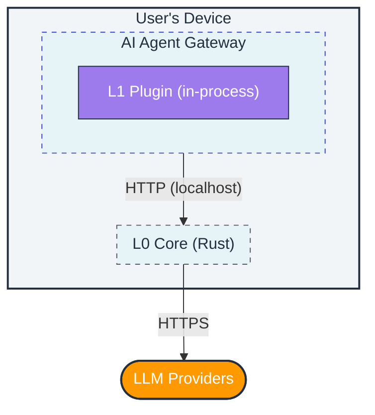
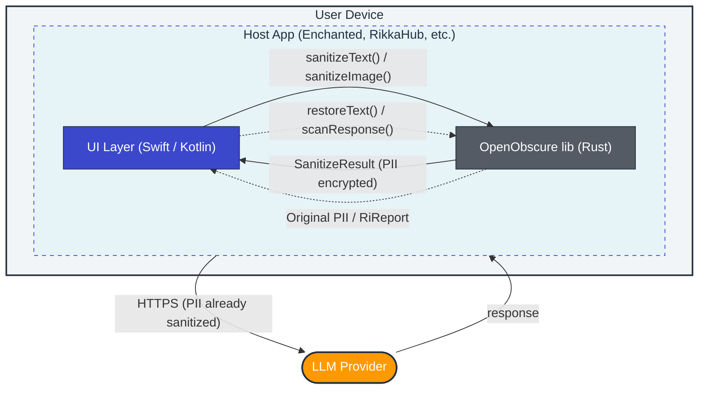

# Deployment Models

OpenObscure runs **entirely on the user's device** — no remote servers, no cloud components, no separate infrastructure. It supports two deployment models depending on where the AI agent runs.

---

**Contents**

- [Gateway Model (Desktop / Server)](#gateway-model-desktop--server)
- [Embedded Model (Mobile / Library)](#embedded-model-mobile--library)
- [Comparison](#comparison)
- [Next Steps](#next-steps)

## Gateway Model (Desktop / Server)

The full-featured deployment. OpenObscure runs as a **sidecar HTTP proxy** on the same host as the AI agent's Gateway. Both layers are active.

| Component | Process | How it runs |
|-----------|---------|-------------|
| **L0** (Rust proxy) | Standalone binary | Separate process, started as sidecar alongside the host agent. |
| **L1** (TS plugin) | In-process | Loaded into the host agent's Node.js runtime via plugin SDK, or used as a library. The reference integration is [OpenClaw](https://github.com/nicholascage-openclaw) — a separate desktop AI agent project. |

**Supported platforms:** macOS (Apple Silicon), Linux (x64 + ARM64), Windows (x64).

**Activation:**
1. **At install time** — The host agent's bundler includes OpenObscure and activates it during setup (if user opts in). Agents with a plugin SDK can automate this step.
2. **Post-install** — User enables OpenObscure by configuring the host agent to route API traffic through `127.0.0.1:18790` instead of directly to LLM providers, and installs the L1 plugin into the agent's extensions directory.

When disabled, the host agent operates normally with direct LLM connections — OpenObscure adds zero overhead when not active.

**Features:** Full PII scanning (regex + NER/CRF + keywords + multilingual IDs), FPE encryption (10 types), image pipeline (face/OCR/NSFW solid-fill redaction, EXIF strip), voice PII detection (KWS keyword spotting), response integrity (R1 dictionary + R2 TinyBERT classifier — cognitive firewall), SSE streaming, NAPI native addon (15-type in-process scanning for Node.js agents).

**Build artifacts:**

| Output | Cargo Target | Use Case |
|--------|-------------|----------|
| `openobscure-core` | `[[bin]]` | Standalone HTTP proxy |
| `libopenobscure_core` | `[lib]` lib | Rust integration crate |

---

## Embedded Model (Mobile / Library)

For mobile apps and custom integrations, OpenObscure compiles as a **native library** (`.a` for iOS, `.so` for Android) linked directly into the host application. No HTTP server, no sockets — just function calls via UniFFI-generated Swift/Kotlin bindings.

**Supported platforms:** iOS (aarch64 device + simulator), Android (arm64-v8a, armeabi-v7a, x86_64, x86).

**API surface:**

| Function | What it does |
|----------|-------------|
| `OpenObscureMobile::new(config, fpe_key)` | Initialize scanner + FPE engine with host-provided key |
| `sanitize_text(text)` | Scan for PII, encrypt with FPE, return sanitized text + mapping |
| `restore_text(text, mapping)` | Decrypt FPE values in response text using saved mapping |
| `sanitize_image(bytes)` | Face redact + OCR text redact + NSFW redact + EXIF strip (optional, adds ~20MB) |
| `sanitize_audio_transcript(text)` | Scan speech transcript for PII, return sanitized text + mapping |
| `check_audio_pii(text)` | Quick PII count in audio transcript (no encryption) |
| `scan_response(text)` | Scan LLM response for persuasion/manipulation (cognitive firewall, Full/Standard tier) |
| `rotate_key(new_key)` | Rotate FPE key with 30-second overlap window for in-flight mappings |
| `stats()` | PII counts, scanner mode, image pipeline status, device tier |

**Third-party integration:** OpenObscure can be embedded into any iOS/macOS/Android chat app. Tested integrations include [Enchanted](https://github.com/AugustDev/enchanted) (iOS/macOS Ollama client) and [RikkaHub](https://github.com/rikkahub/rikkahub) (Android multi-provider LLM client). See [INTEGRATION_GUIDE.md](../integrate/embedding/INTEGRATION_GUIDE.md) for step-by-step instructions.

**Key differences from Gateway Model:**
- No HTTP server (axum/tokio not compiled in)
- FPE key passed from host app (no OS keychain access on mobile)
- Hardware auto-detection (`auto_detect: true` default) profiles device RAM and selects features automatically — phones with 8GB+ RAM get full NER + ensemble + image pipeline + cognitive firewall, matching gateway efficacy
- `models_base_dir` config field simplifies model path setup — point to a single directory and individual `*_model_dir` fields are auto-resolved from standard subdirectories (`ner/`, `ner_lite/`, `crf/`, `scrfd/`, `blazeface/`, `ocr/`, `nsfw/`, `ri/`)
- Image pipeline and cognitive firewall default to enabled; device budget gates actual activation — without model files on disk these are no-ops
- All features tier-gated via `FeatureBudget` — config is the operator's intent, budget is the hardware gate
- Per-match FPE tweaks (byte offset) prevent frequency analysis within a single request

**Build artifacts:**

| Output | Cargo Target | Use Case |
|--------|-------------|----------|
| `libopenobscure_core.a` | `[lib]` staticlib | iOS static library |
| `libopenobscure_core.so` | `[lib]` cdylib | Android shared library |

The `mobile` feature flag enables UniFFI bindings. The binary target always compiles the full server; the library target can exclude server deps via feature flags.

---

## Comparison

| | Gateway | Embedded |
|---|---------|----------|
| **Intercept method** | HTTP reverse proxy (localhost:18790) | In-process function calls |
| **Layers active** | L0 (proxy) + L1 (plugin) | L0 (library) only |
| **PII handling** | FPE encryption (reversible) on requests; redaction on tool results | FPE encryption (reversible) |
| **Image pipeline** | Full (NSFW + face + OCR + EXIF) | Full (same models, tier-gated) |
| **Cognitive firewall** | R1 dictionary + R2 classifier | R1 dictionary + R2 classifier (Full/Standard) |
| **Voice PII** | KWS keyword spotting | Platform Speech APIs + UniFFI bridge |
| **Key management** | OS keychain or env var | Host app provides key (iOS Keychain / Android Keystore) |
| **Networking** | Forwards host agent's HTTP requests | None — host app handles all networking |
| **API keys** | Passthrough-first (forwards unchanged) | Not involved — host app manages keys |
| **Platforms** | macOS, Linux (x64/ARM64), Windows (x64) | iOS, Android, macOS (native) |
| **Binary size** | ~2.7MB | ~160MB per XCFramework slice (iOS) |

### When to Use Which

| Scenario | Model | Why |
|----------|-------|-----|
| Desktop AI agent (e.g. OpenClaw Gateway) | Gateway | Full feature set, both layers |
| Server / VPS deployment | Gateway | Same binary, headless key management |
| iOS / Android companion app | Embedded | On-device PII protection + cognitive firewall, native bindings |
| Custom Rust application | Embedded | Link as a library crate, call directly |
| Edge device (Raspberry Pi) | Gateway | Full features, runs on ARM Linux |

### Defense in Depth: Both Models Together

**Both models can run simultaneously.** The mobile app sanitizes PII before it reaches the Gateway (Embedded), and the Gateway sanitizes again before forwarding to LLM providers (Gateway). Double protection for mobile-originated data:

### API Keys & External Connections

OpenObscure does **not** have its own LLM credentials and does **not** initiate its own API calls.

- **Gateway:** Passthrough-first — forwards the host agent's API keys unchanged.
- **Embedded:** No API calls at all — the library sanitizes text/images and returns results. The host app handles all networking.

The only network activity OpenObscure produces (Gateway only) is forwarding the host agent's existing LLM requests through the local proxy. No telemetry, no phone-home, no external dependencies at runtime.

---

## Next Steps

- [Deployment Tiers](deployment-tiers.md) — hardware capability detection, tier thresholds, and feature budgets
- [System Overview](../architecture/system-overview.md) — full architecture, data flow, and threat model
