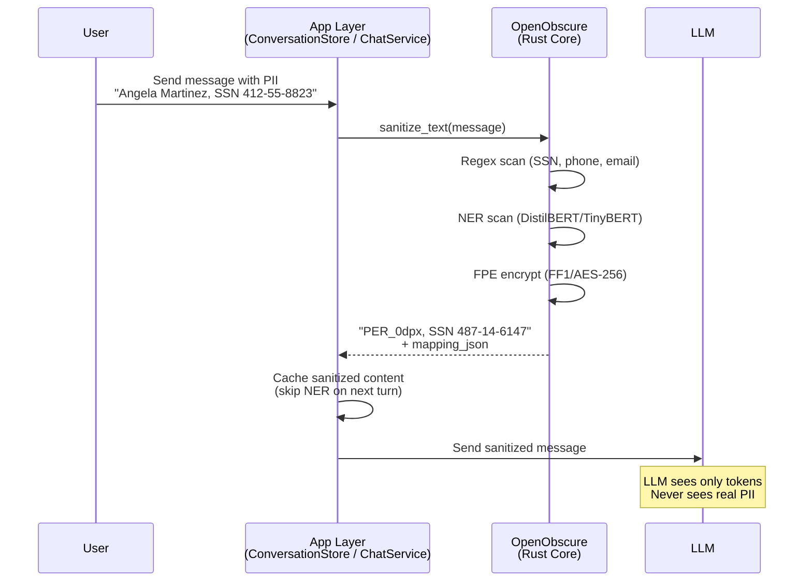
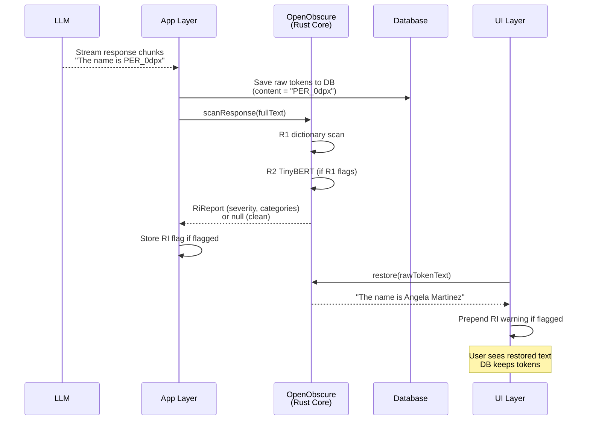
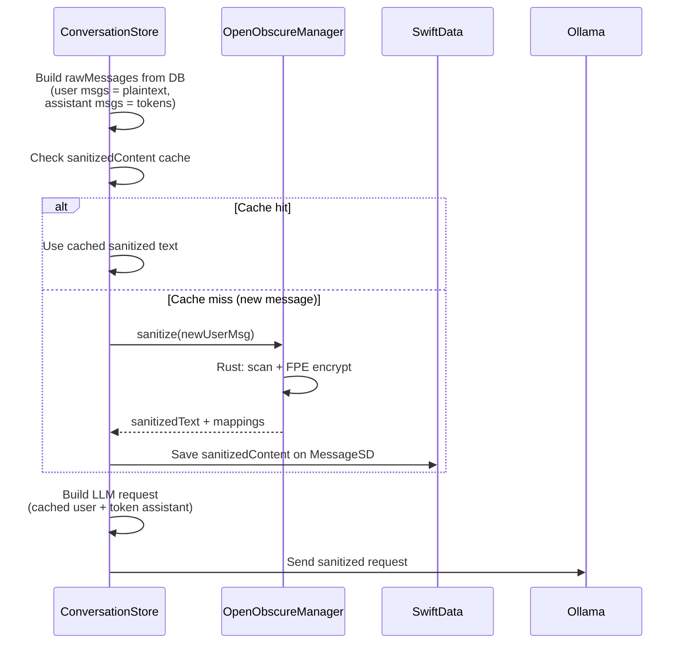
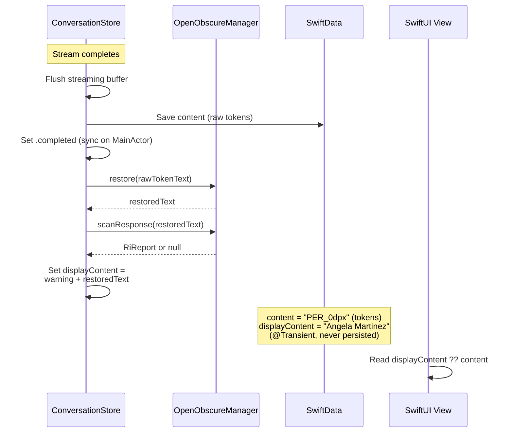
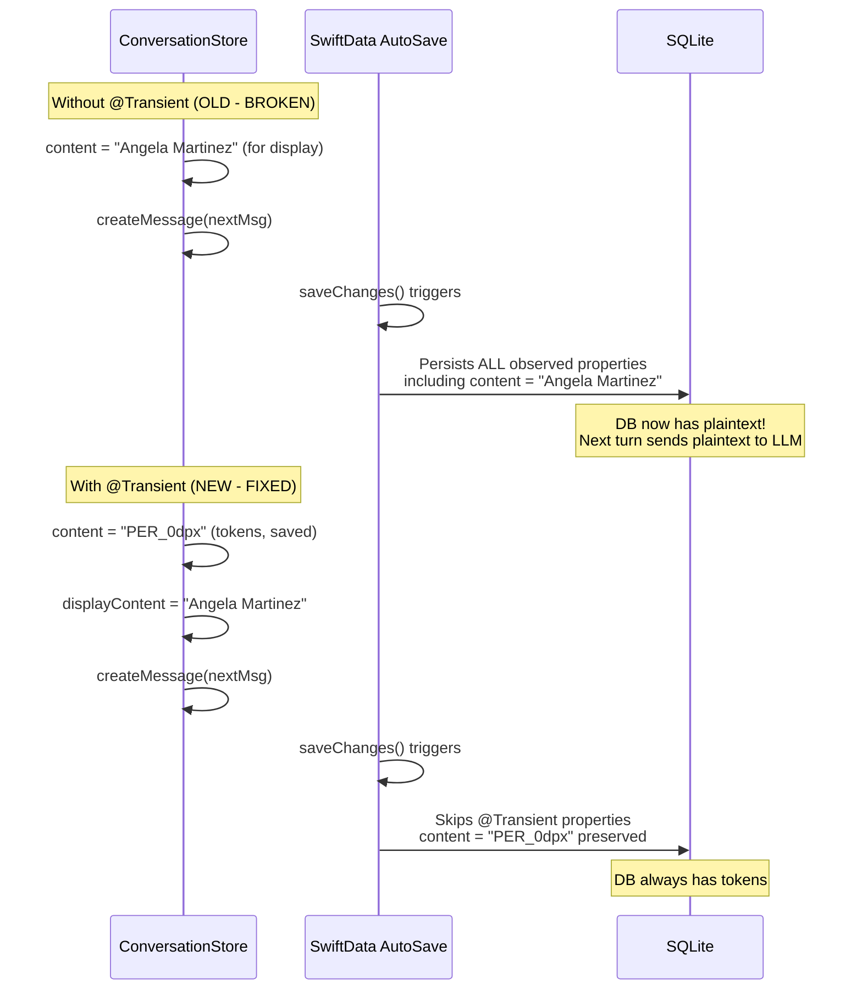
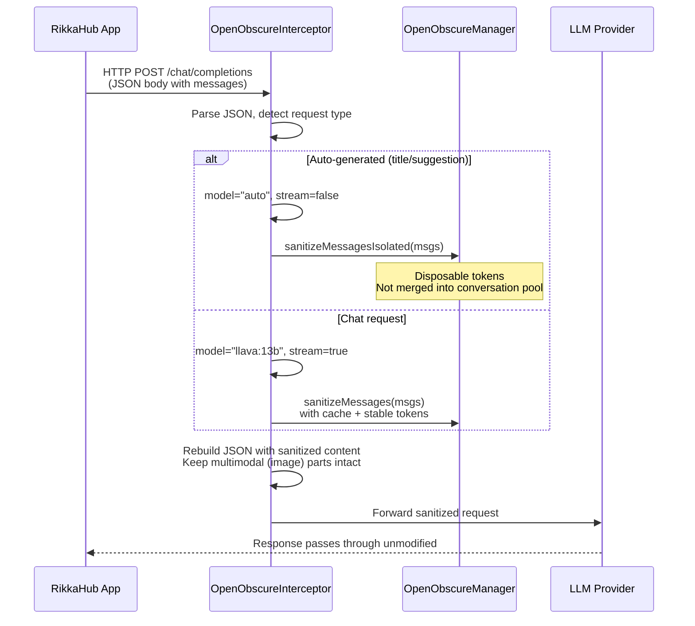
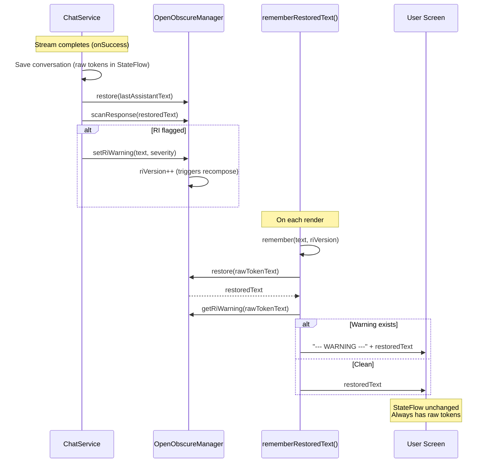
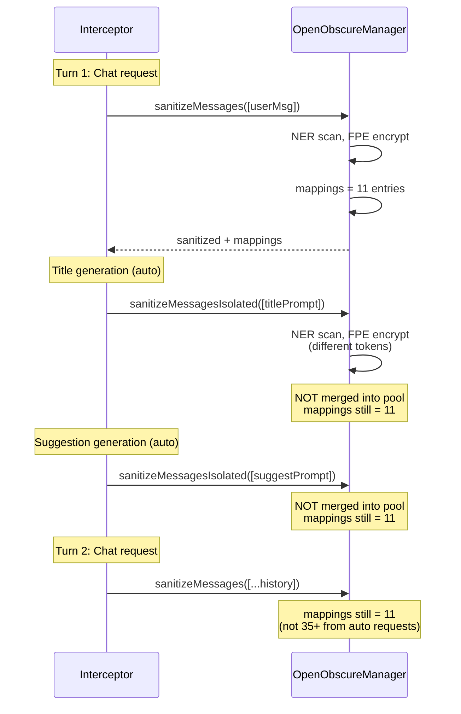
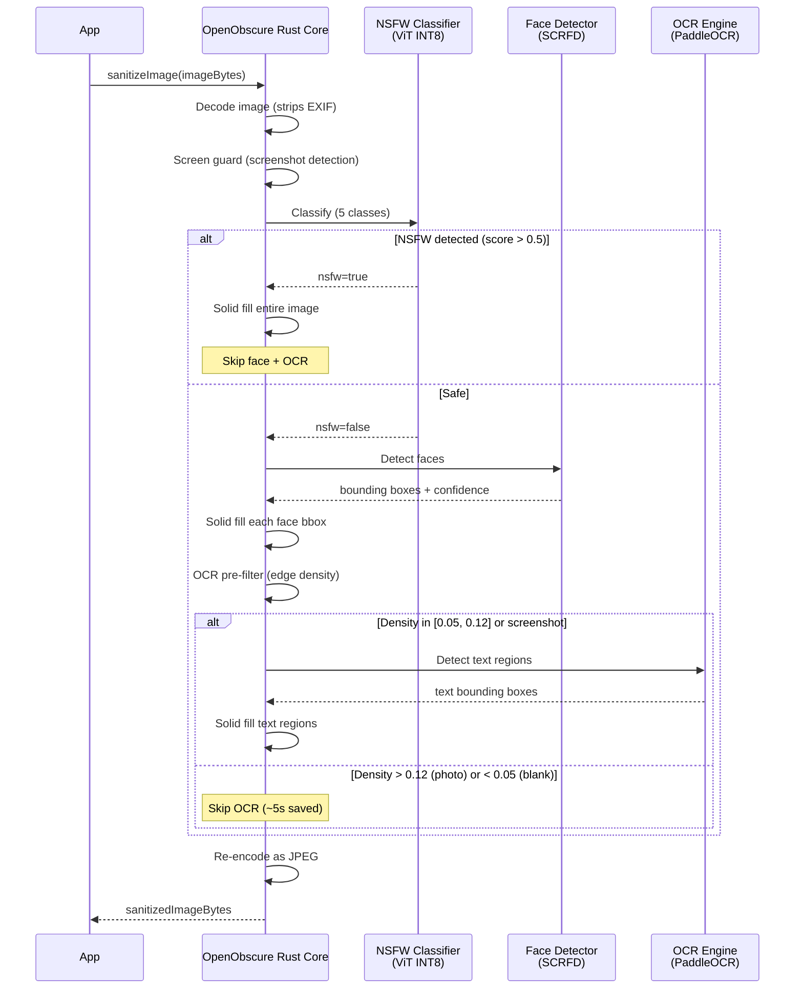
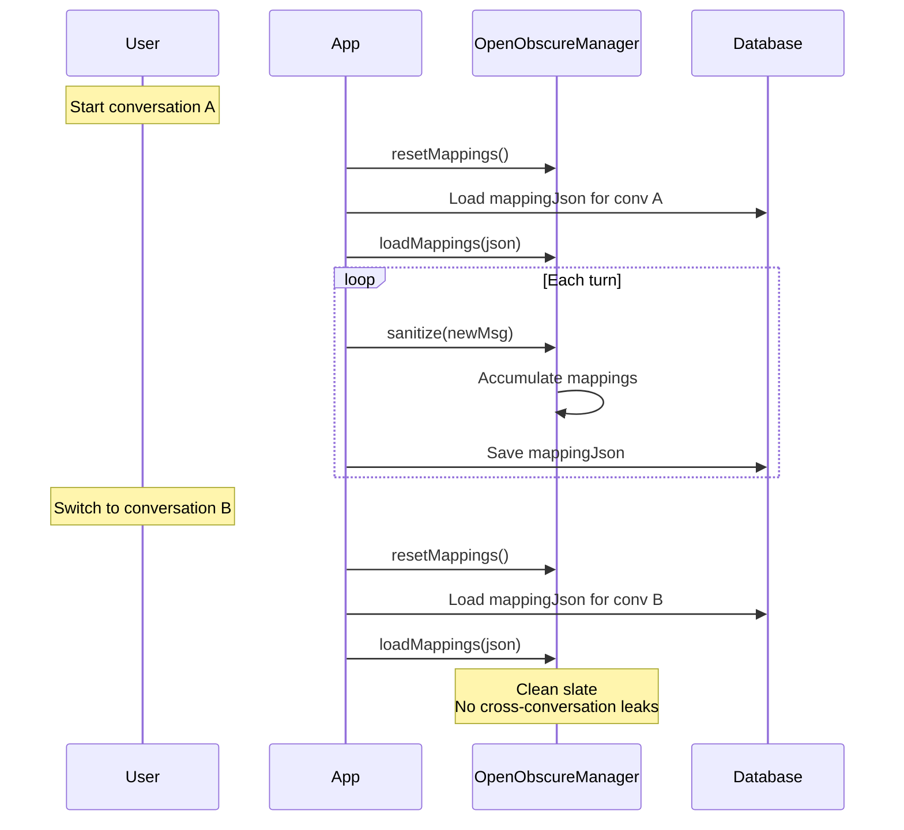

# Embedded Integration Architecture

How OpenObscure integrates into third-party chat apps via the embedded model.
This document covers the data flow for both iOS (Enchanted) and Android (RikkaHub)
reference implementations.

## Core Principle

**The LLM never sees real PII.** All sensitive data is encrypted/tokenized before
leaving the device. The LLM works with opaque tokens (`PER_0dpx`, `HLT_k7qh`,
`487-14-6147`). Restore happens only at the UI rendering layer — never in shared
state or persistent storage.

## Data Flow: Text Sanitization

Both platforms follow the same logical flow, adapted to their frameworks.

### Outbound (User Message to LLM)

### Inbound (LLM Response to User)

## iOS Architecture (Enchanted)

### Key Files Modified

| File | Role |
|------|------|
| `Stores/ConversationStore.swift` | Orchestrates sanitize/restore/RI flow |
| `SwiftData/Models/MessageSD.swift` | SwiftData model with `@Transient displayContent` |
| `OpenObscureManager.swift` | Singleton wrapping Rust FFI calls |

### Sanitize Flow (sendPrompt)

### Restore Flow (handleComplete)

### Why @Transient displayContent

## Android Architecture (RikkaHub)

### Key Files Modified

| File | Role |
|------|------|
| `OpenObscureInterceptor.kt` | OkHttp interceptor, outbound-only |
| `OpenObscureManager.kt` | Singleton: sanitize, restore, RI, image, cache |
| `ChatService.kt` | Stream handling, RI scan in onSuccess |
| `ChatMessage.kt` | Compose `rememberRestoredText()` with RI warning |
| `ChatVM.kt` | Reset/load mappings on conversation switch |
| `ConversationEntity.kt` | Room entity with `mappingJson` column |

### Interceptor Flow (Outbound)

### Restore Flow (Compose Layer)

### Mapping Isolation (Auto-Generated Requests)

## Image Sanitization Pipeline

Same pipeline on both platforms. The integration point differs:
- **iOS**: Called directly in `ConversationStore.sendPrompt()` before building the LLM request
- **Android**: Called in `OpenObscureInterceptor.sanitizeMultimodalMessage()` when processing `image_url` parts

## Session Mapping Lifecycle

## Platform Comparison

| Aspect | iOS (Enchanted) | Android (RikkaHub) |
|--------|----------------|-------------------|
| **Sanitize entry** | `ConversationStore.sendPrompt()` | `OpenObscureInterceptor.intercept()` |
| **DB token storage** | `@Transient displayContent` on MessageSD | StateFlow unchanged, Compose restores |
| **Restore entry** | `handleComplete()` + `restoreMessagesForDisplay()` | `rememberRestoredText()` (Compose) |
| **RI warning** | `riWarningLabel()` in handleComplete | `setRiWarning()` + `riVersion` recompose |
| **Cache mechanism** | `sanitizedContent` on MessageSD (persisted) | `sanitizeCache` HashMap (in-memory) |
| **Mapping persistence** | `mappingJson` on ConversationSD | `mappingJson` on ConversationEntity (Room) |
| **Image sanitize** | Direct call in ConversationStore | Interceptor multimodal part processing |
| **Auto-gen isolation** | N/A (Enchanted has no auto-gen) | `sanitizeMessagesIsolated()` |
| **Conversation switch** | `selectConversation()` | `ChatVM.init` observer |
