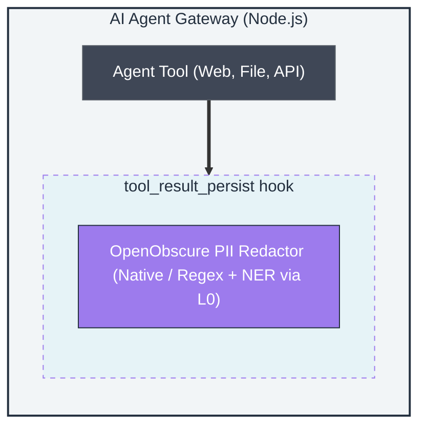

# OpenObscure Plugin — Architecture

> Layer 1 of the OpenObscure privacy firewall. See `../project-plan/MASTER_PLAN.md` for full system architecture.

---

## Role in OpenObscure

The gateway plugin is the **second line of defense**. While L0 (Rust proxy) handles outbound PII encryption, L1 catches PII that enters through **tool results** — web scraping, file reads, API responses, and other agent tool outputs that bypass the proxy entirely.



## Module Map

```
src/
├── index.ts                Plugin entry point — register(), hook wiring, tool registration, auth token, before_tool_call
├── core.ts                 Agent-agnostic API — exports redactPii, redactPiiWithNer, cognitive firewall, logging
├── redactor.ts             PII Redactor — regex detection + NER-enhanced redaction via L0 endpoint
├── cognitive.ts            Cognitive Firewall — JS persuasion dictionary (7 Cialdini categories, 248 phrases, 3→2→1 scanning, severity tiers, warning labels)
├── heartbeat.ts            L1 Heartbeat Monitor — pings L0 health endpoint with auth token
├── oo-log.ts               Unified logging API — ooInfo/ooWarn/ooError/ooDebug/ooAudit + PII scrub
├── types.ts                OpenClaw plugin API type definitions
├── redactor.test.ts        Redactor tests (regex + NER-enhanced)
├── cognitive.test.ts       Cognitive firewall tests (parity, tokenizer, categories, severity, labels, edge cases — 59 tests)
├── heartbeat.test.ts       Heartbeat monitor + auth token tests
├── oo-log.test.ts          Logging API + PII scrubbing + audit log + module constants tests
└── before-tool-call.test.ts  Prepared before_tool_call handler tests
```

## Components

### PII Redactor (redactor.ts)

Scans tool result text for PII and replaces matches with `[REDACTED-*]` labels. Automatically selects the best available detection engine at module load:

**Detection Engines (auto-detected, highest priority first):**

| Engine | When Used | PII Types | Latency |
|--------|-----------|-----------|---------|
| **Native addon** (`@openobscure/scanner-napi`) | Addon installed | 15 (regex + keywords + NER) | <5ms |
| **L0 NER endpoint** (`POST /_openobscure/ner`) | L0 proxy running, no addon | 15 (semantic NER + regex merge) | ~15ms (HTTP) |
| **JS regex** fallback | Neither available | 5 (CC, SSN, phone, email, API key) | ~0ms |

The native addon wraps the same Rust HybridScanner that powers L0. Auto-detection happens once at module load via `require("@openobscure/scanner-napi")`. If the require fails, falls back silently.

**NER model auto-discovery:** When the native addon is loaded, the redactor looks for NER model files at `../openobscure-proxy/models/ner/` relative to the addon's install location. If found, enables NER (person, location, org detection) for 15-type coverage.

**JS Regex Fallback (5 types):**

| PII Type | Pattern | Post-Validation |
|----------|---------|-----------------|
| Credit Card | 13-19 digits with optional separators | Luhn check (rejects invalid) |
| SSN | `NNN-NN-NNNN` | Area validation (no 000/666/900+) |
| Phone | 10+ digits with separators or `+` prefix | Separator/`+` required |
| Email | RFC-like `local@domain.tld` | None |
| API Key | Known prefixes: `sk-`, `AKIA`, `ghp_`, etc. | Prefix match |

**Key difference from L0:** L1 uses **redaction** (`[REDACTED-*]`), not FPE encryption. Tool results are internal and don't need format-preserving properties.

```typescript
const result = redactPii("My SSN is 123-45-6789");
// result.text → "My SSN is [REDACTED-SSN]"
// result.count → 1
// result.types → { ssn: 1 }
```

### Heartbeat Monitor (heartbeat.ts)

Pings L0's `/_openobscure/health` endpoint to detect outages.

| State | User Impact |
|-------|-------------|
| **active** | Silent — no notification |
| **degraded** | Warning: "OpenObscure proxy is not responding — PII protection is disabled" |
| **recovering** | Log: "OpenObscure proxy recovered" |
| **disabled** | "OpenObscure is not enabled. PII will be sent in plaintext." |

**Auth token:** Reads `~/.openobscure/.auth-token` (written by L0 on startup) and sends it as `X-OpenObscure-Token` header with every health check. Without a valid token, L0 returns 401 and the monitor transitions to `degraded`.

### Unified Logging API (oo-log.ts)

All logging goes through a unified facade — no direct `console.*` calls outside this module. Every log line passes through PII scrubbing before output.

| Function | Level | Purpose |
|----------|-------|---------|
| `ooInfo(module, message, data?)` | INFO | General operational messages |
| `ooWarn(module, message, data?)` | WARN | Non-fatal issues (L0 unreachable, config fallback) |
| `ooError(module, message, data?)` | ERROR | Failures requiring attention |
| `ooDebug(module, message, data?)` | DEBUG | Detailed diagnostic output |
| `ooAudit(module, message, data?)` | AUDIT | GDPR audit trail (routed to separate JSONL file) |

**Module constants:** `REDACTOR`, `HEARTBEAT`, `PLUGIN` — prevent typos in log module tags.

**PII scrubbing:** All string fields run through `redactPii()` before output, ensuring no PII leaks through log messages even if developers forget to sanitize.

### Cognitive Firewall (cognitive.ts)

Embedded JS persuasion/manipulation scanner mirroring the L0 Rust `persuasion_dict.rs` + `response_integrity.rs` logic. Provides L1-level response integrity scanning without requiring the L0 proxy.

| Aspect | Detail |
|--------|--------|
| **Categories** | 7 Cialdini categories: Urgency, Scarcity, SocialProof, Fear, Authority, Commercial, Flattery |
| **Phrases** | 248 total (pinned to exact Rust parity per category) |
| **Scanning** | 3→2→1 word window (longest match first, overlap dedup via byte offsets) |
| **Severity** | Notice (1 cat, ≤2 matches), Warning (2+ cats or 3+ matches), Caution (4+ cats or Commercial+Fear/Urgency) |
| **Warning labels** | `--- OpenObscure WARNING ---` format matching L0 output exactly |
| **NAPI bridge** | `scan_persuasion()` free function wraps Rust `PersuasionDict` for native speed when NAPI addon installed |

```typescript
import { scanPersuasion } from "openobscure-plugin/core";
const result = scanPersuasion("Act now! This exclusive offer expires soon.");
// result.severity → "Caution", result.categories → ["Urgency", "Scarcity", "Commercial"]
```

### Plugin Registration (index.ts)

```typescript
import { register } from "openobscure-plugin";

register(api, {
  redactToolResults: true,
  heartbeat: true,
});
```

Registers two things with the host agent:

1. **`tool_result_persist` hook** — Called synchronously after every tool execution. Scans the result text with the PII Redactor and replaces matches before persistence.

2. **Heartbeat monitor** — Background interval that pings L0 health with auth token, warns user on L0 failure, logs recovery.

## Hook Design: tool_result_persist

The `tool_result_persist` hook is **synchronous** (no async/Promise). This is critical because:
- OpenClaw persists tool results immediately after hook return
- An async hook would allow PII to be persisted before redaction completes
- The regex-based redactor is fast enough for synchronous execution (~1ms for typical tool results)

```
Tool executes → tool_result_persist fires → PII Redactor scans → redacted result persisted
                                                 │
                                                 └─ Synchronous, blocking
```

## Test Coverage

| Suite | What's Covered |
|-------|----------------|
| `PII Redactor` | SSN, CC (Luhn valid/invalid), email, phone, API key, multiple PII, invalid SSN areas, clean text |
| `NER-Enhanced Redaction` | NER type labels cover all L0 PII types, NER-enhanced redaction merge |
| `HeartbeatMonitor` | Initial state, healthy check, degraded transition, consecutive failures, recovery, auth token |
| `STATE_MESSAGES` | Message content for each state, active silence |
| `ooLog` | Logging facade, PII scrubbing, JSON/plain output |
| `PII scrubbing` | Defense-in-depth PII scrub in all log string fields |
| `GDPR audit log` | Audit routing to separate JSONL file |
| `OO_MODULES constants` | Module constant values and coverage |
| `before_tool_call handler` | Prepared handler registration, feature check, fallback behavior |
| `Persuasion Dictionary` | Total phrase count pinned to 248 (Rust parity) |
| `Per-Category Phrase Count Parity` | 7 per-category count assertions + sum check (Tier 1a) |
| `Cognitive Edge Cases` | Unicode, long text, HTML tags, newlines, smart quotes, repeated whitespace |
| `Severity Boundaries` | All boundary conditions (Notice/Warning/Caution thresholds, combo overrides) |
| `Warning Label Exact Format` | Notice/Warning/Caution string match, SocialProof display name |
| `scanPersuasion` | Clean text, persuasive text, Caution-level, empty string |
| **Total** | **112 tests across 22 suites** |

## Resource Budget

| Metric | Target | Actual |
|--------|--------|--------|
| RAM (resident) | ~25MB | Part of OpenClaw Node.js process |
| Storage | ~3MB | Source + compiled JS |
| Latency (redaction) | <5ms | ~1ms for typical tool results |

## Technology Stack

| Component | Choice | Why |
|-----------|--------|-----|
| Language | TypeScript 5.4 | Compatible with host agent runtime |
| Module system | CommonJS | Compatible with OpenClaw plugin loader |
| Native scanner | `@openobscure/scanner-napi` (optional) | 15-type Rust HybridScanner via napi-rs |
| Testing | node:test + node:assert | Zero-dependency, built into Node.js |
| Test runner | tsx | TypeScript execution without pre-compilation |

## Relationship to L0 (Rust Proxy)

| Aspect | L0 (Proxy) | L1 (Plugin) |
|--------|------------|-------------|
| **Intercept point** | HTTP requests/responses | Tool results |
| **PII handling** | FPE encryption (format-preserving) | Redaction (`[REDACTED]`) |
| **Reversible?** | Yes (decrypt on response) | No (destructive redaction) |
| **Runs in** | Standalone Rust binary | OpenClaw Node.js process |
| **Catches** | All LLM API traffic | Tool outputs (web, file, API) |

Together, L0 and L1 form a **defense-in-depth** strategy: L0 encrypts PII in transit to LLMs, L1 redacts PII from local tool operations.

## Generic Usage (without OpenClaw)

For agent-agnostic access to OpenObscure's privacy functions, use the core entry point:

```typescript
import { redactPii } from "openobscure-plugin/core";
```

This exports core logic (PII redaction, health monitoring, logging) without any agent framework wiring.
The `register()` function and OpenClaw-specific tool definitions remain available
via the default entry point (`openobscure-plugin`).

## Recently Completed

- **Native scanner auto-detection:** `redactPii()` auto-upgrades to NAPI addon (15-type Rust HybridScanner) when `@openobscure/scanner-napi` is installed — DONE
- **NER-enhanced redaction:** When L0 is healthy, redactor calls `POST /_openobscure/ner` for semantic PII spans (names, addresses, orgs) merged with regex results — DONE
- **`before_tool_call` handler:** Prepared handler that auto-activates when OpenClaw wires the hook, upgrading from soft to hard enforcement — DONE (Phase 10F)
- **Agent-agnostic API (`core.ts`):** Exports core functions without framework wiring for non-OpenClaw integrations — DONE
- **Cognitive Firewall (`cognitive.ts`):** Embedded JS persuasion dictionary (248 phrases, 7 categories), severity computation, warning labels — mirrors Rust R1 logic exactly. NAPI `scan_persuasion()` bridge for native speed. Tier 1-4 test coverage (59 tests). — DONE (Phase 13F)

## Future Work

- **Streaming redaction:** Handle streamed tool results (e.g., large file reads) incrementally (blocked by OpenClaw's synchronous hook API)
