# OpenObscure Proxy — Architecture

> Layer 0 of the OpenObscure privacy firewall. See `../project-plan/MASTER_PLAN.md` for full system architecture.

---

## Role in OpenObscure

The Rust PII proxy is the **hard enforcement** layer. It sits between the AI agent and LLM providers as an HTTP reverse proxy. Every API request passes through it — there is no bypass path.

```mermaid
flowchart LR
    %% Direction and Grouping
    subgraph LocalHost [" Local Host Environment "]
        direction LR
        
        subgraph Agent [" Compute "]
            A["<b>AI Agent</b><br/>(Local App)"]
        end

        subgraph Proxy [" OpenObscure Proxy "]
            direction TB
            IP["<b>Endpoint</b><br/>127.0.0.1:18790"]
            
            subgraph Logic [" Security Operations "]
                direction TB
                req["<b>Request Path</b><br/>Scan → FPE Encrypt PII"]
                res["<b>Response Path</b><br/>FPE Decrypt ciphertexts"]
            end
            
            IP --- Logic
        end
        
        %% Local Handshake
        A <== "HTTP" ==> IP
    end

    subgraph Cloud [" External Cloud "]
        LLM["<b>LLM Provider</b><br/>(Anthropic, OpenAI...)"]
    end

    %% Network Connections
    Logic <== "HTTPS" ==> LLM

    %% --- AWS STYLE STYLING ---
    
    %% Main Host Boundary
    style LocalHost fill:#f2f5f7,stroke:#232F3E,stroke-width:2px,color:#232F3E
    
    %% Internal Logic
    style Agent fill:#e6f3f7,stroke:#3b48cc,stroke-dasharray: 5 5,color:#232F3E
    style Proxy fill:#e6f3f7,stroke:#545b64,stroke-dasharray: 5 5,color:#232F3E
    style Logic fill:#ffffff,stroke:#545b64,stroke-dasharray: 2 2,color:#232F3E
    
    %% Node Styling
    style A fill:#3b48cc,stroke:#232F3E,color:#fff
    style IP fill:#ffffff,stroke:#545b64,color:#232F3E
    style req fill:#545b64,stroke:#232F3E,color:#fff
    style res fill:#545b64,stroke:#232F3E,color:#fff

    %% External Provider
    style Cloud fill:#fff7ed,stroke:#ff9900,stroke-width:2px,color:#232F3E
    style LLM fill:#ff9900,stroke:#232F3E,stroke-width:2px,color:#fff

    %% Link Styling
    linkStyle 1 stroke:#3b48cc,stroke-width:3px
    linkStyle 2 stroke:#ff9900,stroke-width:3px
```



## Module Map

```
src/
├── main.rs              Entry point: CLI (clap subcommands), config, vault init, auth token, server startup, model eviction
├── config.rs            TOML config deserialization and validation (ImageConfig, VoiceConfig, ResponseIntegrityConfig)
├── server.rs            axum Router, middleware stack, graceful shutdown, NER endpoint
├── proxy.rs             Reverse proxy handler (the core request/response loop)
│
│   ── Text PII ──
├── scanner.rs           PII regex scanner (RegexSet + individual Regex)
├── hybrid_scanner.rs    Hybrid scanner: regex → keywords → NER/CRF, dedup, nested JSON, code fences, ensemble voting
├── keyword_dict.rs      Health/child keyword dictionary (~700 terms, HashSet O(1) lookup, multilingual)
├── ner_scanner.rs       TinyBERT INT8 ONNX NER (BIO tags → PII spans)
├── ner_endpoint.rs      POST /_openobscure/ner — semantic PII scan endpoint for L1 plugin
├── crf_scanner.rs       CRF fallback classifier (delegates RAM detection to device_profile)
├── wordpiece.rs         WordPiece tokenizer for NER input
├── fpe_engine.rs        FF1 FPE encrypt/decrypt engine
├── key_manager.rs       FPE key rotation: versioned vault keys, RwLock, 30s overlap window
├── pii_types.rs         PII type definitions (15 types incl. Iban), alphabet mappers, format templates
├── mapping.rs           Per-request FPE mapping store for response decryption
├── hash_token.rs        Hash-based token generation for non-FPE PII redaction (deterministic short tokens)
├── body.rs              Three-pass body processing: images → voice → text PII scanning
├── passthrough.rs       Lightweight passthrough proxy (no scanning, for benchmarking/testing)
│
│   ── Multilingual PII ──
├── lang_detect.rs       Language detection via whatlang (9 languages, fallback to English)
├── multilingual/
│   ├── mod.rs           Per-language pattern registry + scan dispatch
│   ├── es.rs            Spanish: DNI, NIE, phone, IBAN (check-digit validation)
│   ├── fr.rs            French: NIR, phone, IBAN (modulus 97 validation)
│   ├── de.rs            German: Personalausweis, phone, IBAN
│   ├── pt.rs            Portuguese/Brazilian: CPF, CNPJ, phone (mod 11 check digits)
│   ├── ja.rs            Japanese: My Number, phone (weighted mod 11)
│   ├── zh.rs            Chinese: Citizen ID 18-digit, phone (weighted mod 11 + X)
│   ├── ko.rs            Korean: RRN, phone (weighted mod 11)
│   └── ar.rs            Arabic: national ID patterns, Gulf/Egypt phone formats
│
│   ── Visual PII ──
├── image_detect.rs      Base64 image detection in JSON (Anthropic + OpenAI formats)
├── image_fetch.rs       URL image fetch: download remote images for inline processing
├── image_pipeline.rs    ImageModelManager orchestrator: decode → resize → NSFW → classifier → face → OCR → encode
├── face_detector.rs     SCRFD-2.5GF (Full/Standard, 640x640) + Ultra-Light RFB-320 (Lite, 320x240) + BlazeFace (128x128, fallback) face detection
├── nsfw_detector.rs     [DEPRECATED] Legacy NudeNet detector (retained for reference only, not used in pipeline)
├── nsfw_classifier.rs   NSFW classifier (ViT-base 5-class, LukeJacob2023/nsfw-image-detector)
├── ocr_engine.rs        PaddleOCR PP-OCRv4 det+rec ONNX (text region detection, CTC decode)
├── image_redact.rs      Solid-color fill for face and text regions (irreversible redaction)
├── screen_guard.rs      Screenshot heuristics (EXIF, resolution, status bar uniformity)
├── detection_meta.rs    BboxMeta, NsfwMeta, ScreenshotMeta detection metadata types
├── detection_validators.rs  Detection verification framework (bbox sanity, NSFW consistency)
│
│   ── Voice PII ──
├── voice_detect.rs      Base64 audio detection in JSON (WAV/MP3/OGG/WebM MIME detection)
├── audio_decode.rs      Audio format decoding: WAV/MP3/OGG → PCM 16kHz mono (symphonia)
├── kws_engine.rs        KWS keyword spotting via sherpa-onnx Zipformer (~5MB INT8, PII trigger phrases)
├── voice_pipeline.rs    KWS-gated selective audio strip: detect PII trigger phrases → strip matching blocks
│
│   ── Response Integrity (Cognitive Firewall) ──
├── persuasion_dict.rs    R1 dictionary (~250 phrases, 7 Cialdini categories, HashSet O(1) lookup)
├── response_integrity.rs R1→R2 cascade: sensitivity tiers, R2Role dispatch, severity computation
├── ri_model.rs           R2 TinyBERT FP32 ONNX multi-label classifier (4 EU AI Act Article 5 categories)
├── response_format.rs   Multi-LLM response format detection (Anthropic/OpenAI/Gemini/Cohere/Ollama/plaintext)
│
│   ── Infrastructure ──
├── device_profile.rs    Hardware profiler: detect RAM/cores, classify tier (Full/Standard/Lite), derive FeatureBudget
├── ort_ep.rs            ONNX Runtime EP selection: CoreML (Apple), NNAPI (Android), CPU fallback
├── vault.rs             OS keychain + env var bridge (FPE key + API keys)
├── health.rs            Health endpoint, HealthStats, crash marker, image counters, device tier + feature budget
├── oo_log.rs            Unified logging macros (oo_info!, oo_warn!, oo_audit!) + module constants
├── pii_scrub_layer.rs   PII scrub filter for log output (tracing MakeWriter wrapper)
├── crash_buffer.rs      mmap ring buffer for crash diagnostics (survives SIGKILL/OOM) + request journal for crash recovery
├── sse_accumulator.rs   SSE frame accumulation for cross-frame PII token and FPE ciphertext reassembly
├── error.rs             Unified error types
├── integration_tests.rs E2E tests (wiremock + tower::oneshot)
│
│   ── Mobile Library (Embedded Model) ──
├── lib_mobile.rs        Mobile API surface: OpenObscureMobile (sanitize, restore, image, stats, sanitize_audio_transcript, check_audio_pii, scan_response)
└── uniffi_bindings.rs   UniFFI interface definitions for Swift/Kotlin (feature-gated: "mobile")
```

## Request Flow

```
1. Host agent sends request to proxy
        │
2. proxy_handler() receives request
        │
3. resolve_provider() — match path prefix to upstream URL
        │
4. Buffer request body (enforce size limit)
        │
5. Pass 1: Image processing (if image.enabled)
   │   a. Walk JSON tree for base64 image content blocks
   │      (Anthropic: type="image" + source.data, OpenAI: type="image_url" + data: URI)
   │   b. For each image: decode base64 → screen guard check → resize (960px max)
   │   c. NSFW check — ViT-base 5-class classifier (LukeJacob2023/nsfw-image-detector) → if NSFW detected, full-image solid fill, skip face/OCR
   │   d. Face detection — SCRFD-2.5GF (Full/Standard) or Ultra-Light RFB-320 (Lite, with tiling heuristic) → NMS → solid-fill face regions
   │   e. OCR: PaddleOCR PP-OCRv4 det → text regions → solid fill (Tier 1) or recognize+scan (Tier 2)
   │   f. Encode processed image → replace base64 in JSON
   │   g. Sequential model loading: face model dropped before OCR loaded
   │
5b. Pass 1b: Voice processing (if voice feature enabled)
   │   a. Walk JSON tree for base64 audio content blocks (WAV/MP3/OGG/WebM)
   │   b. Decode audio to PCM 16kHz mono (audio_decode.rs, symphonia)
   │   c. KWS keyword spotting (sherpa-onnx Zipformer) for PII trigger phrases
   │   d. Strip audio blocks where PII keywords detected, pass clean audio through
   │
6. Pass 2: Text PII scanning
   │   hybrid_scanner.scan_json() — multi-layer scan
   │   a. Regex scanner (CC, SSN, phone, email, API keys, IPv4/6, GPS, MAC) + post-validation
   │   b. Keyword dictionary (health/child terms, ~700 entries)
   │   c. NER/CRF semantic scanner (names, addresses, orgs) if model loaded
   │   d. Deduplicate overlapping spans (regex wins on overlap)
   │   e. Nested JSON: parse serialized JSON strings, scan recursively (max depth 2)
   │   f. Code fences: mask content inside ``` and ` blocks before scanning
   │   - Skip configured fields (model, temperature, etc.)
   │   - Return Vec<PiiMatch> with byte offsets + JSON paths
   │   See: Detection Engine Configuration (../docs/configure/detection-engine-configuration.md)
   │
7. For each PiiMatch:
   │   a. extract_encryptable() — split prefix/domain from encryptable part
   │   b. FormatTemplate::from_raw() — strip separators (dashes, spaces)
   │   c. AlphabetMapper::string_to_numerals() — convert to Vec<u16>
   │   d. Validate domain size (radix^len ≥ 1,000,000)
   │   e. FF1<Aes256>::encrypt(tweak, numerals) — NIST SP 800-38G
   │   f. Reconstruct: numerals → string → re-insert separators → reattach context
   │   g. Store mapping: ciphertext → (plaintext, tweak, type)
   │
8. Apply replacements to JSON body (reverse offset order)
        │
9. Forward modified request to upstream LLM provider (HTTPS)
        │
10. Buffer upstream response
        │
11. For each stored mapping:
    │   - String-replace ciphertext with plaintext in response
    │   - Sort by ciphertext length desc (prevent partial matches)
    │
12. Return decrypted response to the host agent
        │
12b. Response integrity scan (if enabled):
    │   a. Extract text from response JSON (Anthropic/OpenAI format)
    │   b. R1: Dictionary scan (~250 phrases, 7 categories)
    │   c. R2: If triggered by sensitivity/R1 result, run TinyBERT classifier
    │   d. Cascade: Confirm/Suppress/Upgrade/Discover
    │   e. If flagged & log_only=false: prepend warning label
        │
13. Clean up request mappings from store
```

## FPE (Format-Preserving Encryption)

FF1 (NIST SP 800-38G) encrypts 10 structured PII types into ciphertext of identical format — a credit card encrypts to another credit card. Five keyword/NER types use hash-token redaction instead. Per-record tweaks prevent frequency analysis.

For the full reference — per-type radix/alphabet table, TOML config options, key generation, key rotation, fail-open/fail-closed behavior, and domain size safety — see [FPE Configuration](../docs/configure/fpe-configuration.md).

**Implementation:** `fpe_engine.rs` (FF1 encrypt/decrypt), `key_manager.rs` (versioned keys, 30s overlap rotation), `vault.rs` (OS keychain + env var bridge), `pii_types.rs` (per-type radix and eligibility), `body.rs` (fail-mode handling).

## Authentication & Key Management

### Passthrough-First Design

OpenObscure reuses the host agent's API keys by default — **no duplicate key management**. The proxy forwards all auth headers from the host agent to upstream providers untouched:


All original request headers are forwarded except:
- **Hop-by-hop headers** (RFC 7230): `Connection`, `Transfer-Encoding`, `Host`, etc.
- **Provider-specific strip_headers**: configured per provider in TOML (e.g., `x-openobscure-internal`)

### FPE Key Management

Key generation, storage resolution order (env var → OS keychain), and zero-downtime rotation are covered in [FPE Configuration](../docs/configure/fpe-configuration.md).

### Health Endpoint Auth Token

L0 generates a shared auth token for the health endpoint:

1. **`OPENOBSCURE_AUTH_TOKEN` env var** — explicit token for Docker/CI
2. **`~/.openobscure/.auth-token` file** — auto-generated on first run (0600 perms on Unix)
3. **Auto-generate** — random 32-byte hex written to file

L1 reads the token from `~/.openobscure/.auth-token` and sends it as `X-OpenObscure-Token` header. Health endpoint returns 401 without a valid token. Proxy routes are NOT auth-gated — only the health endpoint.

## Content-Type Handling

The proxy only processes **JSON** request bodies:

| Content-Type | Action |
|-------------|--------|
| `application/json` | Process images (Pass 1) + scan text for PII (Pass 2) |
| `*/*+json` (e.g., `application/vnd.api+json`) | Process images + scan text for PII |
| Missing (no Content-Type header) | Process optimistically (common in API calls) |
| `text/plain`, `multipart/*`, binary, etc. | Pass through without scanning |

Non-JSON bodies are forwarded to upstream unchanged. Base64-encoded images within JSON bodies are detected and processed (face solid-fill, OCR text solid-fill, EXIF strip) before text PII scanning.

## PII Statistics Logging

Each request logs per-type PII match counts **without logging PII values**:

```
INFO request_id=550e8400-... pii_total=3 pii_breakdown="ssn=1, email=1, phone=1" "PII encrypted in request"
```

This enables monitoring PII volume without creating a new privacy risk in logs.

## Error Handling & Fail Mode

Configurable via `fail_mode` in `openobscure.toml`:

### Fail-Open (default)
- FPE encryption error on a single match → log, skip that match, forward original value
- Entire body processing error → log, forward original body unmodified
- The proxy must never block AI functionality due to FPE bugs or edge cases

### Fail-Closed
- Body processing error → reject with **502 Bad Gateway**, do not forward to upstream
- Use when privacy guarantees are more important than availability

### Always blocking (regardless of fail mode)
- Vault unavailable (keychain locked) → **503 Service Unavailable** (no privacy guarantees without the FPE key)
- Upstream unreachable → 502 Bad Gateway
- Body exceeds `max_body_bytes` → **413 Payload Too Large**

L1 (Gateway Plugin) provides a second line of defense for tool results.

## Provider Routing

Configured via TOML. Each provider maps a route prefix to an upstream URL:

```
Request:  POST http://127.0.0.1:18790/anthropic/v1/messages
          ├── Match: /anthropic → providers.anthropic
          ├── Strip prefix: /v1/messages
          └── Forward: POST https://api.anthropic.com/v1/messages
```

Longest prefix match wins when multiple providers overlap.

## Resource Budget

OpenObscure detects device hardware at startup via the `device_profile` module and selects a capability tier (Full/Standard/Lite) based on total RAM. The tier determines which features are enabled and the RAM ceiling.

| Tier | Max RAM | Scanners | Image | Model Timeout |
|------|---------|----------|-------|---------------|
| **Full** (8GB+) | 275MB | NER + CRF + ensemble | Yes | 300s |
| **Standard** (4–8GB) | 200MB | NER + CRF | Yes | 120s |
| **Lite** (<4GB) | 80MB | CRF + regex | Yes | 60s |

On embedded (mobile), budget = 20% of total RAM clamped to [12MB, 275MB].

| Metric | Target | Actual |
|--------|--------|--------|
| RAM (Lite tier) | ~12–80MB | NER + CRF (no ensemble) |
| RAM (Standard tier) | ~67–200MB | NER + image pipeline |
| RAM (Full tier, peak) | ~224MB | NER + ensemble + image pipeline |
| Binary size | <8MB | **2.7MB** (release, stripped, LTO) |
| Dependencies | Minimal | ~35 direct + 1 dev (wiremock) |
| Latency overhead | <5ms (regex), <15ms (NER), <80ms (image) | TBD |
| Test count | — | **1,677** (742 lib + 935 bin) |

## Technology Stack

| Component | Choice | Why |
|-----------|--------|-----|
| HTTP framework | axum 0.8 | Ergonomic, tower middleware, low overhead |
| Async runtime | tokio | Industry standard for async Rust |
| HTTP client | hyper 1 + hyper-util | Direct control over body transformation |
| TLS | rustls + hyper-rustls | Pure Rust, no OpenSSL dependency at link time |
| FPE | fpe 0.6 (FF1) | NIST-approved, pure Rust, RustCrypto AES |
| NER inference | ort 2.0 (ONNX Runtime) | TinyBERT INT8 + BlazeFace + PaddleOCR, cross-platform |
| Image processing | image 0.25 | Decode/encode/resize/solid-fill redaction, pure Rust, strips EXIF |
| Base64 | base64 0.22 | Image content decode/encode |
| EXIF reading | kamadak-exif 0.5 | Screenshot detection (pre-strip analysis) |
| Regex | regex (RegexSet) | Linear time, multi-pattern in one pass |
| Language detection | whatlang 0.16 | Trigram-based language identification, no model download needed |
| Audio decode | symphonia 0.5 (optional) | WAV/MP3/OGG/Vorbis decode for voice pipeline |
| KWS inference | sherpa-rs 0.6.8 + sherpa-rs-sys (optional) | sherpa-onnx Zipformer keyword spotting for PII trigger phrases |
| Config | serde + toml | Human-readable, Rust ecosystem standard |
| Keychain | keyring 3 | Cross-platform OS credential storage |
| Hex encoding | hex 0.4 | Env var key decoding (headless deployments) |
| Logging | tracing + tracing-oslog/journald | Structured, async-aware, platform-native |
| Crash buffer | memmap2 0.9 | mmap ring buffer survives SIGKILL/OOM |

## Image Pipeline

Two-pass processing in `body.rs`: images first (entire base64 string replacement), then text PII (substring FPE).

### ImageModelManager (`image_pipeline.rs`)

```rust
pub struct ImageModelManager {
    nsfw_classifier: Mutex<Option<Arc<Mutex<NsfwClassifier>>>>,
    face_detector: Mutex<Option<Arc<Mutex<FaceDetector>>>>,
    scrfd_detector: Mutex<Option<Arc<Mutex<ScrfdDetector>>>>,
    ultralight_detector: Mutex<Option<Arc<Mutex<UltraLightDetector>>>>,
    ocr_detector: Mutex<Option<Arc<Mutex<OcrDetector>>>>,
    ocr_recognizer: Mutex<Option<Arc<Mutex<OcrRecognizer>>>>,
    last_use: Mutex<Instant>,
    config: ImageConfig,
}
```

**Request-scoped model guards:** Models use a double-`Mutex<Option<Arc<Mutex<T>>>>` pattern. The outer Mutex protects load/evict, the inner Mutex gives `&mut` access for ONNX inference (`Session::run` requires `&mut self`). Requests clone the inner `Arc` before releasing the outer lock. Eviction sets the slot to `None` without invalidating in-flight references — existing `Arc` clones keep models alive until the request completes.

**Memory rule:** Models loaded sequentially. Face model loaded/used/dropped before OCR model loaded. Never both in RAM simultaneously. The NSFW classifier follows the same lazy-load/evict pattern. Background eviction task (60s interval) evicts models idle beyond `model_idle_timeout_secs` (default 300).

### Face Detection (`face_detector.rs`)

Tier-gated face detection: SCRFD-2.5GF for Full/Standard tiers (multi-scale), Ultra-Light RFB-320 for Lite tier (better resolution than BlazeFace), BlazeFace as fallback. Auto-fallback chain: SCRFD → Ultra-Light → BlazeFace on error.

**SCRFD-2.5GF (Full/Standard tier):**

| Property | Value |
|----------|-------|
| Model | SCRFD-2.5GF (~3MB) |
| Input | `[1, 3, 640, 640]` float32, RGB |
| Output | 9 tensors: score/bbox/kps at strides 8/16/32, 2 anchors per cell |
| Post-processing | Score threshold + NMS (IoU 0.4) |
| Strengths | Multi-scale FPN: detects 20px–400px faces in same image |

**Ultra-Light RFB-320 (Lite tier):**

| Property | Value |
|----------|-------|
| Model | Ultra-Light-Fast-Generic-Face-Detector-1MB (~1.2MB) |
| Input | `[1, 3, 240, 320]` float32, RGB normalized (pixel-127)/128 |
| Output | Scores `[1, 4420, 2]` (background/face) + boxes `[1, 4420, 4]` (normalized coords) |
| Post-processing | Confidence threshold + NMS (IoU 0.3) |
| Strengths | 2.5x resolution vs BlazeFace (320x240 vs 128x128), ~1.2MB model size |

**BlazeFace (fallback):**

| Property | Value |
|----------|-------|
| Model | BlazeFace short-range (~230KB INT8) |
| Input | `[1, 3, 128, 128]` float32, RGB normalized to [-1, 1] |
| Output | Bounding boxes + confidence scores |
| Post-processing | Sigmoid activation, anchor-relative decoding, NMS (IoU 0.3) |
| Anchors | 1664 generated (strides 8/16/16/16, 2/6/6/6 per stride) |

**BlazeFace Tiling Heuristic:** When BlazeFace is used (fallback path) on images with longest side > 512px and the first pass finds 0 faces, an automatic tiled second pass runs: 4 overlapping quadrants (62.5% of each dimension, ~25% overlap), BlazeFace on each tile, coordinate remapping, and NMS merge (IoU 0.3). Cost: ~4ms extra, only when needed.

### OCR Engine (`ocr_engine.rs`)

PaddleOCR PP-OCRv4 text detection and recognition via ONNX Runtime.

| Component | Model | Input | Output |
|-----------|-------|-------|--------|
| Detector | det_model.onnx (~2.4MB) | `[1, 3, H, W]` BGR, ImageNet norm | Probability map → binary mask → connected components → text regions |
| Recognizer | rec_model.onnx (PP-OCRv4, ~10MB) | `[B, 3, 48, W]` cropped regions | Logits → CTC greedy decode with dictionary |

**Two tiers:**
- **DetectAndFill (Tier 1, default):** Detect text regions → solid-fill all. No recognition model needed.
- **FullRecognition (Tier 2+):** Detect → recognize → scan text for PII → selectively solid-fill PII regions.

### Screenshot Detection (`screen_guard.rs`)

| Heuristic | Method | Weight |
|-----------|--------|--------|
| EXIF software | Check Software/UserComment tags for 18 screenshot tool names | Definitive (single match = screenshot) |
| No camera hardware | EXIF has Software but no Make/Model | Supporting |
| Screen resolution | Match against 21 common resolutions (desktop + mobile, 1x + 2x) | Supporting |
| Status bar | Color variance in top 5% strip < 50 (uniform = status bar) | Supporting |

Explicit EXIF software match → screenshot. Otherwise need >= 2 supporting heuristics.

## Deployment Modes

The proxy crate produces both a **binary** and a **library**:

| Output | Cargo Target | Use Case |
|--------|-------------|----------|
| `openobscure-proxy` | `[[bin]]` | Gateway Model: standalone HTTP proxy |
| `libopenobscure_proxy.a` | `[lib]` staticlib | Embedded Model: iOS static library |
| `libopenobscure_proxy.so` | `[lib]` cdylib | Embedded Model: Android shared library |
| `libopenobscure_proxy` | `[lib]` lib | Rust tests + integration crate |

The `mobile` feature flag enables UniFFI bindings. The binary target always compiles the full server; the library target can exclude server deps via feature flags.

## Recently Completed

- **Request journal for crash recovery** — `RequestJournal` in `crash_buffer.rs` writes mmap-backed journal entries before upstream forward and after mapping cleanup. On startup, incomplete entries logged as WARN for diagnostics. Prevents silent PII mapping loss on proxy crash.
- **Request-scoped model guards** — All image models changed from `Mutex<Option<T>>` to `Mutex<Option<Arc<Mutex<T>>>>`. Outer lock held briefly to clone Arc; inner lock held during inference. Eviction clears slot without invalidating in-flight references.
- **Ultra-Light RFB-320 face detector** — New Lite tier face detector (320x240 input, ~1.2MB model) replacing BlazeFace as default on Lite tier. 2.5x resolution vs BlazeFace. BlazeFace retained as fallback.
- **BlazeFace tiling heuristic** — Automatic 4-tile splitting for images > 512px when first BlazeFace pass finds 0 faces. ~4ms overhead, only on miss. Detects small background faces that BlazeFace's 128x128 input misses.
- **FPE extended to 10 types** — IPv4 (radix 10), IPv6 (radix 16), GPS (radix 10), MAC (radix 16), and IBAN (radix 36) now use FF1 FPE instead of hash-token redaction. New `ff1_radix16` cipher for hex types (IPv6, MAC). IBAN gets dedicated `PiiType::Iban` with country code preservation. Lowercase normalization applied before FormatTemplate for case-insensitive types (Email, IPv6, MAC, IBAN)
- **NSFW classifier** — ViT-base 5-class classifier (LukeJacob2023/nsfw-image-detector) as single NSFW gate, replaces previous NudeNet + ViT-tiny cascade, fail-open, lazy-loaded with eviction
- **Multi-LLM response format detection** — `response_format.rs` auto-detects response formats from 6 providers (Anthropic, OpenAI, Gemini, Cohere, Ollama, plaintext) for response integrity text extraction and warning injection
- **SCRFD-2.5GF** — multi-scale face detection for Full/Standard tiers (640x640 input, FPN, 20px–400px faces)
- **CoreML/NNAPI EPs** — `ort_ep.rs` consolidates all ONNX session building with hardware-accelerated inference on mobile
- **Multilingual PII** — 9 languages with check-digit validated national IDs via `lang_detect.rs` + `multilingual/`
- **Voice PII detection** — KWS keyword spotting via sherpa-onnx Zipformer (~5MB INT8) for PII trigger phrases, selective audio block stripping via `voice_pipeline.rs`
- **NER endpoint** — `POST /_openobscure/ner` for L1 plugin semantic scanning
- **PP-OCRv4** — English recognition model upgrade replacing PaddleOCR-Lite

## Future Work

- **Protection status header** — Inject `X-OpenObscure-Protection` response header (e.g. `pii=on; ri=on; image=on`) so upstream clients/UIs can display a "Privacy Protection ON" indicator
- **DeBERTa-v3-small NER** — potential TinyBERT upgrade for better domain-specific recall (if fine-tuned TinyBERT plateaus)

## Related

- [Dependency License Audit](LICENSE_AUDIT.md)
- [Process Watchdog Installation](install/README.md)
- [Architecture in docs/](../docs/architecture/l0-proxy.md)
